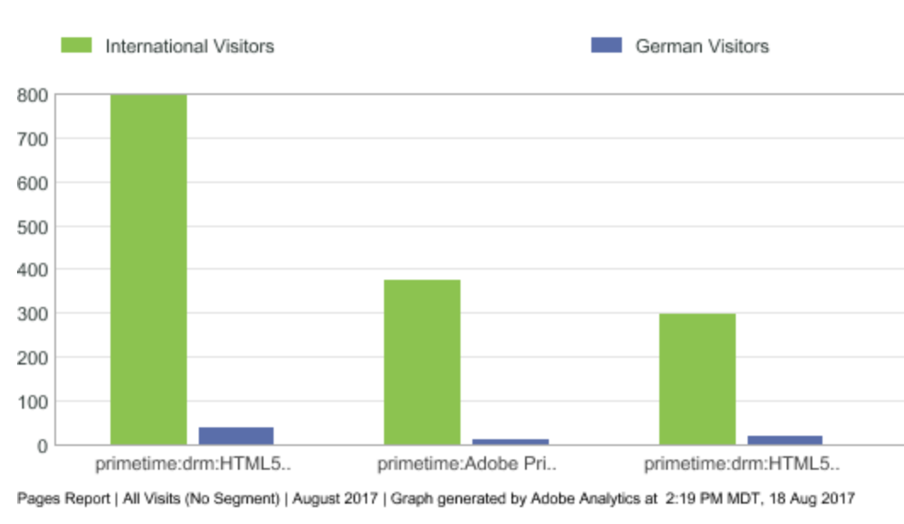
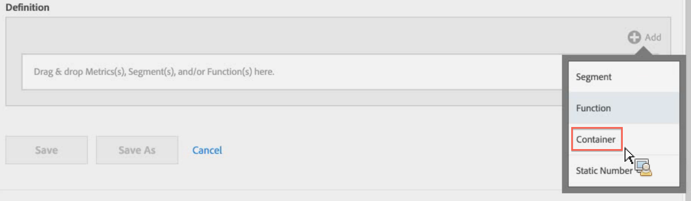
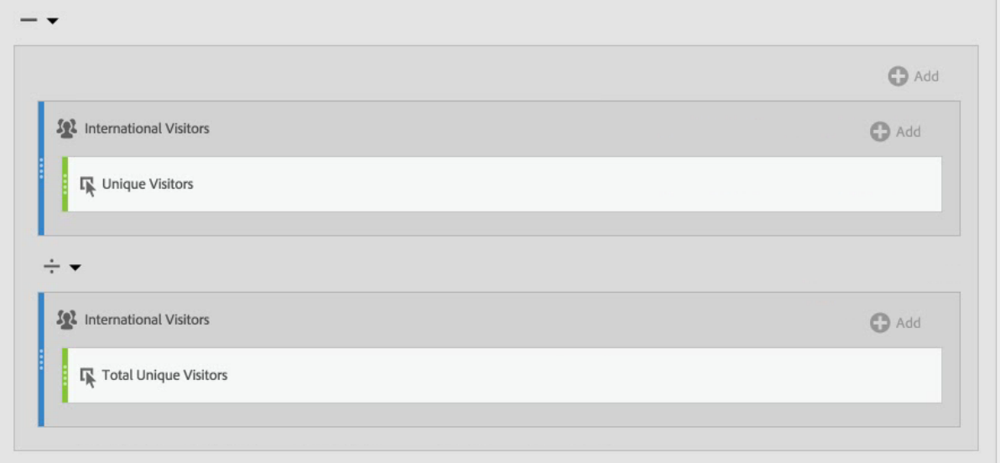
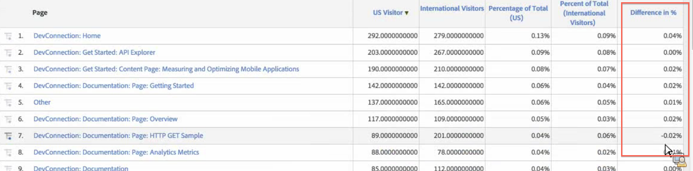

# Segmented Metrics

## Compare Segments {#section_29A6E0070F084BFDB6228FA9CE106F48}

Let's say you want to compare different aspects of a "US Visitors" segments to those of an "International Visitors" segment. You can create metrics that will give you insights such as: 

* How does content browsing behavior compare between the two groups? (Another example would be: How does the conversion rate compare between the two segments?)
* As a percentage of total visitors, how many US visitors browse certain pages, versus International visitors?
* Where are the biggest differences in terms of which content is accessed by these different segments?
Let's explore the first question: How does content browsing behavior compare between the two groups? 

1. If you don't have a comparable segment, create an internal segment right in the Calculated Metric Builder called "German Visitors", where "Countries" equals "Germany". Just drag the Countries dimension into the Definition canvas and select Germany as the value:  

   >[!NOTE]
   >
   >You can also do this in the[ Segment Builder](https://marketing.adobe.com/resources/help/en_US/analytics/segment/seg_build.html), but we have simplified the workflow by making dimensions available in the Calculated Metric Builder. 

   >[!NOTE]
   >
   >"Internal" means that the segment is not visible in the ** [!UICONTROL  Segments] ** list in the left rail. You can however, make it public by hovering over the "i" icon next to it and clicking ** [!UICONTROL  Make public] **. 

1. If you don't have a comparable segment, create a segment called "International Visitors" where "Countries" does not equal "Germany."
1. Build and save a metric called "German Visitors" by dragging the Germany segment into the Definition canvas and dragging the Unique Visitors metric within it:  

1. Repeat Step 3 with the International Visitors segment and the Unique Visitors metric to create an International Visitors metric.
1. In Analysis Workspace, drag the ** [!UICONTROL  Page] ** Dimension into a Freeform Table and drag the 2 new calculated metrics next to each other to the top:  

1. Or, in Reports &amp; Analytics, open the [!UICONTROL  Pages] report and click ** [!UICONTROL  Show Metrics] **, then apply the new US Visitors and International Visitors segmented metrics to see how their content browsing behavior compares.  

## Compare Percentages of Totals {#section_846CB89725F04388AE0352DB20189EE8}

You can introduce another level of inquiry by comparing visitor browsing behavior in normalized percentages. To do so, create, two new metrics, "% of Total German Visitors" and "% of Total International Visitors": 

1. Drop the German (or International) Visitors segment into the canvas.
1. Drop another German (or International) Visitors segment below. However, this time, click its configuration (gear) icon to select the Metric Type "Total". The Format should be "Percent". The operator should be "divided by". You end up with this metric definition:  

1. Apply this metric to your project:  

## Compare Differences in Percentages (using Containers) {#section_13D6353259B74C09B37BA6378A501938}

If you want to see the biggest differences between US and International browsing behavior at a glance, you can create another metric that subtracts the percentages from each other. To do so, you can use the Container functionality that effectively acts as parentheses around the 2 sets of metrics. 
1. In the [!UICONTROL  Definition] canvas, click ** [!UICONTROL  Add] ** > ** [!UICONTROL  Container] **:  

1. Drop the "% of Total US Visitors" metric that you created previously into the first container - it expands to its full definition:  

1. Create another container below and drop the "% of Total International Visitors" metric into it.
1. Change the operator between the 2 containers to a minus (-).  

1. Save the metric (make sure you have named it something like "Difference in % between US and Int'l.").
1. When applied to the report, you can easily where the greatest differences in percentages are, and you can sort the report accordingly.  

