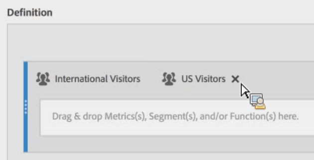
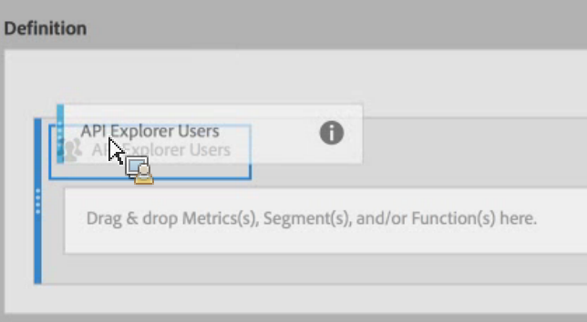

# Stacking and Replacing Segments

## Stacking Segments {#section_3FC1118FEE2B40B7BB90F29C8521AF53}

In the Definition canvas, simply drop the new segment next to the existing one: 

 

## Replacing one Segment with Another {#section_3DA899DF522A44D7A583C5DC8C0A033E}

In the Definition canvas, simply drop the new segment on top of the existing one: 

 
