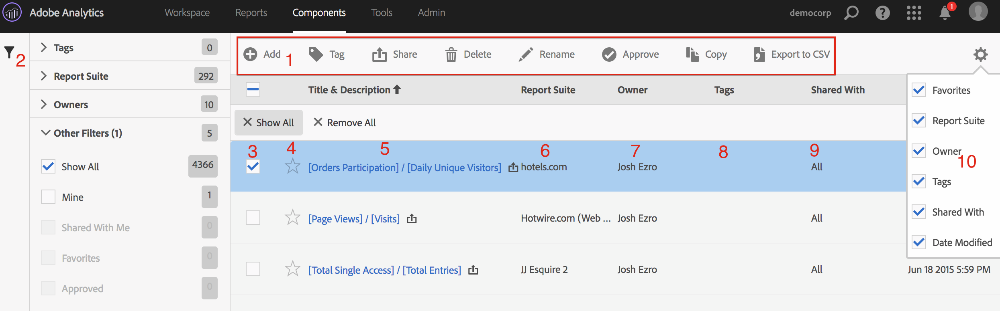

# Calculated Metric Manager

The Calculated Metric Manager shows you all the segments you own and that have been shared with you. Admin-level users can see all custom metrics in the organization. This overview presents the user interface and the capabilities of the Calculated Metric Manager. Access it by 

* Going to **[!UICONTROL  Analytics]** > **[!UICONTROL  Components]** in the left navigation. Then click **[!UICONTROL  Calculated Metrics]**.

 

|  #  | UI Feature  | Description  |
|---|---|---|
|  1  | Calculated Metrics Management Tool Bar  | Once you have checked a metric, this tool bar appears. Most management tasks can be completed from this tool bar.  |
|  2  | Show/Hide Filters  | Clicking Show Filters brings up the filter menu. You can filter by Tags, Report Suites, Owners, Show All (Admin only), Shared with Me, Mine, Favorites, and Approved.  |
|  3  | Check boxes  | Check a custom metric in order to manage it.  |
|  4  | Favorites  | Clicking the star next to a metric turns the star yellow and marks the metric as a favorite.  |
|  5  | Segment titles and descriptions  | Provided in the Calculated Metric Builder. To edit the title and description, click the title link - this takes you back to the Calculated Metric Builder.  |
|  6  | Report Suites  | This column indicates in which report suite the metric was last saved.  |
|  7  | Owner  | Indicates who owns the custom metric. As a non-Admin, you can see only metrics you own or those that were shared with you.  |
|  8  | Tags  | Shows tags that were applied to the metric, either by you or by people who shared the segment with you.  |
|  9  | Shared with  | Lists individuals or groups (Admin only) or All (Admin only) that you shared the segment with.  |
|  10  | Column selector  | Lets you select or deselect columns in the Calculated Metric Manager so that you can customize the view.  |
|  11  | Shared icon (not shown)  | Indicates that this custom metric is shared by you or with you.  |
|  12  | Approved icon (not shown)  | Indicates that this custom metric has been approved by an Administrator.  |

