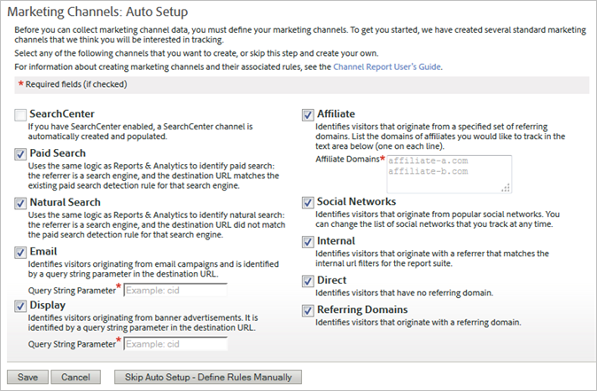

# Automatic setup

Run the one-time setup for the Marketing Channel report.

## Automatic setup {#topic_E9ABE9E9E71B4E40A4E7EA9AD2C0372B}

Run the one-time setup for the Marketing Channel report. 

The Marketing Channel report comes with a one-time setup page to get you started. It provides several marketing channels that you can use for tracking. You can skip this setup if you feel comfortable creating channels and rules. However, Adobe recommends that you allow the wizard to create the channels for you. The automatic setup lets you see how rules are constructed, or edit them for your own purposes. You can disable or delete the predefined channels at any time. 

## Run the automatic setup for Marketing Channels {#task_0F694146D48B4647BD7D5F060D394AB7}

How to run the Marketing Channels automatic setup.

1. Click **[!UICONTROL Analytics]** > **[!UICONTROL Admin]** > **[!UICONTROL Report Suites]**.
1. On the [!UICONTROL Report Suite Manager], select a report suite.
1. Click **[!UICONTROL Edit Settings]** > **[!UICONTROL Marketing Channels]** > **[!UICONTROL Marketing Channel Manager]**.

   

   >[!NOTE]
   >
   >The [!UICONTROL Marketing Channels: Auto Setup] page displays automatically when you access channel configuration applications in Admin Tools. (See [Marketing Channel Manager](../c_marketing_channels/c_channels.md#topic_45CF1C6A783B4F96ABF6317EAB6A854F).) This page does not display if your report suite contains one or more marketing channels. You cannot access this page again unless you select another report suite that does not contain marketing channels.

1. Make sure the channels that you want to create are selected.

   When selected, **[!UICONTROL Email]**, **[!UICONTROL Display]**, and **[!UICONTROL Affiliate]** are required fields.

   See [Marketing Channel Manager](../c_marketing_channels/c_channels.md#topic_45CF1C6A783B4F96ABF6317EAB6A854F). 

1. Click **[!UICONTROL Save]**.
