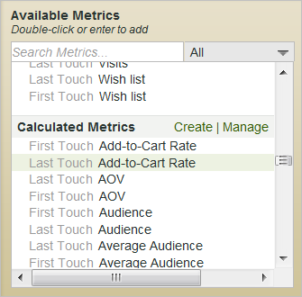
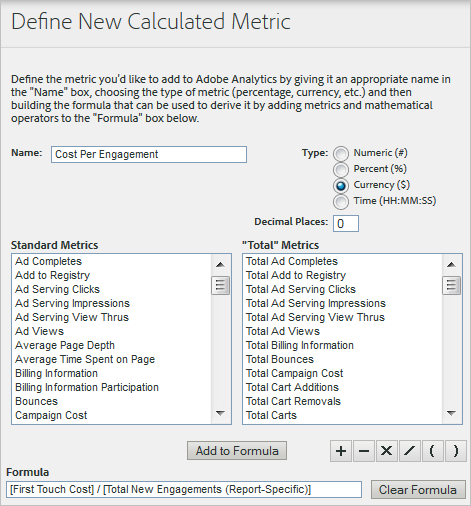

# Calculated metrics used Marketing Channel reports

Add calculated metrics to Marketing Channel reports in Analytics.

## Calculated metrics used Marketing Channel reports {#topic_4521D324A79E43EF99E69FCDE1E92F74}

Add calculated metrics to Marketing Channel reports in Analytics. 

Calculated metrics created in reports and analytics are available in the [!UICONTROL Marketing Channel] report, with first-touch and last-touch equivalents. For example, if you have created a calculated metric called Revenue per Order, that metric is available on the Marketing Channel report as *`First Touch Revenue per Order`* and *`Last Touch Revenue per Order`*.

You can create calculated metrics directly from the [!UICONTROL Marketing Channel Report]. Calculated metrics allow you to make useful comparisons between first-touch and last-touch channel metrics. For example, you can display the difference between first and last touch revenue. 

## Add calculated metrics to a Marketing Channel report {#task_4A9E82ACA23A4071B58191C821DBD3D3}

Add a calculated metric from the Marketing Channel Overview Report. You can add up to four metrics to the report.

1. Open a [!UICONTROL Marketing Channel Overview Report].

   See [Run Marketing Channel reports](../c_marketing_channels/t_reports_sc.md#task_AED9E5814809432AB00955CC54F80C84). 

1. In the report, click **[!UICONTROL Edit.]** 

   >[!NOTE]
   >
   >If you are viewing a [!UICONTROL First Touch] or [!UICONTROL Last Touch] detail report, click **[!UICONTROL Add Metrics]** to select a metric. (See [Metrics](https://marketing.adobe.com/resources/help/en_US/sc/user/index.html#Metrics) in *Marketing Reports and Analytics Help*.)

   

1. Scroll to [!UICONTROL Calculated Metrics], then double-click a calculated metric.

   If the calculated metric does not exist, click **[!UICONTROL Create]** to define the metric here. For an example, see [Calculated Metric Example](t_add_calculated.md#example_463EC7AFACA94043A2C34B5E8AADF419) after this procedure. Also, see [Creating Calculated Metrics](https://marketing.adobe.com/resources/help/en_US/sc/user/index.html#Creating%20Calculated%20Metrics) in *Marketing Reports and Analytics Help* for more information. 
1. Click **[!UICONTROL Save.]**

### Calculated Metric Example {#example_463EC7AFACA94043A2C34B5E8AADF419}

The following example shows a calculated metric formula that divides *First-Touch Costs* by *Total New Engagements*.

If you are familiar with importing classifications, you can add numeric classifications and upload them via the Classifications Importer for use as cost and budget metrics.

See [Classifications](https://marketing.adobe.com/resources/help/en_US/reference/index.html?f=classifications) help. 
