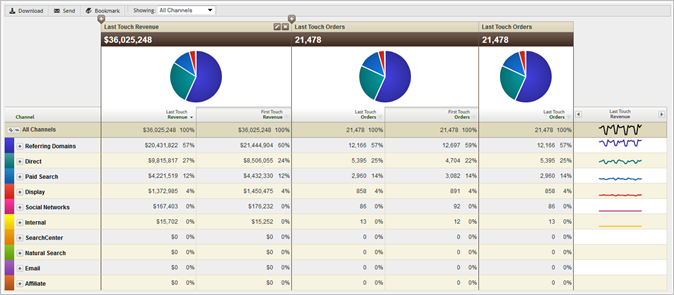

# About Marketing Channel reports

Marketing Channel reporting lets you know how much revenue your marketing channels generate. These reports include an overview report of the first and last-touch channel allocation, with critical, standard metrics like revenue, orders, and cost.

You configure channel definition rules in Admin Tools. APIs specific for the channel reports are available. No external implementation changes are necessary to run the [!UICONTROL Marketing Channel] report.

* [Example Report](../c_marketing_channels/c_overview.md#section_64F7FB1326A64B318654BAFE66FA97EC) 
* [Available Reports](../c_marketing_channels/c_overview.md#section_8A95A56AE24E4F34BBA069361D6354B9)

## Example Report {#section_64F7FB1326A64B318654BAFE66FA97EC}

Channel data is supported in dashboards, APIs, Report Builder (for Excel), Ad Hoc Analysis, Data Warehouse, and Data Extract.

 [Add](t_report_add_metrics.md#task_D381139E00504666AB2402D553CFEA5B) (or edit) metrics.

Add a column to the report.

## Available Reports {#section_8A95A56AE24E4F34BBA069361D6354B9}

The following [!UICONTROL Marketing Channel] reports are available in the Experience Cloud. 

<table id="table_8AA4D85C3F7C4F34BA6116136C06EAC3"> 
 <thead> 
  <tr> 
   <th colname="col1" class="entry"> 
Report 
 </th> 
   <th colname="col2" class="entry"> 
Description 
 </th> 
  </tr> 
 </thead>
 <tbody> 
  <tr> 
   <td colname="col1"> 
Channel Overview 
 </td> 
   <td colname="col2"> 
The overview report is a summary report that displays pie charts and graphs that depict trends over the selected time period. You can add first and last-touch metrics, or create calculated metrics for this report. You can also drill into the first and last-touch channel and detail reports from the overview table. Other Marketing Channel reports provide ways to look deeper into the data summarized on this report. 
 
When you expand a channel in the report, you can see breakdown reporting for the channel's values. Channel Values are unclassified values in the channel detail. 
 </td> 
  </tr> 
  <tr> 
   <td colname="col1"> 
First or Last-Touch Channel 
 </td> 
   <td colname="col2"> 
Displays metrics showing data about a specific first-touch or last-touch channel. In these reports, you can break down a channel and show the details of each channel. 
 </td> 
  </tr> 
  <tr> 
   <td colname="col1"> 
First or Last-Touch Channel Detail 
 </td> 
   <td colname="col2"> 
Displays details such as page names and referrers, which is taken from the channel values you set up in the  Set the channel's value to option when <a href="../c_marketing_channels/t_rules.md#task_84EDE9F46F404CB9B7CA0537328CEE08" type="task" format="dita" scope="local"> configuring rules</a>. Channel detail reports let you closely examine the channel detail values from the overview report. 
 </td> 
  </tr> 
 </tbody> 
</table>

