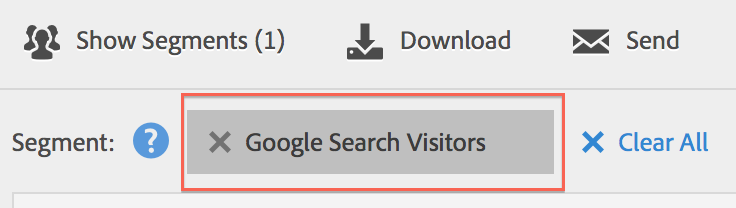

# Selecting and Applying Segments

>1. Bring up the report to which you want to apply a segment, for example the [!UICONTROL  Pages Report].
>1. Click **[!UICONTROL  Show Segments]** above the report. The segment rail opens.

>       1. Mark the checkbox next to one or more of the segments or **[!UICONTROL  Search Segments]** to find the right segment.

>       >[!NOTE]
>       >
>       >You can apply more than one segment to a report (this is called segment stacking). When multiple segments are applied, the criteria in each segment is combined using an 'and' operator and then applied. There is no limit to how many segments you can stack.

>       >[!NOTE]
>       >
>       >Clicking the Information icon (i) next to the segment name lets you preview the key metrics to see whether you have a valid segment and how broad the segment is.
>1. You can filter by report suite by selecting the **[!UICONTROL  (Only) &amp;lt;report suite name&amp;gt;]** check box. This will show only those segments that were last saved in that report suite.
>1. Click **[!UICONTROL  Apply Segment]** and the report will refresh. The segment or segments that are applied now display at the top of the report:

>       