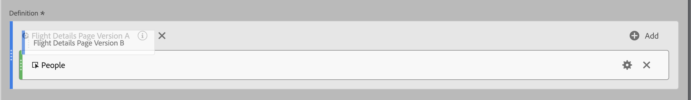

# Stack and replace segments

You can stack and replace segments within the Calculated metric builder.

## Stack segments {#stack-segment}

1. Begin building a metric, as described in [Build calculated metrics](cm-build-metrics.md).

1. In the Definition canvas, drop the new segment next to the existing one:

   

## Replace one segment with another {#replace-segment}

1. Begin building a metric, as described in [Build metrics](cm-build-metrics.md).

1. In the Definition canvas, drop the new segment on top of the existing one:

   
