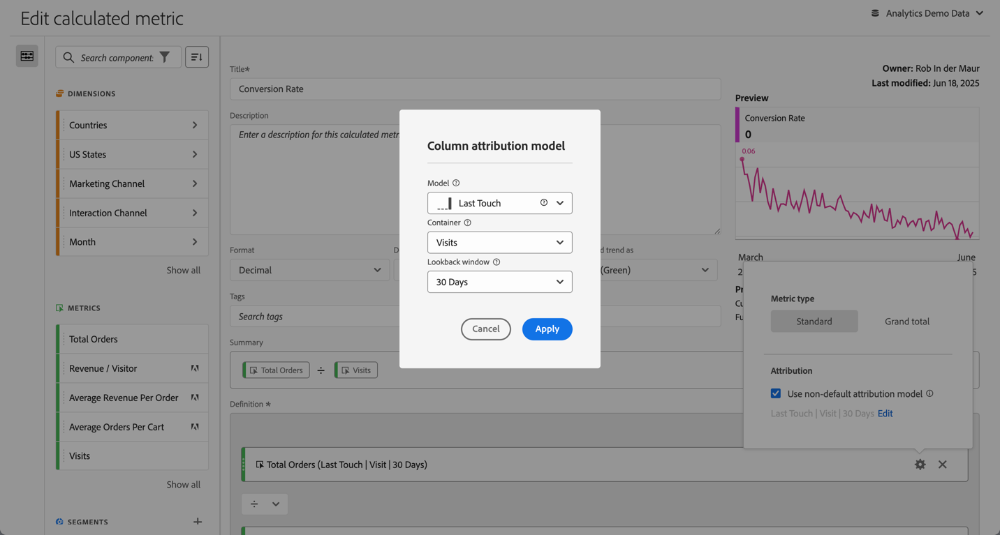

# Metric type and attribution {#metric-type-attribution}

You can configure the metric type and [attribution model](#attribution-models) for a metric in a calculated metric definition.

1. Select  in the metric component.
1. In the popup dialog:

   

   * Specify the **[!UICONTROL Metric type]**:

      |  Metric Type  | Definition  |
      |---|---|
      |  **[!UICONTROL Standard]**  | If a formula consists of a single standard metric, it displays identical data to its non-calculated-metric counterpart. Standard metrics are useful to create calculated metrics specific to each individual line item. 
For example,  **[!UICONTROL Orders]**   **[!UICONTROL Visits]** takes the orders for that specific line item and divides it by the number of visites for that specific line item.  |
      |  **[!UICONTROL Grand total]**  | Use  **[!UICONTROL Grand total]** for the reporting period in every line item. If a formula consists of a single Grand total metric, the calculated metric displays the same Grand total number on every line item. Grand total metrics are useful when you want to create calculated metrics that compare against total data. 
For example,  **[!UICONTROL Orders]**   **[!UICONTROL Total Visits]** shows the proportion of orders against all visits, not just the visits to the specific line item. In this example, you specify **[!UICONTROL Grand Total]** for the  **[!UICONTROL Visits]** metric in your calculated metric, which will automatically turn it into  **[!UICONTROL Total Visits]**. |

   * Specify **[!UICONTROL Attribution]**. 

     1. You can either:

        * Disable **[!UICONTROL Use non-default attribution model]** to use the default column attribution model, which is Last Touch, with a lookback window of 30 days.
        * Enable **[!UICONTROL Use non-default attribution model]**. In the **[!UICONTROL Column attribution model]** dialog, 
       
          * Select a **[!UICONTROL Model]** from the [attribution models](#attribution-models).
          * Select a **[!UICONTROL Container]** from the [container](#container) options.
          * Select a **[!UICONTROL Lookback window]** from the [lookback window](#lookback-window) options. If you select **[!UICONTROL Custom Time]**, you can define the time period in **[!UICONTROL Minute(s)]** up to **[!UICONTROL Quarter(s)]**.

     1. Select **[!UICONTROL Apply]** to apply the non-default attribution model. Select Cancel to cancel.

     If you already have defined a non-default attribution model, select **[!UICONTROL Edit]** to modify the selection.

See [Example](#example) for an example of using an attribution model, container, and lookback window.

## Attribution models {#attribution-models}

>[!CONTEXTUALHELP]
>id="components_calculatedmetrics_nondefaultattributionmodel"
>title="Use non-default attribution model"
>abstract="Enable a non-default attribution model for the selected metric."

>[!CONTEXTUALHELP]
>id="components_calculatedmetrics_attributionmodel"
>title="Model"
>abstract="Select an attribution model for the metric."

>[!CONTEXTUALHELP]
>id="components_calculatedmetrics_attribution_lasttouch"
>title="Last Touch"
>abstract="100% of credit goes to the last dimension value seen by a visitor."

>[!CONTEXTUALHELP]
>id="components_calculatedmetrics_attribution_firsttouch"
>title="First Touch"
>abstract="100% of credit goes to the first dimension value seen by a visitor."

>[!CONTEXTUALHELP]
>id="components_calculatedmetrics_attribution_linear"
>title="Linear"
>abstract="Credit is spread evenly across all dimension values."

>[!CONTEXTUALHELP]
>id="components_calculatedmetrics_attribution_participation"
>title="Participation"
>abstract="100% credit to every dimension value seen by a visitor. Column totals are overstated."

>[!CONTEXTUALHELP]
>id="components_calculatedmetrics_attribution_sametouch"
>title="Same Touch"
>abstract="Credit is given only to dimension values occurring on the same event as conversion."

>[!CONTEXTUALHELP]
>id="components_calculatedmetrics_attribution_instance"
>title="Same Touch"
>abstract="Credit is given only to dimension values occurring on the same event as conversion."

>[!CONTEXTUALHELP]
>id="components_calculatedmetrics_attribution_ushaped"
>title="U Shaped"
>abstract="40% credit to the first dimension value, 40% to the last, 20% shared by the middle."

>[!CONTEXTUALHELP]
>id="components_calculatedmetrics_attribution_jcurve"
>title="J Curve"
>abstract="60% credit to the last dimension value, 20% to the first, 20% shared by the middle."

>[!CONTEXTUALHELP]
>id="components_calculatedmetrics_attribution_jshaped"
>title="J Curve"
>abstract="60% credit to the last dimension value, 20% to the first, 20% shared by the middle."

>[!CONTEXTUALHELP]
>id="components_calculatedmetrics_attribution_inversej"
>title="Inverse J"
>abstract="60% credit to the first dimension value, 20% to the last, 20% shared by the middle."

>[!CONTEXTUALHELP]
>id="components_calculatedmetrics_attribution_reversejshaped"
>title="Inverse J"
>abstract="60% credit to the first dimension value, 20% to the last, 20% shared by the middle."

>[!CONTEXTUALHELP]
>id="components_calculatedmetrics_attribution_timedecay"
>title="Time Decay"
>abstract="Dimension values closest in time to a conversion get the most credit."

>[!CONTEXTUALHELP]
>id="components_calculatedmetrics_attribution_custom"
>title="Custom"
>abstract="Define your own position based attribution weighting."

>[!CONTEXTUALHELP]
>id="components_calculatedmetrics_attribution_positionbased"
>title="Custom"
>abstract="Define your own position based attribution weighting."

>[!CONTEXTUALHELP]
>id="components_calculatedmetrics_attribution_algorithmic"
>title="Algorithmic"
>abstract="Credit is dynamically determined on a statistical algorithm."

{{attribution-models-details}}

## Container {#container}

>[!CONTEXTUALHELP]
>id="components_calculatedmetrics_attribution_container"
>title="Container"
>abstract="Select a container to set the desired scope for the attribution."

{{attribution-container}}

## Lookback window {#lookback-winwow}

>[!CONTEXTUALHELP]
>id="components_calculatedmetrics_attribution_lookbackwindow"
>title="Lookback window"
>abstract="This setting determines the window of data attribution that will be applied for each conversion."

{{attribution-lookback-window}}

## Example

{{attribution-example}}

<!--
When [building a calculated metric](/help/components/calculated-metrics/c-workflow/cm-workflow/c-build-metrics/cm-build-metrics.md), you can specify the metric type and the attribution model.

## Metric type

To specify the metric type when building a calculated metric:

1. Select the gear icon next to the metric whose type you want to select.

    

1. Choose from the following options:

   |  Metric Type  | Definition  |
   |---|---|
   |  Standard  | These metrics are the same metrics used in standard [!DNL Analytics] reporting. If a formula consisted of a single standard metric, it displays identical data to its non-calculated-metric counterpart. Standard metrics are useful for creating calculated metrics specific to each individual line item. For example, [Orders] / [Visits] takes orders for that specific line item and divides it by the number of visits for that specific line item.  |
   |  Grand total  | Use Grand total for the reporting period in every line item. If a formula consisted of a single Grand total metric, it displays the same total number on every line item. Grand total metrics are useful for creating calculated metrics that compare against site total data. For example, [Orders] / [Total Visits] shows the proportion of orders against ALL visits to your site, not just the visits to the specific line item.  |

## How linear allocation works

[Attribution](/help/analyze/analysis-workspace/attribution/overview.md) is how allocation models in calculated metrics are evaluated.

For a full list of non-default attribution models and lookback windows supported, see [Attribution models and lookback windows](/help/analyze/analysis-workspace/attribution/models.md).

The following example illustrates how calculated metrics with linear allocations work in reporting: 

| | Hit 1 | Hit 2 | Hit 3 | Hit 4 | Hit 5 | Hit 6 | Hit 7 |
|--- |--- |--- |--- |--- |--- |--- |--- |
|Data Sent In|PROMO A|-|PROMO A|PROMO B|-|PROMO C|$10|
|Last Touch eVar|PROMO A|PROMO A|PROMO A|PROMO B|PROMO B|PROMO C|$10|
|First Touch eVar|PROMO A|PROMO A|PROMO A|PROMO A|PROMO A|PROMO A|$10|
|Example prop|PROMO A|-|PROMO A|PROMO B|-|PROMO C|$10|

In this example, the values A, B, and C were sent into a variable on hits 1, 3, 4, and 6 before a $10 purchase was made on hit 7. In the second row, those values persist across hits on a last touch visit basis. The third row illustrates a first-touch visit persistence. Finally, the last row illustrates how data would be recorded for a prop which does not have persistence.

-->