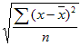

# Basic functions


The [Calculated metrics builder](/help/components/calculated-metrics/workflow/c-build-metrics/cm-build-metrics.md) lets you apply statistical and mathematical functions. This article documents an alphabetical list of the functions and their definitions.

>[!NOTE]
>
>Where [!DNL metric] is identified as an argument in a function, other expressions of metrics are also allowed. For example, [COLUMN MAXIMUM(metrics)](#column-maximum) also allows for [COLUMN MAXIMUM(PageViews + Visits)](#column-maximum).


## Table functions versus row functions 

A table function is one where the output is the same for every row of the table. A row function is one where the output is different for every row of the table. 

Where applicable and relevant, a function is annotated with the type of function: [!BADGE Table]{type="Neutral"} or [!BADGE Row]{type="Neutral"} 

## What does the include-zeros parameter mean?

It tells whether to include zeros in the computation. Sometimes zero means *nothing*, but sometimes it's important.

For example, if you have a Revenue metric, and then add a Page Views metric to the report, there are suddenly more rows for your revenue, which are all zero. You probably don't want that additional metric to affect any **[MEAN](cm-functions.md#mean)**, **[ROW MINIMUM](cm-functions.md#row-min)**, **[QUARTILE](cm-functions.md#quartile)**, and more calculations that you have in the revenue column. In this case, you would check the `include-zeros` parameter.

An alternative scenario is that you have two metrics of interest and one has a higher average or minimum because some of the rows are zeros.  In that case, you can opt not to check the parameter to include zeros


## Absolute Value {#absolute-value}

<!-- markdownlint-disable MD034 -->

>[!CONTEXTUALHELP]
>id="functions-abs"
>title="Absolute Value"
>abstract="Returns the absolute value of a number. The absolute value of a number is the number with a positive value."

<!-- markdownlint-enable MD034 -->


 **[!UICONTROL ABSOLUTE VALUE(metric)]**

[!BADGE Row]{type="Neutral"} Returns the absolute value of a number. The absolute value of a number is the number with a positive value.

| Argument | Description |
|---|---|
| metric | The metric for which you want to calculate the absolute value. |

**Use case**: Ensure all results are positive when analyzing metrics that might produce negative values, such as revenue deltas or percentage changes. This helps focus on the magnitude of change without regard to direction.

**In the Calculated Metric Builder**: Wrap your metric or expression in the **Absolute Value** function, for example: **Absolute Value**(Current Revenue - Prior Revenue). This converts any negative differences to positive values.

>[!TIP]
>
>Use this for measuring absolute differences between two time periods or segments, regardless of whether performance increased or decreased.
>

## Column Maximum {#column-maximum}

<!-- markdownlint-disable MD034 -->

>[!CONTEXTUALHELP]
>id="functions-col-max"
>title="Column Maximum"
>abstract="Returns the largest value in a set of dimension elements for a metric column. MAXV evaluates vertically within a single column (metric) across dimension elements."

<!-- markdownlint-enable MD034 -->

 **[!UICONTROL COLUMN MAXIMUM(metric, include_zeros)]**

Returns the largest value in a set of dimension elements for a metric column. MAXV evaluates vertically within a single column (metric) across dimension elements.

| Argument | Description |
|---|---|
| metric | Requires at least one metric but can take any number of metrics as parameters. |
| include_zeros | Whether or not to include zero values in the calculations. |

**Use case**: Identify the highest value within a breakdown, such as the day with the most visits or the product with the highest revenue. This helps highlight peak performance across categories.

**In the Calculated Metric Builder**: Apply **Column Maximum** to a metric like *Revenue* or *Visits* when breaking down by *Day* or *Product*. The function returns the largest value in that column for each row.

>[!TIP]
>
>Use an [IF](https://experienceleague.adobe.com/en/docs/analytics-platform/using/cja-components/cja-calcmetrics/cm-adv-functions#if) statement such as **IF**(*Revenue* = **Column Maximum***(Revenue*), 1, 0) to highlight the top-performing item in your breakdown.
>

## Column Minimum {#column-minimum}

<!-- markdownlint-disable MD034 -->

>[!CONTEXTUALHELP]
>id="functions-col-min"
>title="Column Minimum"
>abstract="Returns the smallest value in a set of dimension elements for a metric column. MINV evaluates vertically within a single column (metric) across dimension elements."

<!-- markdownlint-enable MD034 -->


 **[!UICONTROL COLUMN MINIMUM(metric, include_zeros)]**

Returns the smallest value in a set of dimension elements for a metric column. MINV evaluates vertically within a single column (metric) across dimension elements.

| Argument | Description |
|---|---|
| metric| Requires at least one metric but can take any number of metrics as parameters.|
| include_zeros | Whether or not to include zero values in the calculations. |

**Use case**: Identify the lowest-performing value within a breakdown, such as the campaign with the fewest conversions or the day with the lowest revenue. This helps quickly surface underperforming segments.

**In the Calculated Metric Builder**: Apply **Column Minimum** to a metric like *Revenue* or *Conversion Rate* when breaking down by *Campaign* or *Day*. The function returns the smallest value in that column for each row.

>[!TIP]
>
>Use an [IF](https://experienceleague.adobe.com/en/docs/analytics-platform/using/cja-components/cja-calcmetrics/cm-adv-functions#if) statement such as **IF**(*Revenue* = **Column Minimum***(Revenue*), 1, 0) to highlight the lowest-performing item in your breakdown.
>


## Column Sum {#column-sum}

<!-- markdownlint-disable MD034 -->

>[!CONTEXTUALHELP]
>id="functions-col-sum"
>title="Column Sum"
>abstract="Adds all numeric values for a metric within a column (across the elements of a dimension)."

<!-- markdownlint-enable MD034 -->


 **[!UICONTROL COLUMN SUM(metric)]**

Adds all numeric values for a metric within a column (across the elements of a dimension).

| Argument | Description |
|---|---|
| metric | Requires at least one metric but can take any number of metrics as parameters.|

**Use case**: Calculate the total of all values within a breakdown, such as total revenue across all products or total visits across all days. This helps when you need an overall total to compare against individual row values.

**In the Calculated Metric Builder**: Apply **Column Sum** to a metric like *Revenue* or *Visits* while breaking down by *Product* or *Day*. The function returns the total of all values in that column for each row.

>[!TIP]
>
>Use when you need a reference to the overall total in order to calculate shares or percentages of total performance.
>


## Count {#count}

<!-- markdownlint-disable MD034 -->

>[!CONTEXTUALHELP]
>id="functions-count"
>title="Count"
>abstract="Returns the number, or count, of non-zero values for a metric within a column (the number of unique elements reported within a dimension)."

<!-- markdownlint-enable MD034 -->


 **[!UICONTROL COUNT(metric)]**

[!BADGE Table]{type="Neutral"} Returns the number, or count, of non-zero values for a metric within a column (the number of unique elements reported within a dimension).

| Argument | Description |
|---|---|
| metric| The metric you want to count.|

**Use case**: Count the number of data points included in a calculation, such as the number of days in a date range or the number of products in a breakdown. This helps when you need to know how many items contribute to an aggregated value.

**In the Calculated Metric Builder**: Apply **Count** to a metric like *Visits* or *Revenue* to return the total number of rows (or data points) included in the current breakdown or date range.

>[!TIP]
>
>Use together with **Column Sum** to calculate averages manually (for example, **Column Sum**(*Revenue*) / **Count**(Revenue)).
>

## Exponent {#exponent}

<!-- markdownlint-disable MD034 -->

>[!CONTEXTUALHELP]
>id="functions-exp"
>title="Exponent"
>abstract="Returns e raised to the power of a given number. The constant e equals 2.71828182845904, the base of the natural logarithm. EXPONENT is the inverse of LN, the natural logarithm of a number."

<!-- markdownlint-enable MD034 -->

 **[!UICONTROL EXPONENT(metric)]**

[!BADGE Row]{type="Neutral"} Returns e raised to the power of a given number. The constant e equals 2.71828182845904, the base of the natural logarithm. EXPONENT is the inverse of LN, the natural logarithm of a number.

| Argument | Description |
|---|---|
| metric | The exponent applied to the base e.|

**Use case**: Raise a number or metric to a specified power, such as squaring a value or applying an exponential growth factor. This is useful when modeling growth trends or scaling a metric exponentially.

**In the Calculated Metric Builder**: Use **Exponent** with a metric and a power value. For example: **Exponent**(*Visits*, 2) squares the *Visits* metric.

>[!TIP]
>
>Combine with **Logarithm** for advanced modeling or to smooth out highly variable data when comparing growth patterns.
>


## Mean {#mean}

<!-- markdownlint-disable MD034 -->

>[!CONTEXTUALHELP]
>id="functions-mean"
>title="Mean"
>abstract="Returns the arithmetic mean, or average, for a metric in a column"

<!-- markdownlint-enable MD034 -->


 **[!UICONTROL MEAN(metric, include_zeros)]**

[!BADGE Table]{type="Neutral"} Returns the arithmetic mean, or average, for a metric in a column.

| Argument | Description |
|---|---|
| metric | The metric for which you want to calculate the average.|
| include_zeros | Whether or not to include zero values in the calculations. |

**Use case**: Calculate the arithmetic average of a set of values, such as the average daily revenue or the average number of visits per campaign. This helps establish a baseline for comparing individual values within a dataset.

**In the Calculated Metric Builder**: Apply **Mean** to a metric like *Revenue* or *Visits* to return the average value across all data points in the selected breakdown or date range.

>[!TIP]
>
>Use to understand overall performance trends, or combine it with **Standard Deviation** to measure consistency around the average.
>

## Median {#median}

<!-- markdownlint-disable MD034 -->

>[!CONTEXTUALHELP]
>id="functions-median"
>title="Median"
>abstract="Returns the median for a metric in a column. The median is the number in the middle of a set of numbers. That is, half the numbers have values that are greater than or equal to the median, and half are less than or equal to the median."

<!-- markdownlint-enable MD034 -->


 **[!UICONTROL MEDIAN(metric, include_zeros)]**

[!BADGE Table]{type="Neutral"} Returns the median for a metric in a column. The median is the number in the middle of a set of numbers. That is, half the numbers have values that are greater than or equal to the median, and half are less than or equal to the median.

| Argument | Description |
|---|---|
| metric | The metric for which you want to calculate the median.|
| include_zeros | Whether or not to include zero values in the calculations. |

**Use case**: Identify the middle value in a set of data, such as the median daily revenue or median page views per visit. This is helpful when you want to reduce the impact of outliers and see the central tendency of your data.

**In the Calculated Metric Builder**: Apply Median to a metric like Revenue or Page Views to return the midpoint value across all data points in the selected breakdown or date range.

>[!TIP]
>
>Use instead of **Mean** when your data contains extreme highs or lows that might skew the average.
>


## Modulo {#modulo}

<!-- markdownlint-disable MD034 -->

>[!CONTEXTUALHELP]
>id="functions-modulo"
>title="Modulo"
>abstract="Returns the remainder after dividing x by y using Euclidean division. "

<!-- markdownlint-enable MD034 -->


 **[!UICONTROL MODULO(metric_X, metric_Y)]**

Returns the remainder after dividing x by y using Euclidean division. 

| Argument | Description |
|---|---|
| metric_X | The first metric that you would like to divide. |
| metric_Y | The second metric that you would like to divide. |

**Use case**: Return the remainder after dividing one number by another. This can be useful for cyclical or repeating patterns, such as identifying every nth day or campaign in a sequence.

**In the Calculated Metric Builder**: Use **Modulo** with two numeric inputs. For example: **Modulo**(*Day Number*, 7) returns the remainder after dividing the day number by seven, which can help group data by week.

>[!TIP]
>
>Combine with conditional logic to highlight recurring intervals or to segment data based on repeating cycles.
>

### More Examples

The return value has the same sign as the input (or is zero).

```
MODULO(4,3) = 1
MODULO(-4,3) = -1
MODULO(-3,3) = 0
```

To ensure you always get a positive number, use

```
MODULO(MODULO(x,y)+y,y)
```

## Percentile {#percentile}

<!-- markdownlint-disable MD034 -->

>[!CONTEXTUALHELP]
>id="functions-percentile"
>title="Percentile"
>abstract="Returns the nth percentile, which is a value between 0 and 100. When n < 0, the function uses zero. When n > 100, the function returns 100."

<!-- markdownlint-enable MD034 -->


 **[!UICONTROL PERCENTILE(metric, k, include_zeros)]**

[!BADGE Table]{type="Neutral"} Returns the nth percentile, which is a value between 0 and 100. When n < 0, the function uses zero. When n > 100, the function returns 100.

| Argument | Description |
|---|---|
| metric | The percentile value in the range 0 to 100, inclusive. |
| k | The metric column that defines relative standing. |
| include_zeros | Whether or not to include zero values in the calculations. |

**Use case**: Identify the value below which a given percentage of data points fall, such as the 90th percentile of daily revenue or page views. This helps measure distribution and detect high-performing outliers.

**In the Calculated Metric Builder**: Apply **Percentile** to a metric like *Revenue* or *Visits*, and specify the desired percentile value (for example, **Percentile**(*Revenue*, 90)). The result shows the threshold that 90% of data points fall below.

>[!TIP]
>
>Use to set performance benchmarks or to filter for top-performing days, campaigns, or products.
>

## Power Operator {#power-operator}

<!-- markdownlint-disable MD034 -->

>[!CONTEXTUALHELP]
>id="functions-pow"
>title="Power Operator"
>abstract="Returns x raised to the y power."

<!-- markdownlint-enable MD034 -->

 **[!UICONTROL POWER OPERATOR(metric_X, metrix_Y)]**

Returns x raised to the y power.

| Argument | Description |
|---|---|
| metric_X | The metric that you would like to raise to the metric_Y power. |
| metric_Y | The power you would like to raise metric_X to. |

**Use case**: Raise one number or metric to the power of another, such as squaring a value or applying an exponential weight. This is helpful when modeling growth, scaling values, or performing advanced mathematical transformations.

**In the Calculated Metric Builder**: Use **Power Operator** between two numeric values or metrics. For example: *Revenue* ^ 2 raises the *Revenue* value to the second power.

>[!TIP]
>
>Similar to the **Exponent** function but expressed as a mathematical operator, allowing for more compact formulas within calculated metrics.
>

## Quartile {#quartile}

<!-- markdownlint-disable MD034 -->

>[!CONTEXTUALHELP]
>id="functions-quartile"
>title="Quartile"
>abstract="Returns the quartile of values for a metric. For example, quartiles can be used to find the top 25% of products driving the most revenue."

<!-- markdownlint-enable MD034 -->


 **[!UICONTROL QUARTILE(metric, quartile, include_zeros)]**

[!BADGE Table]{type="Neutral"} Returns the quartile of values for a metric. For example, quartiles can be used to find the top 25% of products driving the most revenue. [COLUMN MINIMUM](#column-minimum), [MEDIAN](#median), and [COLUMN MAXIMUM](#column-maximum) return the same value as [QUARTILE](#quartile) when quartile is equal to `0` (zero), `2`, and `4`, respectively.

| Argument | Description |
|---|---|
| metric | The metric for which you want to calculate the quartile value. |
| quartile | Indicates which quartile value to return. |
| include_zeros | Whether or not to include zero values in the calculations. |

**Use case**: Divide a dataset into four equal parts to understand how values are distributed, such as identifying the top 25% of days by revenue or visits. This helps segment performance into ranked groups for deeper comparison.

**In the Calculated Metric Builder**: Apply **Quartile** to a metric like *Revenue* or *Visits*, and specify which quartile to return (for example, **Quartile**(*Revenue*, 3) to find the threshold for the third quartile, or top 25%).

>[!TIP]
>
>Use to group values into performance tiers such as low-, mid-, and high-performing campaigns or products.
>

## Round {#round}

<!-- markdownlint-disable MD034 -->

>[!CONTEXTUALHELP]
>id="functions-round"
>title="Round"
>abstract="Round without a *number* parameter is the same as round with a *number* parameter of 0, namely round to the nearest integer.  With a *number* parameter, ROUND returns the *number* digits to the right of the decimal.  If *number* is negative, it returns 0's to the left of the decimal."

<!-- markdownlint-enable MD034 -->

 **[!UICONTROL ROUND(metric, number)]**

Round without a *number* parameter is the same as round with a *number* parameter of 0, namely round to the nearest integer.  With a *number* parameter, ROUND returns the *number* digits to the right of the decimal.  If *number* is negative, it returns 0's to the left of the decimal.

| Argument | Description |
|---|---|
| metric | The metric that you want to round. |
| number | How many digits to the right of the decimal to return. (If negative returns zeros to the left of the decimal). |

**Use case**: Simplify numeric results by rounding them to a specified number of decimal places. This is helpful for creating cleaner visualizations or making calculated metrics easier to read in reports.

**In the Calculated Metric Builder**: Apply **Round** to a metric or expression and specify the number of decimal places. For example: **Round**(*Conversion Rate*, 2) rounds the value to two decimal places.

>[!TIP]
>
>Use to standardize metric formatting across reports, especially when displaying percentages or currency values.
>

### More Examples

```
ROUND( 314.15, 0) = 314
ROUND( 314.15, 1) = 314.1
ROUND( 314.15, -1) = 310
ROUND( 314.15, -2) = 300
```

## Row Count {#row-count}

<!-- markdownlint-disable MD034 -->

>[!CONTEXTUALHELP]
>id="functions-count-rows"
>title="Row Count"
>abstract="Returns the count of rows for a given column (the number of unique elements reported within a dimension). *Uniques exceeded* is counted as 1."

<!-- markdownlint-enable MD034 -->

 **[!UICONTROL ROW COUNT()]**

Returns the count of rows for a given column (the number of unique elements reported within a dimension). *Uniques exceeded* is counted as 1.

**Use case**: Count the total number of rows returned in a breakdown or dataset, such as the number of days, campaigns, or products included in a report. This helps understand how many items contribute to your analysis.

**In the Calculated Metric Builder**: Apply **Row Count** to return the total number of rows in the current breakdown or segment. For example, when viewing *Revenue* by *Product*, **Row Count** returns the number of products shown.

>[!TIP]
>
Use with other functions like **Column Sum** to calculate averages manually (for example, **Column Sum**(*Revenue*) / **Row Count**()).
>

## Row Max {#row-max}

<!-- markdownlint-disable MD034 -->

>[!CONTEXTUALHELP]
>id="functions-row-max"
>title="Row Max"
>abstract="Maximum of the columns of each row."

<!-- markdownlint-enable MD034 -->

 **[!UICONTROL ROW MAX(metric, include_zeros)]**

Maximum of the columns of each row.

| Argument | Description |
|---|---|
| metric | Requires at least one metric but can take any number of metrics as parameters. |
| include_zeros | Whether or not to include zero values in the calculations. |

**Use case**: Identify the highest value across all metrics in a single row, such as determining which metric (for example, *Revenue*, *Orders*, or *Visits*) has the greatest value for a specific day or segment. This helps highlight which metric leads within each row of data.

**In the Calculated Metric Builder**: Apply **Row Maximum** when multiple metrics are included in a calculated metric. For example: **Row Maximum**(*Revenue*, *Orders*, *Visits*) returns the largest value among those metrics for each row.

>[!TIP]
>
>Use to compare related metrics side by side and identify which contributes the most to performance within each row.
>

## Row Min {#row-min}

<!-- markdownlint-disable MD034 -->

>[!CONTEXTUALHELP]
>id="functions-row-min"
>title="Row Min"
>abstract="Minimum of the columns of each row."

<!-- markdownlint-enable MD034 -->

 **[!UICONTROL ROW MIN(metric, include_zeros)]**

Minimum of the columns of each row.

| Argument | Description |
|---|---|
| metric | Requires at least one metric but can take any number of metrics as parameters. |
| include_zeros | Whether or not to include zero values in the calculations. |

**Use case**: Identify the lowest value across all metrics in a single row, such as finding which metric (for example, *Revenue*, *Orders*, or *Visits*) has the smallest value for a particular day or segment. This helps spot the weakest-performing metric within each row of data.

**In the Calculated Metric Builder**: Apply **Row Minimum** when comparing multiple metrics. For example: **Row Minimum**(*Revenue*, *Orders*, *Visits*) returns the smallest value among those metrics for each row.

>[!TIP]
>
>Combine with Row Maximum to calculate performance ranges or to highlight underperforming metrics in a side-by-side comparison.
>

## Row Sum {#row-sum}

<!-- markdownlint-disable MD034 -->

>[!CONTEXTUALHELP]
>id="functions-row-sum"
>title="Row Sum"
>abstract="Sum of the columns of each row."

<!-- markdownlint-enable MD034 -->

 **[!UICONTROL ROW SUM(metric, include_zeros)]**

Sum of the columns of each row.

| Argument | Description |
|---|---|
| metric | Requires at least one metric but can take any number of metrics as parameters. |

**Use case**: Add together the values of multiple metrics within a single row, such as summing *Revenue* and *Tax* to calculate total transaction value, or combining *Visits* from different sources. This helps consolidate related metrics into one total.

**In the Calculated Metric Builder**: Apply **Row Sum** to combine multiple metrics. For example: **Row Sum**(*Revenue*, *Tax*) adds those two metrics for each row in your breakdown.

>[!TIP]
>
>Use to create combined totals or to group related performance indicators into a single calculated metric.
>

## Square Root {#square-root}

<!-- markdownlint-disable MD034 -->

>[!CONTEXTUALHELP]
>id="functions-sqrt"
>title="Square Root"
>abstract="Returns the positive square root of a number. The square root of a number is the value of that number raised to the power of 1/2."

<!-- markdownlint-enable MD034 -->


 **[!UICONTROL SQUARE ROOT(metric, include_zeros)]**

[!BADGE Row]{type="Neutral"} Returns the positive square root of a number. The square root of a number is the value of that number raised to the power of 1/2.

| Argument | Description |
|---|---|
| metric | The metric for which you want to calculate the square root. |

**Use case**: Return the square root of a number or metric, such as finding the root of variance when calculating standard deviation or normalizing values in a dataset. This is useful for advanced statistical or data transformation calculations.

**In the Calculated Metric Builder**: Apply **Square Root** to a metric or expression. For example: **Square Root**(Variance(*Revenue*)) returns the standard deviation of *Revenue*.

>[!TIP]
>
>Use when you need to scale metrics proportionally or to support other statistical functions that rely on root values.
>

## Standard Deviation {#standard-deviation}

<!-- markdownlint-disable MD034 -->

>[!CONTEXTUALHELP]
>id="functions-stdev"
>title="Standard Deviation"
>abstract="Returns the standard deviation, or square root of the variance, based on a sample population of data."

<!-- markdownlint-enable MD034 -->

 **[!UICONTROL STANDARD DEVIATION(metric, include_zeros)]**

[!BADGE Table]{type="Neutral"} Returns the standard deviation, or square root of the variance, based on a sample population of data.

| Argument | Description |
|---|---|
| | The metric for which you want to calculate the standard deviation.|
| include_zeros | Whether or not to include zero values in the calculations. |

**Use case**: Measure how much values vary from the average, such as evaluating how consistent daily revenue or visits are over time. This helps identify volatility, stability, or unusual fluctuations in performance.

**In the Calculated Metric Builder**: Apply **Standard Deviation** to a metric like *Revenue* or *Visits* to calculate the spread of values within the selected breakdown or date range. For example: **Standard Deviation**(*Revenue*) shows how much daily revenue deviates from the mean.

>[!TIP]
>
>Use with *Mean* to detect anomalies or compare the consistency of performance across campaigns, products, or segments.
>

## Variance {#variance}

<!-- markdownlint-disable MD034 -->

>[!CONTEXTUALHELP]
>id="functions-variance"
>title="Variance"
>abstract="Returns the variance based on a sample population of data."

<!-- markdownlint-enable MD034 -->

 **[!UICONTROL VARIANCE(metric, include_zeros)]**

[!BADGE Table]{type="Neutral"} Returns the variance based on a sample population of data.

| Argument | Description |
|---|---|
| metric | The metric for which you want to calculate the variance.|
| include_zeros | Whether or not to include zero values in the calculations. |

**Use case**: Measure how far values in a dataset spread out from the mean, such as analyzing how much daily revenue or session duration varies over time. This helps quantify the degree of consistency or fluctuation in performance.

**In the Calculated Metric Builder**: Apply **Variance** to a metric like *Revenue* or *Time Spent per Visit* to calculate the average squared deviation from the mean. For example: **Variance**(*Revenue*) shows how much revenue values differ from the average over the selected range.

>[!TIP]
>
>Use with **Standard Deviation** to better understand data variability and identify areas of unpredictable performance.
>

The equation for VARIANCE is:

{width="100"}

Where *x* is the sample mean, [MEAN(*metric*)](#mean), and *n* is the sample size.


To calculate a variance, you look at an entire column of numbers. From that list of numbers you first calculate the average. Once you have the average, you go through each entry and do the following:

1. Subtract the average from the number.

1. Square the result.

1. Add that to the total.

Once you have iterated over the entire column, you have a single total. You then divide that total by the number of items in the column. That number is the variance for the column. It is a single number. It is, however, displayed as a column of numbers.

In the example of the following three-item column:

| column |
|:---:|
| 1 |
| 2 |
| 3 |

The average of this column is 2. The variance for the column is ((1 - 2)<sup>2</sup> + (2 - 2)<sup>2</sup> + (3 - 2)<sup>2</sup>/3) = 2/3.

<!--

## Absolute Value (Row)

Returns the absolute value of a number. The absolute value of a number is the number with a positive value.

```
ABS(metric)
```

|  Argument  | Description  |
|---|---|
|  *metric* | The metric for which you want the absolute value.  |

## Column Maximum

Returns the largest value in a set of dimension elements for a metric column. MAXV evaluates vertically within a single column (metric) across dimension elements.

```
MAXV(metric)
```

|  Argument  | Description  |
|---|---|
|  *metric* | A metric that you would like to have evaluated.  |

## Column Minimum 

Returns the smallest value in a set of dimension elements for a metric column. MINV evaluates vertically within a single column (metric) across dimension elements.

```
MINV(metric)
```

|  Argument  | Description  |
|---|---|
|  *metric* | A metric that you would like to have evaluated.  |

## Column Sum 

Adds all of the numeric values for a metric within a column (across the elements of a dimension).

```
SUM(metric)
```

|  Argument  | Description  |
|---|---|
|  *metric* | The metric for which you want the total value or sum.  |

## Count (Table) 

Returns the number, or count, of non-zero values for a metric within a column (the number of unique elements reported within a dimension).

```
COUNT(metric)
```

|  Argument  | Description  |
|---|---|
|  *metric* | The metric that you want to count.  |

## Exponent (Row) 

Returns *e* raised to the power of a given number. The constant *e* equals 2.71828182845904, the base of the natural logarithm. EXP is the inverse of LN, the natural logarithm of a number.

```
EXP(metric)
```

|  Argument  | Description  |
|---|---|
|  *metric* | The exponent applied to the base *e*.  |

## Exponentiation 

Power Operator


pow(x,y) = x<sup>y</sup> = x*x*x*… (y times)


## Mean (Table) 

Returns the arithmetic mean, or average, for a metric in a column.

```
MEAN(metric)
```

|  Argument  | Description  |
|---|---|
|  *metric* | The metric for which you want the average.  |

## Median (Table) 

Returns the median for a metric in a column. The median is the number in the middle of a set of numbers-that is, half the numbers have values that are greater than or equal to the median, and half are less than or equal to the median.

```
MEDIAN(metric)
```

|  Argument  | Description  |
|---|---|
|  *metric* | The metric for which you want the median.  |

## Modulo 

The remainder of col1 / col2, using Euclidean division.

Returns the remainder after dividing x by y.

```
x = floor(x/y) + modulo(x,y)
```

The return value has the same sign as the input (or is zero).

```
modulo(4,3) = 1 
modulo(-4,3) = -1 
modulo(-3,3) = 0
```

To always get a positive number, use 

```
modulo(modulo(x,y)+y,y)
```

## Percentile (Table) 

Returns the k-th percentile of values for a metric. You can use this function to establish a threshold of acceptance. For example, you can decide to examine dimension elements who score above the 90  percentile.

```
PERCENTILE(metric,k)
```

<table id="table_35CD840ACFB44CD9979881DB8823CC53"> 
 <thead> 
  <tr> 
   <th colname="col1" class="entry"> Argument </th> 
   <th colname="col2" class="entry"> Description </th> 
  </tr> 
 </thead>
 <tbody> 
  <tr> 
   <td colname="col1"> <i>metric</i> </td> 
   <td colname="col2"> The metric column that defines relative standing. </td> 
  </tr> 
  <tr> 
   <td colname="col1"> <p>k </p> </td> 
   <td colname="col2"> The percentile value in the range 0 to 100, inclusive. </td> 
  </tr> 
 </tbody> 
</table>

## Quartile (Table) 

Returns the quartile of values for a metric. For example, quartiles can be used to find the top 25% of products driving the most revenue. MINV, MEDIAN, and MAXV return the same value as QUARTILE when quart is equal to 0 (zero), 2, and 4, respectively.

```
QUARTILE(metric,quart)
```

<table id="table_64EA3DAAE77541439D59FAF0353F83A2"> 
 <thead> 
  <tr> 
   <th colname="col1" class="entry"> Argument </th> 
   <th colname="col2" class="entry"> Description </th> 
  </tr> 
 </thead>
 <tbody> 
  <tr> 
   <td colname="col1"> <i>metric</i> </td> 
   <td colname="col2"> The metric for which you want the quartile value. </td> 
  </tr> 
  <tr> 
   <td colname="col1"> <p>quart </p> </td> 
   <td colname="col2"> Indicates which *value to return. </td> 
  </tr> 
 </tbody> 
</table>

&#42;If *quart* = 0, QUARTILE returns the minimum value. If *quart* = 1, QUARTILE returns the first quartile (25 percentile). If *quart* = 2, QUARTILE returns the first quartile (50 percentile). If *quart* = 3, QUARTILE returns the first quartile (75 percentile). If *quart* = 4, QUARTILE returns the maximum value.

## Round 

Returns the nearest integer for a given value. For example, if you want to avoid reporting currency decimals for revenue and a product has $569.34, use the formula Round( *Revenue*) to round revenue to the nearest dollar, or $569. A product reporting $569.51 will be round to the nearest dollar, or $570.

```
ROUND(metric)
```

|  Argument  | Description  |
|---|---|
|  *number* | The metric you want to round.  |

Round without a digits parameter is the same as round with a digits parameter of 0, namely round to the nearest integer. With a digits parameter it returns that many digits to the right of the decimal. If digits is negative, it returns 0's to the left of the decimal.

```
round( 314.15, 0) = 314 
round( 314.15, 1) = 314.1 
round( 314.15, -1) = 310 
round( 314.15, -2) = 300
```

## Row Count 

Returns the count of rows for a given column (the number of unique elements reported within a dimension). "Uniques exceeded" is counted as 1.

## Row Max 

The maximum of the columns in each row.

## Row Min 

The minimum of the columns in each row.

## Row Sum

The sum of the columns of each row.

## Square Root (Row) 

Returns the positive square root of a number. The square root of a number is the value of that number raised to the power of 1/2.

```
SQRT(metric)
```

|  Argument  | Description  |
|---|---|
|  *number* | The metric for which you want the square root.  |

## Standard Deviation (Table) 

Returns the standard deviation, or square root of the variance, based on a sample population of data.

The equation for STDEV is:



where x is the sample mean (*metric*) and *n* is the sample size.

```
STDEV(metric)
```

<table id="table_8BCF2E4B02434AABAAD026FB3C4E8B2F"> 
 <tbody> 
  <tr> 
   <td> <b> Argument</b> </td> 
   <td> <b> Description</b> </td> 
  </tr> 
  <tr> 
   <td> <b> <i> metric</i> </b> </td> 
   <td> <p> The metric for which you want for standard deviation. </p> </td> 
  </tr> 
 </tbody> 
</table>

## Variance (Table) 

Returns the variance based on a sample population of data.

The equation for VARIANCE is:


where x is the sample mean, MEAN(*metric*), and *n* is the sample size.

```
VARIANCE(metric)
```

|  Argument  | Description  |
|---|---|
|  *metric* | The metric for which you want the variance.  |

In order to calculate a variance you look at an entire column of numbers. From that list of numbers you first calculate the average. Once you have the average you go through each entry and do the following:

1. Subtract the average from the number.

2. Square the result.

3. Add that to the total.

Once you have iterated over the entire column you have a single total. You then divide that total by the number of items in the column. That number is the variance for the column. It is a single number. It is, however, displayed as a column of numbers.

In case of a three-item column:

1

2

3

The average of this column is 2. The variance for the column will be ((1 - 2)<sup>2</sup> + (2 - 2)<sup>2</sup> + (3 - 2)<sup>2</sup>/3 = 2/3.

-->