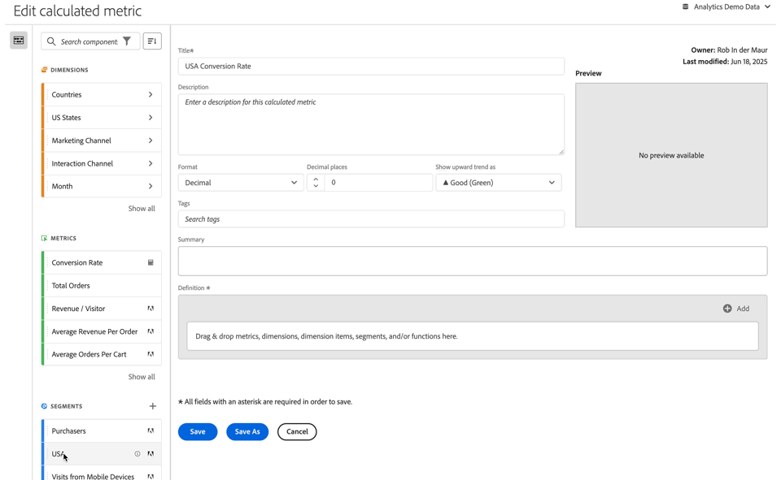

# Build calculated metrics {#build-metrics}

Adobe Analytics provides a canvas to drag and drop dimensions, metrics, segments, and functions to create custom metrics based on container hierarchy logic, rules, and operators. This integrated development tool lets you build and save simple or complex calculated metrics.

You can use the calculated metric builder to create or edit calculated metrics. When created in this way, calculated metrics are available in the component list and can then be used in projects throughout your organization. Alternatively, you can quickly create a calculated metric that is available only for the project where it was created, as described in [Create calculated metrics for a single project](/help/analyze/analysis-workspace/components/apply-create-metrics.md#create-calculated-metrics-for-a-single-project) in [Metrics](/help/analyze/analysis-workspace/components/apply-create-metrics.md).

[Create a calculated metric](../cm-workflow.md) describes the different options available to create a new calculated metric.

## Areas of the calculated metrics builder

The **[!UICONTROL Calculated metric builder]** dialog is used to create new or edit existing calculated metrics. The dialog is titled **[!UICONTROL New calculated metric]** or **[!UICONTROL Edit calculated metric]** for metrics that you create or manage from the [[!UICONTROL Calculated metrics] manager](../cm-manager.md).

>[!BEGINTABS]

>[!TAB Calculated metric builder] 

>[!TAB Create or Edit calculated metric] 

>[!ENDTABS]

1. Specify the following details ( is required):

   | Element | Description |
   | --- | --- |
   | **[!UICONTROL Report suite]** | You can select the report suite for the calculated metric.  The calculated metric you define is available in Workspace projects based on the selected report suite. | 
   | **[!UICONTROL Project-only metric]** | An info box appears at the top of this dialog when you edit a calculated metric that was created for a single project, as described in [Create calculated metrics for a single project](/help/analyze/analysis-workspace/components/apply-create-metrics.md#create-calculated-metrics-for-a-single-project). 
If you want to make this calculated metric available for all projects, select the option, **[!UICONTROL Make this metric available to all your projects and add it to your component list]**.
 |
   | **[!UICONTROL Title]**  | Name the calculated metric, for example, `Conversion Rate`. |
   | **[!UICONTROL Description]** | Provide a description for the segment, for example, `Calculated metric to define the conversion rate.` There is no need to describe the formula for the calculated metric as the formula is already automatically available in [!UICONTROL Summary]. |
   | **[!UICONTROL Format]** | Select a format for the calculated metric: You can select between **[!UICONTROL Decimal]**, **[!UICONTROL Time]**, **[!UICONTROL Percent]**, and **[!UICONTROL Currency]**. |
   | **[!UICONTROL Decimal places]** | Specify the number of decimal places for the format selected. Only enabled when the format selected is Decimal, Currency, and Percent. |
   | **[!UICONTROL Show upward trend as]** | Specify whether an upward trend of the calculated metric displays as ▲ **[!UICONTROL Good (Green)]** or as ▼ **[!UICONTROL Bad (Red)]**. | 
   | **[!UICONTROL Currency]**  | Specify the currency of the calculated metric. Only enabled when format selected is Currency. |
   | **[!UICONTROL Tags]**| Organize the calculated metric by creating or applying one or more tags. Start typing to find existing tags you can select. Or press **[!UICONTROL ENTER]** to add a new tag. Select  to remove a tag. |
   | **[!UICONTROL Preview]** | The preview covers the last 90 days and is a way to gauge whether you have defined your metric correctly. | 
   | **[!UICONTROL Summary]** | Displays a summary of the definition of the calculated metric.  For example:   **[!UICONTROL Total Orders]**   **[!UICONTROL Sessions]**. |
   | **[!UICONTROL Definition]** | Define your segment using the [Definition builder](#definition-builder). |

1. To verify whether your calculated metric definition is correct, use the constantly updated **[!UICONTROL Preview]** of the results of the calculated metric. The **[!UICONTROL Preview]** covers the last 90 days and evaluates the definition of your calculated metric continuously.
   
   The **[!UICONTROL Product compatibility]** indicates the compatibility of the calculated metric with Adobe Analytics functionalities. See [Metric compatibility](/help/components/calculated-metrics/cm-compatibility.md) for more information. 

1. Select:
   * **[!UICONTROL Save]** to save the calculated metric.
   * **[!UICONTROL Save As]** to save a copy of the calculated metric. 
   * **[!UICONTROL Cancel]** to cancel any changes you made to the calculated metric or cancel the creation of a new calculated metric.

## Definition builder

You use the Definition builder to drag and drop dimensions, metrics, segments, and functions to create custom metrics based on container hierarchy logic, rules, and operators. In that construction, you can use standard metrics, Adobe defined metrics, calculated metrics, segments, dimensions and functions. All these components are available from the component panel in the Calculated metric builder. Furthermore, you can use operators and containers in the definition.

Only metrics are defined as singular components in the **[!UICONTROL Definition]** area. All other components are defined as a container, wrapping metrics or other containers. See [Containers](#containers) for more information.

### Metrics

To add a metric:

* Drag and drop an  **[!UICONTROL Metrics]** component from the components panel onto **[!UICONTROL Drag and drop metrics, dimensions, dimension items, segments, and/or functions here]**. You can use the  in the components bar to search for specific components.

When you use a calculated metric as part of your definition, the calculated metric is expanded.

To modify a metric:

1. Select  in a metric component in the **[!UICONTROL Definition]** area.
1. In the popup dialog you can define the type of metric and an attribution model. See [Metric type and Attribution](m-metric-type-alloc.md).

To delete a metric:

* Select  in the metric.

### Operators

Operators let you specify the operator between components or containers. Operators appear automatically between

* two or more metrics in a container, 
* two or more containers in a container, 
* one or more metrics and one or more containers in a container. 
 
You can select:

| Symbol | Operator |
|:---:|---|
|  | Divide (default) |
|  | Multiply |
|  | Subtract |
|  | Add |

### Static number

You can add a static number to your calculated metric definition. To add a static number:

* Select  **[!UICONTROL Add]** from within a container.
* Select **[!UICONTROL Static number]**. A static number container appears. 
* Select [!UICONTROL *Click to add a value*] and type a value.

### Containers

You add dimensions, segments and functions as containers to a calculated metric definition. You can also add a generic container. Containers function like a math expression and determine the order of operations. Anything within a container gets processed before the next component or container.

#### Segment container

You use the concept of a segment container to create a [segmented metric](metrics-with-segments.md). You can construct a segment container using a segment, or using a segment you create from a dimension.

* To add a segment container from a dimension:

  1. Drag and drop a  **[!UICONTROL Dimensions]** component from the components panel onto **[!UICONTROL Drag and drop metrics, dimensions, dimension items, segments, and/or functions here]**. You can use the  in the components bar to search for specific components.
  1. In the **[!UICONTROL Create Segment from Dimension]** popup, define the condition for the segment. Select from the list of operators and select a value or enter a value. For example, **[!UICONTROL Month]** **[!UICONTROL equals]**  `Sep 2024`.
  1. Select **[!UICONTROL Done]**. A segment container is added to the **[!UICONTROL Definition]**. 

* To add a segment container from a segment, you can use:

  * Drag and drop a  **[!UICONTROL Segments]** component from the components panel onto **[!UICONTROL Drag and drop metrics, dimensions, dimension items, segments, and/or functions here]**. You can use the  in the components bar to search for specific segments.
    Automatically a segment container is added to the **[!UICONTROL Definition]**, using the name of the segment.

  * Drag and drop a  **[!UICONTROL Segment]** component from the components panel onto a generic container. The container is modified into a segment container.

  * Select  **[!UICONTROL Add]** from within a container:

    1. Select **[!UICONTROL Segment]**. A segment container is added to the **[!UICONTROL Definition]**.
    1. In the new segment container, select a segment from the [!UICONTROL *Select...*] drop-down menu.

  >[!TIP]
  >
  >You can add more than one segment to a container. 

  The segments in the container are named after the segment component. For example,  **[!UICONTROL Web sessions]**. Select  to display a popup with details on the segment. In the popup, select  to edit the segment definition.

To remove a segment from a container:

* Select  next to the segment name.

See [Segmented metrics](metrics-with-segments.md) for more details and examples.

#### Function container

To add a function container, you can use:

* Drag and drop:

  1. Drag and drop a  **[!UICONTROL Functions]** component from the components panel onto **[!UICONTROL Drag and drop metrics, dimensions, dimension items, segments, and/or functions here]**. You can use the  in the components bar to search for specific functions.
  1. Automatically a function container is added to the **[!UICONTROL Definition]** using the name of the function. 

* Select  **[!UICONTROL Add]** from within a container:

  1. Select **[!UICONTROL Function]**.
  1. In the container, select a function from the [!UICONTROL *Select...*] drop-down menu.

The function container is named after the function component. For example,  **[!UICONTROL SQUARE ROOT (metric)]**. Select  to display a popup with details on the function. Select **[!UICONTROL Learn more]** for more information on the function. 

See [Use functions](cm-using-functions.md) for details on how to use functions and what functions are available to create a calculated metric.

#### Generic container

To add a generic container:

* Select  **[!UICONTROL Add]** from within a container
* Select **[!UICONTROL Container]**. A new empty generic container is added to the **[!UICONTROL Definition]**. You can use a generic container to nest or create a hierarchy in the definition of your calculated metric.

#### Delete a container

To delete a container, select  at the container level.

>[!MORELIKETHIS]
>
>[Use functions](cm-using-functions.md)
>[Segments](/help/components/segmentation/seg-overview.md)
>

<!--

Adobe Analytics provides a canvas to drag and drop dimensions, metrics, segments, and functions to create custom metrics based on container hierarchy logic, rules, and operators. This integrated development tool lets you build and save simple or complex calculated metrics.

## Begin building a calculated metric

You can use the calculated metric builder to create or edit calculated metrics. When created in this way, calculated metrics are available in the component list and can then be used in projects throughout your organization. Alternatively, you can quickly create a calculated metric that is available only for the project where it was created, as described in [Create calculated metrics for a single project](/help/analyze/analysis-workspace/components/apply-create-metrics.md#create-calculated-metrics-for-a-single-project) in [Metrics](/help/analyze/analysis-workspace/components/apply-create-metrics.md).

Access the calculated metric builder to begin creating a calculated metric that is available in the component list. 

1. Access the calculated metric builder in any of the follows ways:

   * In Analysis Workspace, open a project, then select **[!UICONTROL Components]** > **[!UICONTROL Create metric]**.
   * In Analysis Workspace, open a project, then select the **Plus** icon next to the [!UICONTROL **Metrics**] section in the left rail.
   * In [!DNL Adobe Analytics], go to **[!UICONTROL Components]** > **[!UICONTROL Calculated metrics]**, then select **[!UICONTROL + Add]** at the top of the Calculated metrics page.

1. Continue with [Areas of the calculated metric builder](#areas-of-the-calculated-metrics-builder).

## Areas of the Calculated metrics builder

The following image and accompanying table explain some of the main areas and features of the Calculated metrics builder.

| Location in image  | Name and function  |
|---|---|
| 1 | **Title:** Naming the metric is mandatory. You cannot save the metric unless it is named.  |
| 2 | **Description:** Give it a user-friendly description to show what it's used for and to distinguish it from similar ones. 
The description also appears within a report. It's best NOT to put the formula into the description - instead, describe what this metric should and should not be used for. (The formula is generated as you build the metric, underneath the Summary heading. As a result, there is no need to add the formula to the description.) 
  |
| 3 | **Format:** Choices include Decimal, Time, Percent, and Currency.  |
| 4 | **Decimal Places:** Shows how many decimal places will be shown in the report. The maximum number of decimal places you can specify is 10.  |
| 5| **Show Upward Trend As:** This metric polarity setting shows whether Analytics should consider an upward trend in the metric as good (green) or bad (red). As a result, the report's graph will show as green or red when it's going up.  |
| 6 | **Tags:** Tagging is a good way to organize metrics. All users can create tags and apply one or more tags to a metric. However, you can see tags only for those segments that you own or that have been shared with you. What kinds of tags should you create? Here are some suggestions for useful tags:<ul><li>**Team names**, such as Social Marketing, Mobile Marketing.</li><li>**Projects** (analysis tags), such as Entry-page analysis.</li><li>**Categories**, such as Women's; Geography.</li><li>**Workflows**, such as To be approved; Curated for (a specific business unit)</li></ul> |
| 7 | **Summary:** 
The Summary formula updates anytime you make a change to the metric definition. This formula also shows up in the metrics rail on the left when you hover over a metric and click the  icon. 
  |
| 8 | **Definition:** This is where you drag in metrics/calculated metrics, segments, and/or functions to build the calculated metric. <ul><li>If you drag in a calculated metric, it will expand its metric definition automatically. </li> <li>You can nest definitions with containers. However, unlike segment containers, these containers function like a math expression and determine the order of operations. </li> </ul>  |
| 9 | **Operator:** Divided by (  ) is the default operator, plus there are the +, -, and x operators. |
| 10 | **Preview:** Provides a quick read on any possible errors. The preview covers the last 90 days. This is a way of initially gauging whether you have selected the right components for your metric. An unexpected result would mean you need to take a second look at the metric definition.  |
| 11 | **Product compatibility:** Product compatibility shows you whether the metric is compatible with <a href="/help/analyze/reports-analytics/current-data.md"  > Current Data </a>, with Fully Processed Data, or only with Marketing Channel reports (first-touch allocation). 
Note:  Current Data does not support all metrics. Metrics that contain segments or functions are not compatible with current data. <a href="/help/components/calculated-metrics/cm-compatibility.md"  > More... </a> 
 
  |
| 12 | **Add:** For all types of calculated metrics, you can add containers and static numbers to the definition. For advanced calculated metrics, you can also add segments and functions. <ul><li>Containers function like a math expression and determine the order of operations. So anything in a container will get processed before the next operation.</li><li>Dragging a segment onto a container segments everything in that container. (Advanced calculated metrics only)</li><li>You can stack multiple segments in a container.</li></ul> |
| 13 | **Gear icon (Metric Type, Attribution):** Selecting the gear icon next to a metric lets you specify the <a href="/help/components/calculated-metrics/workflow/c-build-metrics/m-metric-type-alloc.md"  > metric type and attribution models </a>. |
| 14 | **New:** Lets you create a new component, such as a new segment (which takes you to the <a href="/help/components/segmentation/segmentation-workflow/seg-build.md"  > Segment Builder </a>.) |
| 15 | **Search Components:** This search bar lets you search for dimensions, metrics, segments (advanced calculated metrics only), and functions (advanced calculated metrics only). |
| 16 | **List of Dimensions:** Rather than leaving the Calculated Metric Builder in order to build a simple segment (in the Segment Builder), e.g. "Page = Homepage", you can drag in Page and select Homepage directly from the Calculated Metric Builder.
This results in a much more streamlined workflow for creating segmented calculated metrics.
 |
| 17 | **List of Metrics:** Metrics come in 3 categories: <ul> <li>Standard metrics () </li><li>Calculated metrics ( ) </li><li id="li_8735E76637ED4C3F983731A66E04C93E">Metrics templates ( ) - at the bottom of the list. </li> </ul> 
When you hover over a metric, you can see the Info icon to the right of it: . Clicking this icon gives you the following information: 
<ul> <li>The formula of how it is calculated. </li><li>A preview trend of the metric. </li><li>An edit (pencil) icon  at the top right that will take you to the Calculated Metrics Builder where you can edit this calculated metric. </li></ul> |
| 18 | **List of Segments:** (Advanced calculated metrics only) As an Admin, this list shows all segments created in your login company. If you are a non-Admin user, this list shows segments you own and those shared with you. <a href="/help/components/segmentation/segment-reference/seg-rights.md"  > More... </a> |
| 19 | **List of Functions:** (Advanced calculated metrics only) Functions are divided into two lists: <a href="/help/components/calculated-metrics/cm-reference/cm-functions.md"  > Basic </a> (used most often) and <a href="/help/components/calculated-metrics/cm-reference/cm-adv-functions.md"  > Advanced </a>. |
| 20 | **Report Suite selector:** Lets you switch to a different report suite. |

{style="table-layout:auto"}

-->
