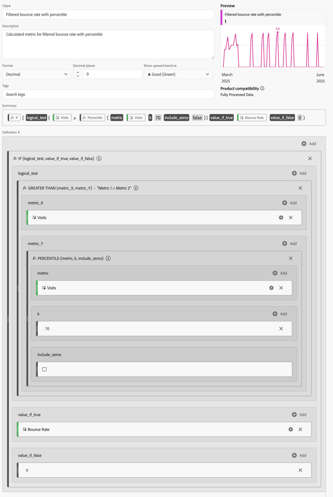

# Filtered and weighted metrics

This article shows examples of filtered and weighted metrics.

## Filtered bounce rate

This simple filtered metric shows the bounce rate for only those pages with over 100 visits:

{zoomable="yes"}

Keep in mind that this formula is dependent on a consistent time range. If you run a report for a single day, any page with more than 20 visits is worth looking at. If you run it for a month, you may want the filter to include more visits.

## Filtered bounce rate with percentile

This filter shows the bounce rate for the top 30 percent of pages, when sorted by visits.

{zoomable="yes"}

## Weighted bounce rate

Suppose you want to sort by bounce rate in general, but pages with higher visits should be higher on the list. You could create a Weighted Bounce Rate that looks like this:

