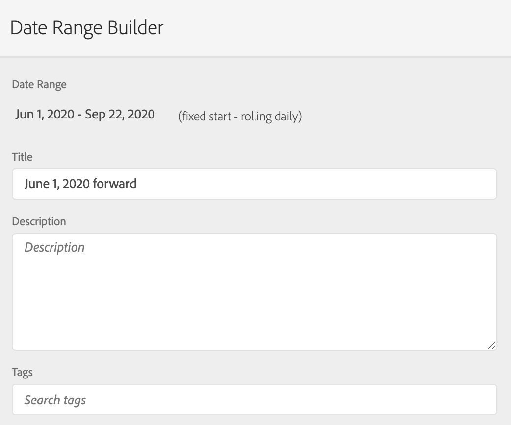
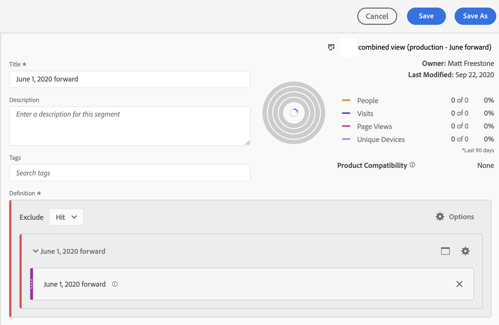
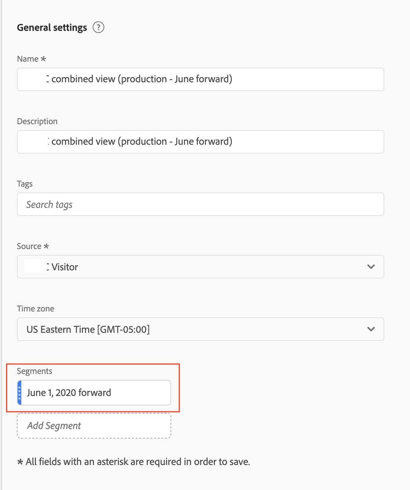
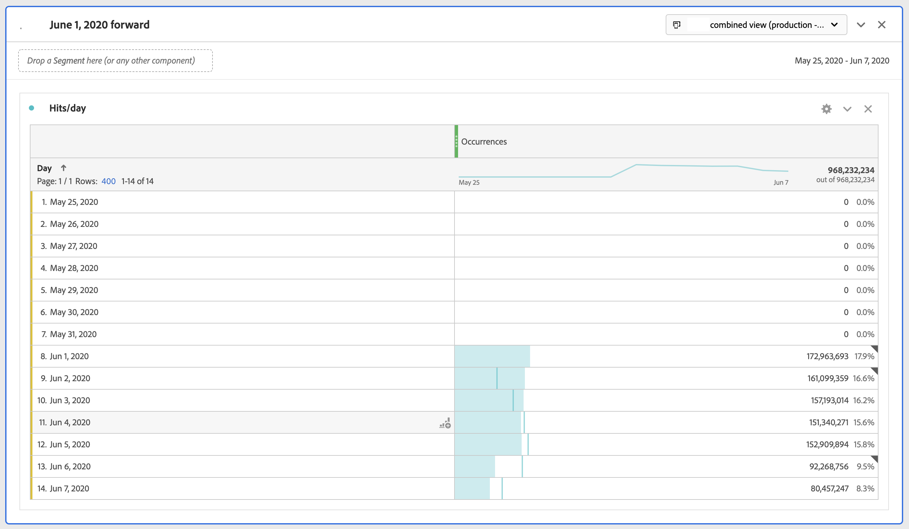

# Limit a VRS to certain dates

When we turn on stitching, the stitching starts on a specific date. Let's assume that date is June 1. The CDA VRS will contain unstitched data prior to June 1. You may want to hide any data in the VRS prior to June 1 so that your analysis can focus on date ranges after stitching began.

You can limit the VRS data to certain dates by doing the following:

## Step 1: Create VRS with a rolling-daily date range

When you set up the VRS, under Components, add in a date range that has a fixed start, with a rolling-daily date range. The fixed start should be the day that stitching began.

## Step 2: Create an "exclude-exclude" segment

Next, create a hit segment that puts the date range in an exclude container inside another exclude container. It’s an “exclude exclude.”

The reason for the “exclude exclude” is that date ranges are intended to override the date range of the report. So if you just include June 1 forward it will always make the report date range June 1 forward. This will lead to undesirable results. When you “exclude exclude”, it overrides this behavior and just limits the data you can draw from to the appropriate date range.

## Step 3: Apply this segment to your CDA VRS

## Step 4: See the results in reporting

Notice that reporting now starts on the desired date, the same day that stitching was first implemented:

