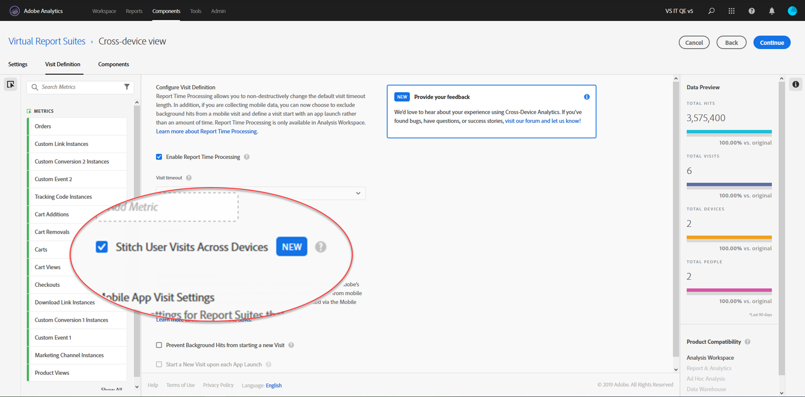

# Set up Cross-Device Analytics

Once all prerequisites are met, use the following steps to enable Cross-Device Analytics. You must belong to a Product Profile Admin group or have admin privileges in Adobe Analytics to follow these steps.

>[!IMPORTANT]
>
>All prerequisites must be met before following these steps. If all prerequisites are not met, the feature is not available or will not work. See the [overview page](overview.md) and the desired stitching method ([Field-based stitching](field-based-stitching.md) or [Device graph](device-graph.md), respectively) for prerequisites and limitations.

## Open a ticket with Customer Care to have CDA provisioned on your cross-device report suite

CDA is provisioned on your cross-device report suite by Adobe engineering. To start this process, contact Customer Care and be prepared to provide the following information:

* Your Adobe Experience Cloud org ID (An alphanumeric string ending with @AdobeOrg)
* The report suite ID for the cross-device report suite you want to enable with CDA
* Which method of CDA you want to use (field-based stitching, Adobe private graph, or Adobe co-op graph)
* If you intend to use field-based stitching, the prop or eVar that contains the user ID
* Your preference of replay frequency and lookback length. Options include a replay once a week with a 7-day lookback window, or a replay every day with a 1-day lookback window.
The default is weekly replay with 7-day lookback window. In this case, data within the last week is subject to change (as it is progressively being stitched and updated).

Once you provide Customer Care with this information, they will work with Adobe Engineering to enable your chosen report suite for CDA processing.

## Create a cross-device virtual report suite to see the cross-device view

Administrators with access to create virtual report suites can create CDA virtual report suites as follows:

1. Navigate to [experiencecloud.adobe.com](https://experiencecloud.adobe.com) and log in using your AdobeID credentials.
2. Click the 9-grid icon at the top, then click Analytics.
3. Hover over Components at the top, then click Virtual Report Suites.
4. Click Add.
5. Enter a name for your virtual report suite, and ensure that the CDA-enabled report suite is selected.
6. (Optional) Apply a segment to the virtual report suite. For example, you can apply a segment that limits the virtual report suite to dates after CDA was turned on and stitching began. This segment allows users to see only stitched date ranges within the VRS.
7. Click the checkbox 'Enable Report Time Processing', which enables several more options including Cross-Device Analytics.
8. Click the checkbox 'Stitch User Visits Across Devices'.
9. Click Continue, finish configuring the virtual report suite, then click Save.

## Additions and changes to cross-device virtual report suites

When Cross-Device Analytics is enabled on a virtual report suite, note the following changes:

* A new cross-device icon appears next to the virtual report suite name. This icon is exclusive to cross-device virtual report suites.
* A new dimension labeled [Identified state](../dimensions/identified-state.md) is available.
* New metrics labeled [People](../metrics/people.md), [Unique Devices](../metrics/unique-devices.md), Identified people, Unidentified people, and People with Experience Cloud ID are available.
* The metric [Unique Visitors](../metrics/unique-visitors.md) is not available, as it is replaced with 'People' and 'Unique Devices'.
* When building segments, the 'Visitor' segment container is replaced with a 'Person' container.
