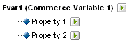
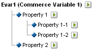

# About sub-classifications

Adobe Analytics supports both single-level and multiple-level classifications models. A classification hierarchy allows you to apply a classification to a classification.

>[!NOTE]
>
>Sub-classification refers to the ability to create classifications of classifications. However, this is not the same as a [!UICONTROL Classification Hierarchy] used to create [!UICONTROL Hierarchy] reports. For more information about Classification hierarchies, see [Classification Hierarchies](/help/admin/admin/conversion-var-admin/classification-hierarchies.md).

For example:

Each classification in this model is independent and corresponds to a new sub-report for the selected reporting variable. Furthermore, each classification constitutes one data column in the data file, with the classification name as the column heading. For example: 

|  KEY  | PROPERTY 1  | PROPERTY 2  |
|---|---|---|
|  123  | ABC  | A12B  |
|  456  | DEF  | C3D4  |

For more information about the data file, see [Classification Data Files](/help/components/classifications/importer/c-saint-data-files.md).

Multiple-level classifications are comprised of parent and child classifications. For example:

**Parent classifications:** A parent classification is any classification that has an associated child classification. A classification can be both a parent and child classification. The top-level parent classifications correspond to single-level classifications.

**Child classifications:** A child classification is any classification that has another classification as its parent instead of the variable. Child classifications provide additional information about their parent classification. For example, a [!UICONTROL Campaigns] classification might have a Campaign Owner child classification. [!UICONTROL Numeric] classifications also function as metrics in classification reports.

Each classification, either parent or child, constitutes one data column in the data file. The column heading for a child classification using the following naming format:

`<parent_name>^<child_name>`

For more information about the data file format, see [Classification Data Files](/help/components/classifications/importer/c-saint-data-files.md).

For example: 

|  KEY  | PROPERTY 1  | Property 1^Property 1-1  | Property 1^Property 1-2  | Property 2  |
|---|---|---|---|---|
|  123  | ABC  | Green  | Small  | A12B  |
|  456  | DEF  | Red  | Large  | C3D4  |

Although the file template for a multilevel classification is more complex, the power of multilevel classifications is that separate levels can be uploaded as separate files. This approach can be used to minimize the amount of data that needs to be uploaded periodically (daily, weekly, and so forth) by grouping data into classification levels that change over time versus those that don't.

>[!NOTE]
>
>If the [!UICONTROL Key] column in a data file is blank, Adobe automatically generates unique keys for each data row. To avoid possible file corruption when uploading a data file with second-level or higher-level classification data, populate each row of the [!UICONTROL Key] column with an asterisk (*).

## Examples

>[!NOTE]
>
>Product classification data is limited to data attributes directly related to the product. The data is not limited to how the products are categorized or sold on the website. Data elements like sale categories, site browse nodes, or sale items are not product classification data. Rather, these elements are captured in report conversion variables.

When uploading data files for this product classification, you can upload the classification data as a single file or as multiple files (see below). By separating the color code in file 1 and the color name in file 2, the color name data (which may only be a few rows) needs to be updated only when new color codes are created. This eliminates the color name (CODE^COLOR) field from the more frequently updated file 1 and reduces file size and complexity when generating the data file.

### Product Classification - Single File {#section_E8C5E031869C449F9B636F5EB3BFEC17}

|  KEY  | PRODUCT NAME  | PRODUCT DETAILS  | GENDER  | SIZE  | CODE  | CODE^COLOR  |
|---|---|---|---|---|---|---|
|  410390013  | Polo-SS  | Men's Polo Shirt, Short Sleeve (M,01)  | M  | M  | 01  | Stone  |
|  410390014  | Polo-SS  | Men's Polo Shirt, Short Sleeve (L,03)  | M  | L  | 03  | Heather  |
|  410390015  | Polo-LS  | Women's Polo Shirt, Long Sleeve (S,23)  | F  | S  | 23  | Aqua  |

### Product Classification - Multiple Files (File 1) {#section_A99F7D0F145540069BA4EEC0597FF13F}

|  KEY  | PRODUCT NAME  | PRODUCT DETAILS  | GENDER  | SIZE  | CODE  |
|---|---|---|---|---|---|
|  410390013  | Polo-SS  | Men's Polo Shirt, Short Sleeve (M,01)  | M  | M  | 01  |
|  410390014  | Polo-SS  | Men's Polo Shirt, Short Sleeve (L,03)  | M  | L  | 03  |
|  410390015  | Polo-LS  | Women's Polo Shirt, Long Sleeve (S,23)  | F  | S  | 23  |

### Product Classification - Multiple Files (File 2) {#section_19ED95C33B174A9687E81714568D56A3}

|  KEY  | CODE  | CODE^COLOR  |
|---|---|---|
|  &#42;  | 01  | Stone  |
|  &#42;  | 03  | Heather  |
|  &#42;  | 23  | Aqua  |
