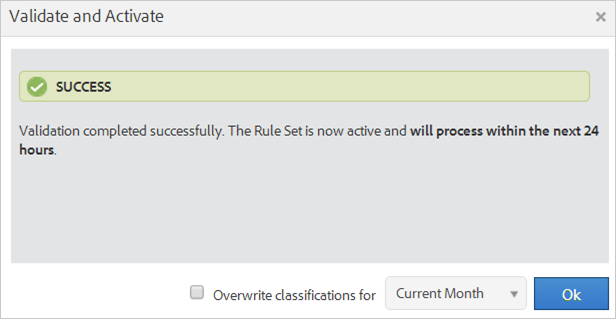
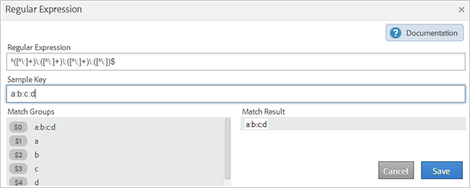
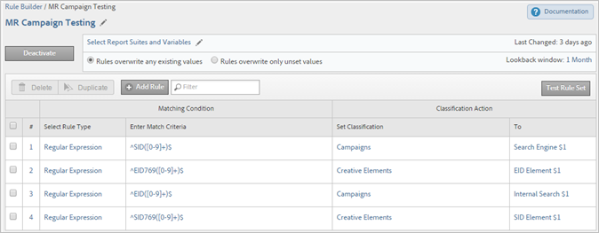

# Classification rules

Classification rules regularly look for unclassified terms. If a rule match is found, the rules add the terms to your classification data tables automatically. You can also use classification rules to overwrite existing keys.

**[!UICONTROL Analytics]** > **[!UICONTROL Admin]** > **[!UICONTROL Classification Rule Builder]**

The Rule Builder lets you create a *classification rule set*, which is a list of *classification rules*. A rule matches criteria you specify, then performs an action.

Classification rules are convenient for:

* **Email** and **Display ads**: Create classification rules to group individual display ad campaigns so that you can learn how the Display campaigns are performing against email campaigns.

* **Tracking codes**: Create classification rules to categorize key values derived from strings in tracking codes, and match them to specific criteria you define.
* **Search terms**: Use [regular expressions](/help/components/classifications/crb/classification-quickstart-rules.md) and wildcards to simplify classifying of search terms. For example if a search term contains *`baseball`*, you can set a *`Sports League`* classification to *`MLB`*.

For example, assume that a tracking code for an email campaign ID is:

`em:Summer:2013:Sale`.

You can set up three rules in a rule set that identify the parts of the string, then classify the values: 

| Select Rule Type  | Enter Match Criteria  | Set Classification  | To  |
|---|---|---|---|
| Starts With  | em:  | Channel  | Email  |
| Ends With  | Sale  | Type  | Sale  |
| Contains  | 2013  | Year  | 2013  |

## How Rules Are Processed {#how-rules-are-processed}

Important information about how classification rules are processed.

<!-- 

about_classification_rules.xml

 -->

* [Important Information about Rules](/help/components/classifications/crb/classification-rule-builder.md) 
* [When Do Rules Not Classify Keys?](/help/components/classifications/crb/classification-rule-builder.md) 
* [About Rule Priority](/help/components/classifications/crb/classification-quickstart-rules.md)

>[!NOTE]
>
>The [!UICONTROL Rule Builder] does not support Numeric 2 classifications.

## Important Information about Rules 

* Specify [group permissions](https://experienceleague.adobe.com/docs/analytics/admin/user-product-management/user-groups/groups.html) for classifications in [!UICONTROL Admin Tools].

* **Regular expressions**: Help is available under [Regular Expressions in Classification Rules](/help/components/classifications/crb/classification-quickstart-rules.md).

* **Report suites**: You cannot choose a classification until at least one report suite is selected. You cannot apply the report suite until you have created the rule set and assigned a variable.

  When you test the rule set, use keys (the variable being classified) from the report to see how they will be impacted by the rule set. (The [key](/help/components/classifications/importer/c-saint-data-files.md) is the variable being classified, or the first column in the classification upload table.) 

* **Rule priority**: If a key matches multiple rules that set the same classification (in the [!UICONTROL Set Classification] column), the last rule that matches the classification is used. See [About Rule Priority](/help/components/classifications/crb/classification-quickstart-rules.md).

* **Limits on number of rules**: No set limit exists for the number of rules you can create. However, a large number of rules may impact browser performance.
* **Processing**: Rules are processed at frequent intervals, depending on your volume of classification related traffic.

  Active rules process every four hours, examining classification data going back typically one month. The rules automatically check for new values and upload the classifications using the importer.

* **Overwriting existing classifications**: See [When Do Rules Not Classify Keys?](/help/components/classifications/crb/classification-quickstart-rules.md) If necessary, you can delete or remove existing classifications, using the importer.

## When Do Rules Not Classify Keys? 

When you activate rules, you can overwrite existing classifications. In the following situations, a classification rule does not classify a [key](/help/components/classifications/importer/c-saint-data-files.md)(variable) if:

* The key is already classified and you do not select [Overwrite Classifications](/help/components/classifications/crb/classification-rule-definitions.md).

  You can overwrite classifications when [adding and activating](/help/components/classifications/crb/classification-quickstart-rules.md) a rule, and when activating a data connectors integration. (For data connectors, rules are created by partners in the Dev Center and displayed in the [!UICONTROL Classification Rule Builder].) 

* A classified key has not appeared in the data after a time frame specified when overwriting a key, even after you enable [Overwrite Classifications](/help/components/classifications/crb/classification-rule-definitions.md).
* The key is not classified and the key is never passed into [!DNL Adobe Analytics] after the time frame beginning about one month ago.

  >[!NOTE]
  >
  >In reports, classifications apply to any time frame specified, whenever a key exists. The date range of a report does not affect reporting.



## Regular Expressions in Classification Rules {#regex-in-classification-rules}

Use regular expressions to match consistently formatted string values with a classification. For example, you can create a classification from specific characters in a tracking code. You can match particular characters, words, or patterns of characters.

<!-- 

regex_classification_rules.xml

 -->

* [Regular Expression - Tracking Code Example](/help/components/classifications/crb/classification-quickstart-rules.md#section_2EF7951398EB4C2F8E52CEFAB4032669) 
* [Regular Expression - Classifying a Specific Character](/help/components/classifications/crb/classification-quickstart-rules.md#section_5D300C03FA484BADACBFCA983E738ACF) 
* [Regular Expressions - Matching Tracking Codes of Varying Length](/help/components/classifications/crb/classification-quickstart-rules.md#section_E86F5BF5C2F44ABC8FFCE3EA67EE3BB2) 
* [Regular Expressions - "Does Not Contain" Example](/help/components/classifications/crb/classification-quickstart-rules.md#section_FCA88A612A4E4B099458E3EF7B60B59C) 
* [Regular Expressions - Reference Table](/help/components/classifications/crb/classification-quickstart-rules.md#section_0211DCB1760042099CCD3ED7A665D716)

>[!NOTE]
>
>As a best practice, regular expressions are best suited for tracking codes that use delimiters.

## Regular Expression - Tracking Code Example {#section_2EF7951398EB4C2F8E52CEFAB4032669}

>[!NOTE]
>
>If the tracking code is URL encoded, it will **not** be classified by the Rules Builder.

In this example, assume you want to classify the following campaign ID:

[!UICONTROL Sample Key]: `em:JuneSale:20130601`

The parts of the tracking code you want to classify are:

* `em` = email 
* `JuneSale` = campaign name 
* `20130601` = date

[!UICONTROL Regular Expression]: `^(.+)\:(.+)\:(.+)$`

How the regular expression correlates to the campaign ID:


[!UICONTROL Match Groups]: Shows how the regular expression corresponds to the campaign ID characters, so that you can classify a position in the campaign ID.


This example tells the rule that the campaign date `20140601` is at the third group `(.+)`, identified by `$3`.

**[!UICONTROL Rule Builder]**

In the [!UICONTROL Rule Builder], configure the rule as follows: 

| Select Rule Type  | Enter Match Criteria  | Set Classification  | To  |
|---|---|---|---|
| Regular Expression  | &Hat;(.+)\:(.+)\:(.+)$  | Campaign Date  | $3  |

**Syntax** 

| Regular Expression | String or Match Result | Corresponding Match Groups |
|--- |--- |--- |
|`^(.+)\:(.+)\:(.+)$`|em:JuneSale:20130601|`$0`: em:JuneSale:20130601  `$1`: em  `$2`: JuneSale  `$3`: 20130601|
|Building the syntax|`^` = starts the line  () = groups characters and lets you extract matching characters in the parentheses.  `(.+)` = captures one ( . ) character and ( + ) any more  \ = start of a string.  `$` = indicates that the preceding character (or character group) is the last in the line.|

See [Regular Expressions - Reference Table](/help/components/classifications/crb/classification-quickstart-rules.md#section_0211DCB1760042099CCD3ED7A665D716) for information about what the characters in a regular expression mean.

## Regular Expression - Classifying a Specific Character {#section_5D300C03FA484BADACBFCA983E738ACF}

One way to use a regular expression is to classify a specific character in a string of characters. For example, assume that the following tracking code contains two important characters:

[!UICONTROL Sample Key]: `4s3234`

* `4` = brand name 
* `s` = identifies a search engine, such as Google


**[!UICONTROL Rule Builder]**

In the [!UICONTROL Rule Builder], configure the rule as follows: 

| Select Rule Type | Enter Match Criteria | Set Classification | To |
|--- |--- |--- |--- |
|Regular Expression|`^.(s).*$`|Brand and Engine|`$0` (Captures the first two characters for brand name and search engine.)|
|Regular Expression|`^.(s).*$`|Search Engine|`$1` (Captures the second character for Google.)|

## Regular Expressions - Matching Tracking Codes of Varying Length {#section_E86F5BF5C2F44ABC8FFCE3EA67EE3BB2}

This example shows how to identify specific characters between colon delimiters when you have tracking codes of varying lengths. Adobe recommends using one regular expression for each tracking code.

Sample Keys:

* `a:b` 
* `a:b:c` 
* `a:b:c:d`

**Syntax**




**[!UICONTROL Rule Builder]**

In the [!UICONTROL Rule Builder], configure the rule as follows: 

| Select Rule Type | Enter Match Criteria | Set Classification | To |
|--- |--- |--- |--- |
|Regular Expression  For match string a:b|`^([^\:]+)\:([^\:]+)$`|a|`$1`|
|Regular Expression  For match string a:b|`^([^\:]+)\:([^\:]+)$`|b|`$2`|
|Regular Expression  For match string a:b:c|`^([^\:]+)\:([^\:]+)\:([^\:]+)$`|a|`$1`|
|Regular Expression  For match string a:b:c|`^([^\:]+)\:([^\:]+)\:([^\:]+)$`|b|`$2`|
|Regular Expression  For match string a:b:c|`^([^\:]+)\:([^\:]+)\:([^\:]+)$`|c|`$3`|
|Regular Expression  For match string a:b:c:d|`^([^\:]+)\:([^\:]+)\:([^\:]+)\:([^\:])$`|d|`$4`|

## Regular Expressions - "Does Not Contain" Example {#section_FCA88A612A4E4B099458E3EF7B60B59C}

This example provides a regular expression that matches any string that does not contain specific characters, in this case `13`.

Regular expression:

`^(?!.*13.*).*$`

Test strings:

```
a:b:
a:b:1313
c:d:xoxo
c:d:yoyo
```

Match results:

```
a:b:
c:d:xoxo
c:d:yoyo
```

In this result, `a:b:1313` does not indicate a match.

## Regular Expressions - Reference Table {#section_0211DCB1760042099CCD3ED7A665D716}

| Expression | Description |
|---|---|
|  `(?ms)`  | Makes the entire regular expression match against a multi-line input, allowing the . wildcard to match any newline characters  |
|  (`?i`)  | Makes the entire regular expression case insensitive  |
|  [`abc`]  | A single character of: a, b or c  |
|  [`^abc`]  | Any single character except: a, b, or c  |
|  [`a-z`]  | Any single character in the range a-z  |
|  [`a-zA-Z`]  | Any single character in the range a-z or A-Z  |
|  `^`  | Start of line (matches the beginning of the line)  |
|  `$`  | Match the end of the line (or before newline at the end)  |
|  `\A`  | Start of string  |
|  `\z`  | End of string  |
|  `.`  | Match any character (except a new line)  |
|  `\s`  | Any whitespace character  |
|  `\S`  | Any non-whitespace character  |
|  `\d`  | Any digit  |
|  `\D`  | Any non-digit  |
|  `\w`  | Any word character (letter, number, underscore)  |
|  `\W`  | Any non-word character  |
|  `\b`  | Any word boundary  |
|  `(...)`  | Capture everything enclosed  |
|  `(a\b)`  | a or b  |
|  `a?`  | Zero or one of a  |
|  `a*`  | Zero or more of a  |
|  `a+`  | One or more of a  |
|  `a{3}`  | Exactly 3 of a  |
|  `a{3,}`  | 3 or more of a  |
|  `a{3,6}`  | Between 3 and 6 of a  |

A good resource for testing regular expression validity is [https://rubular.com/](https://rubular.com/).

## About Rule Priority 

If a key is matched to multiple rules, and it sets the same classification column shown in the [!UICONTROL Set Classification] column, the last rule is used. As such, you might want to rank the most important last in your rule set.

<!-- 

rule_priority.xml

 -->

If you create multiple rules that do not share the same classification, processing order does not matter.

What follows a search-term rule example that classifies search types for an athlete: 

|  Rule Number  | Rule Type  | Match  | Set Classification  | To  |
|---|---|---|---|---|
|  1  | Contains  | Cowboys  | Search Type  | Team  |
|  2  | Contains  | Fantasy  | Search Type  | Fantasy  |
|  3  | Contains  | Romo  | Search Type  | Player  |

If a user searches for *`Cowboys fantasy Tony Romo`*, the term *`Player`* is classified, because it matches the last given classification shown in the Set Classification column.

Similarly, suppose you set up two rules in a set for the following search terms: 

|  Rule Number  | Rule Type  | Match  | Set Classification  | To  |
|---|---|---|---|---|
|  1  | Contains  | Cowboys  | City  | Dallas  |
|  2  | Contains  | Broncos  | City  | Denver  |

A user searches for *`Cowboys vs. Broncos`*. If the rule builder finds a conflict in rule matching, the classification for the second rule (Denver) applies to this search.

## Add a Classification Rule to a Rule Set {#add-classification-to-rule-set}

<!-- 

t_classification_rule.xml

 -->

Add rules by matching a condition to a classification, and specifying the action.

>[!NOTE]
>
>In this procedure, you must apply the rules to one or more report suites. The recommended number of rules per rule set is between 500 and 1000, although there are no limits. If you have over 100 rules, consider simplifying your rule set by using [sub-classifications](/help/components/classifications/c-sub-classifications.md).

To add or edit a classification rule:

1. [Create a Classification Rule Set](/help/components/classifications/crb/classification-rule-set.md) .
1. On the rule set page, click **[!UICONTROL Add Rule]**.

   

1. Next to **[!UICONTROL Report Suites]**, click **[!UICONTROL Add Suites]** to specify one or more report suites to assign to this rule set.

   The **[!UICONTROL Select Report Suites]** page displays.

   >[!NOTE]
   >
   >Report suites display on this page *only* when the following conditions are met:
   >
   >* The report suites have at least one classification defined for that variable in [!UICONTROL Admin Tools].
   >
   >   (See *Variable* in [Classification Rule Sets](/help/components/classifications/crb/classification-rule-set.md) for an explanation about this prerequisite.)
   >
   >* You selected the report suite on the **[!UICONTROL Available Report Suites]** page, which displays after you click [Add Rule Set](/help/components/classifications/crb/classification-rule-set.md) to create the rule set.

1. Specify whether to overwrite existing values:

   | **Rules overwrite any existing values** | (Default setting) Always overwrite existing classification keys, including classifications uploaded via the importer (SAINT). |
   |---|---|
   | **Rules overwrite only unset values** | Only fill in blank (unset) cells. Existing classifications will not be changed. |

1. [Define the rule or rules](/help/components/classifications/crb/classification-rule-definitions.md#section_4A5BF384EEEE4994B6DC888339833529).

   

   For examples of building rules, see [Classifications Rule Builder](/help/components/classifications/crb/classification-rule-builder.md) and [Regular Expressions in Classification Rules](/help/components/classifications/crb/classification-quickstart-rules.md).

   >[!NOTE]
   >
   >If a key matches multiple rules that set the same classification (in the Set Classification column), the last rule that matches the classification is used. See **About Rule Priority** above for more information about sorting rules.

1. [Test your rule set](/help/components/classifications/crb/classification-quickstart-rules.md).
1. After testing, click **[!UICONTROL Active]** to validate and activate the rule.

   Activating a rule automatically builds the file and uploads it for you.

   Field definitions: See [Classification Rule Builder](/help/components/classifications/crb/classification-rule-definitions.md) for complete definitions of interface options on this page.

## Test a Classification Rule Set 

<!-- 

t_classifications_test_rule.xml

 -->

You can test a classification rule or rule set. Running a test checks all the rules in a set.

To test a Classification Rule Set:

1. [Create a Classification Rule Set](/help/components/classifications/crb/classification-rule-set.md) .
1. On the [!UICONTROL Classification Rule Builder], click the rule set name.
1. Ensure that the rule set is associated with a report suite.
1. On the rule editor, click **[!UICONTROL Test Rule Set]**.

   

1. Type or paste test keys in the [!UICONTROL Sample Keys] field.

   Sample keys include:

    * Tracking codes 
    * Search keywords or phrases

   See [Regular Expressions in Classification Rules](/help/components/classifications/crb/classification-quickstart-rules.md) for information about testing regular expressions.
1. Click **[!UICONTROL Run Test]**.

   Rules that match are displayed in the [!UICONTROL Results] table.
1. (Optional) Click **[!UICONTROL Activate]** to activate the rule, and to overwrite existing classifications.

   See for more information about using rules to overwrite existing classifications.

## Validate and Activate Classification Rules 

<!-- 

t_validate_rules.xml

 -->

To validate and activate classification rules:

1. [Create a Classification Rule Set](/help/components/classifications/crb/classification-rule-set.md) , then [add classification rules](/help/components/classifications/crb/classification-quickstart-rules.md) to the set.
1. On the rule editor, click **[!UICONTROL Activate]**.

   

1. (Optional) To overwrite classifications, enable **[!UICONTROL Overwrite classifications for]** <*selection*>.

   This option lets you overwrite existing classifications for affected keys.

   See [Rules Page](/help/components/classifications/crb/classification-rule-definitions.md#section_4A5BF384EEEE4994B6DC888339833529) for a definition of this option.
