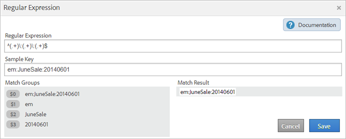

# Classification rules - definitions

Definitions of interface elements on the pages in the Classification Rule Builder.

## Rules Page {#section_4A5BF384EEEE4994B6DC888339833529}

This page displays the rules in a rule set.

**Definitions** 

<table id="table_2B3A8BB7BDE14836ACA6A1D444B011CD"> 
 <thead> 
  <tr> 
   <th colname="col1" class="entry"> Element </th> 
   <th colname="col2" class="entry"> Description </th> 
  </tr> 
 </thead>
 <tbody> 
  <tr> 
   <td colname="col1"> 
Select Report Suites and Variables 
 </td> 
   <td colname="col2"> 
<b>Report Suite</b> 
 
The report suites to which the rule set applies. 
 
<b>Variable</b> 
 
You can apply only one variable when creating a classification rule set. If you want to create multiple rule sets for one variable, you must apply each rule set to multiple report suites. 
 
Note: You can use only the variables you have access to in your report suites. Variables will display in the  New Rule Set panel only after they have at least one classification defined for that variable. 
 
 You can create classifications on a variable in  Admin &gt;  Report Suites &gt;  Traffic &gt;  Traffic Classifications (or  Conversion &gt;  Conversion Classifications). Then select the variable, then click  Add Classification. 
 
See <a href="https://experienceleague.adobe.com/docs/analytics/admin/admin-tools/traffic-variables/traffic-classifications.html"  > Traffic Classifications</a> and <a href="https://experienceleague.adobe.com/docs/analytics/admin/admin-tools/conversion-variables/conversion-classifications.html"  > Conversion Classifications</a> in Admin Help. 
 </td> 
  </tr> 
  <tr> 
   <td colname="col1"> 
 Activate 
 </td> 
   <td colname="col2"> 
Validates and activates a rule. Active rules process daily, examining classification data going back typically one month. The rules automatically check for new values and upload the classifications. 
 </td> 
  </tr> 
  <tr> 
   <td colname="col1"> 
 Deactivate 
 </td> 
   <td colname="col2"> 
Deactivates the rules so that you can edit and test them. 
 </td> 
  </tr> 
  <tr> 
   <td colname="col1"> 
Configure Report Suites and Variables 
 </td> 
   <td colname="col2"> 
Displays the  Available Report Suites page, where you can select one or more available report suites to use for all your rule sets. (This page also displays when you first run the  Classification Rule Builder.) 
 
This feature is intended to help reduce report suite load time, in the event that you have hundreds of available report suites. 
 
The report suites you select here are made available at the rule level, when you click  Add Suites when creating a rule. 
 
Note: A report suite becomes available  only when the report suites have at least one classification defined for the variable in  Admin Tools. 
(See  Variable in <a href="/help/components/classifications/crb/classification-rule-set.md"  > Classification Rule Sets</a> for an explanation about this prerequisite.) 
 
 </td> 
  </tr> 
  <tr> 
   <td colname="col1"> 
Rules overwrite any existing values 
 </td> 
   <td colname="col2"> 
 (Default setting) Always overwrite existing classification keys, including classifications uploaded via the importer (SAINT). 
 </td> 
  </tr> 
  <tr> 
   <td colname="col1"> 
Rules overwrite only unset values 
 </td> 
   <td colname="col2"> 
Only fill in blank (unset) cells. Existing classifications will not be changed. 
 </td> 
  </tr> 
  <tr> 
   <td colname="col1"> 
Lookback window 
 </td> 
   <td colname="col2"> 
When you activate and validate rules, you can specify whether the rules should overwrite existing classifications for affected keys. (Only classified keys that have been previously passed into  Adobe Analytics within the time period you specify are affected.) 
 
If you to not specify a  lookback window, the rules look back roughly one month (depending on current day of the month.) Existing classifications are never overwritten unless you enable this option. 
 
<b>Dev Center</b>: Partners can create classification rules in the  Dev Center. These rules are deployed when the customer activates an integration. In the  Dev Center, the  Overwrite Since option lets the partner specify whether the customer can determine the overwrite value when activating or editing an integration. 
 
See <a href="/help/components/classifications/crb/classification-quickstart-rules.md"  > How Rules Are Processed</a> for more information about rule processing. 
 </td> 
  </tr> 
  <tr> 
   <td colname="col1"> <a href="/help/components/classifications/crb/classification-quickstart-rules.md"  > Add Rule </a> </td> 
   <td colname="col2"> 
Lets you add rules to the rule set. 
 
Note:  If a value is matched twice or more in a set of rules, the system uses the last rule to classify the value. 
 </td> 
  </tr> 
  <tr> 
   <td colname="col1">  Draft </td> 
   <td colname="col2"> Lets you specify that a rule is in draft mode. Draft status lets you test the rule before running it. </td> 
  </tr> 
  <tr> 
   <td colname="col1">  Duplicate </td> 
   <td colname="col2"> Duplicates (copies) a rule set, so that you can apply the rule set to another variable, or to the same variable in a different report suite. </td> 
  </tr> 
  <tr> 
   <td colname="col1"> 
 <a href="/help/components/classifications/crb/classification-quickstart-rules.md"  > Test Rule Set </a> 
 </td> 
   <td colname="col2"> 
Lets you test the validity of a rule set. 
 </td> 
  </tr> 
  <tr> 
   <td colname="col1">  Matching Condition </td> 
   <td colname="col2"> Specifies the conditions you want that for the rule. </td> 
  </tr> 
  <tr> 
   <td colname="col1">  Classification Action </td> 
   <td colname="col2"> 
Specifies the action to take when the Matching Condition occurs. 
 
For example, you set a Campaign Name to $2, which identifies position 2 in a tracking code as the Campaign Name. 
 </td> 
  </tr> 
  <tr> 
   <td colname="col1">  # </td> 
   <td colname="col2"> 
The rule number. 
 
See <a href="/help/components/classifications/crb/classification-quickstart-rules.md"  > How Rules Are Processed</a> for more information. 
 </td> 
  </tr> 
  <tr> 
   <td colname="col1">  Select Rule Type </td> 
   <td colname="col2"> 
Each rule set applies to a specific variable. Valid selections are: 
 
    <ul id="ul_6A8E06BB4AF2402B99C215823CB3D59D"> 
     <li id="li_5C702D4F460841D38A59621A5161A3BC">Starts With </li> 
     <li id="li_8052A741D9F34A2FBC136C181600193E">Ends With </li> 
     <li id="li_D0FA6EA4F09644FFBC9E6BC568BE80AC">Contains </li> 
     <li id="li_48675FE5253942ED887C6A72D1DCEF54"> <a href="/help/components/classifications/crb/classification-quickstart-rules.md"  > Regular Expression </a> </li> 
    </ul> </td> 
  </tr> 
  <tr> 
   <td colname="col1">  Enter Match Criteria </td> 
   <td colname="col2"> The text pattern you are looking for in a key. These criteria can be search terms, characters, or regular expression. </td> 
  </tr> 
  <tr> 
   <td colname="col1">  Set Classification </td> 
   <td colname="col2"> The classification column you want to set if the match criteria are met. </td> 
  </tr> 
  <tr> 
   <td colname="col1">  To </td> 
   <td colname="col2"> The value you want to specify for the selected classification column if the match criteria is met. </td> 
  </tr> 
  <tr> 
   <td colname="col1"> Filter </td> 
   <td colname="col2"> Lets you search for rules. </td> 
  </tr> 
 </tbody> 
</table>

## Regular Expression Page {#section_C932A5469E774841B2229965A154163C}

You can edit regular expressions on the [!UICONTROL Regular Expression] page.

**Definitions** 

|  Element  | Description  |
|---|---|
|  Sample Key  | The test string to use. For example, you can create a classification from specific characters in a tracking code. You can match particular characters, words, or patterns of characters.  |
|  Match Groups  | Shows how the regular expression corresponds to the campaign ID characters, so that you can classify a position in the campaign ID.  |
|  Match Result  | Displays the parts of a string that successfully match the regular expression.  |

See [Regular Expressions in Classification Rules](/help/components/classifications/crb/classification-quickstart-rules.md).

## Testing Page {#section_EC926F97901C4E65901413F9683AA70A}

This page lets you test rules in a set.

**Definitions** 

|  Element  | Description  |
|---|---|
|  Run Test  | When you test the rule set, use keys from the report to see how they will be impacted by the rule set.  |
|  Filter  |Filters the values in the [!UICONTROL Results] panel.  |
