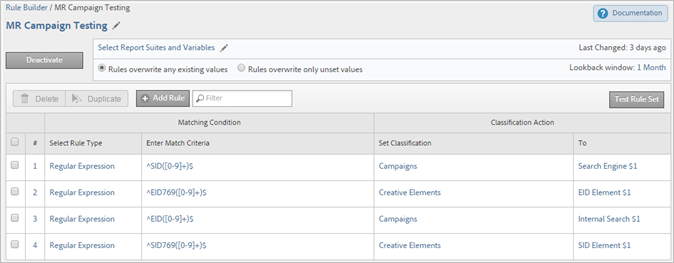

# Classification rule sets

A rule set is a group of classification rules for a specific variable. You apply a variable to the rule set. If you want to create multiple rule sets for one variable, you must apply each rule set to multiple report suites.

## Classification Rule Builder Page {#section_C60B0888C76D49C596EF19F11808B718}

**[!UICONTROL Analytics]** > **[!UICONTROL Admin]** > **[!UICONTROL Classification Rule Builder]**

The following fields and options are available on the [!UICONTROL Classifications Rule Builder].

<table id="table_A5D92409969747E39E041216A5AA32CD"> 
 <thead> 
  <tr> 
   <th colname="col1" class="entry"> Element </th> 
   <th colname="col2" class="entry"> Description </th> 
  </tr> 
 </thead>
 <tbody> 
  <tr> 
   <td colname="col1"> 
<a href="/help/components/classifications/crb/classification-rule-set.md"  > Add Rule Set</a> 
 </td> 
   <td colname="col2"> 
Creates a rule set. 
 </td> 
  </tr> 
  <tr> 
   <td colname="col1"> 
Rules 
 </td> 
   <td colname="col2"> Displays the number of rules contained in the set. </td> 
  </tr> 
  <tr> 
   <td colname="col1"> 
Status 
 </td> 
   <td colname="col2"> Displays the activity status of the rule set, such as Draft or Active. Active rules process daily, examining classification data going back typically one month. The rules automatically check for new values and upload the classifications. </td> 
  </tr> 
  <tr> 
   <td colname="col1"> 
Last Changed 
 </td> 
   <td colname="col2"> Indicates when the rule set was edited. </td> 
  </tr> 
  <tr> 
   <td colname="col1"> 
Duplicate 
 </td> 
   <td colname="col2"> Duplicates (copies) a rule set, so that you can apply the rule set to another variable, or to the same variable in a different report suite. </td> 
  </tr> 
 </tbody> 
</table>

## Create a Classification Rule Set {#create-classification-rule-set}

Name the classification rule set, apply the variable, and specify overwrite settings.

1. (Prerequisite) Define the classification structure in **[!UICONTROL Admin]** > **[!UICONTROL Report Suites]**.

   (See [Classifications](https://experienceleague.adobe.com/docs/ analytics/components/classifications/c-classifications.html) in Admin Tools help on adding classifications.)

   Variables will display in the [!UICONTROL New Rule Set] panel only after they have at least one classification defined for that variable.

   You can create classifications on a variable in **[!UICONTROL Admin]** > **[!UICONTROL Report Suites]** > **[!UICONTROL Traffic]** > **[!UICONTROL Traffic Classifications]** (or **[!UICONTROL Conversion]** > **[!UICONTROL Conversion Classifications]**). Then select the variable, then click **[!UICONTROL Add Classification]**.

1. To create the rule set, click **[!UICONTROL Admin]** > **[!UICONTROL Classification Rule Builder]** > **[!UICONTROL Add Rule Set]**.

   

1. Name the rule set, then click **[!UICONTROL Create Rule Set]**.
1. Select the rule set for edit.

   

1. Click **[!UICONTROL Select Report Suites and Variables]**.

   The report suite and variable list is populated with all classified variables available in all the report suites in your log-in company. A single variable in a report suite can belong to only one rule set.

   See *`Variable`* in the definitions for the [Classification Rule Builder](/help/components/classifications/crb/classification-rule-definitions.md) page for more information.
1. Specify the report suites and variables to use, then click **[!UICONTROL Save]**.
1. Continue by [adding classification rules](/help/components/classifications/crb/classification-rule-set.md) to the rule set.
