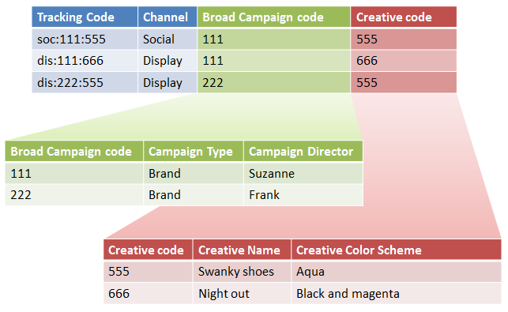

# Sub-classifications and the Rule Builder

You can combine the Classification Rule Builder with sub-classifications if you ensure that every sub classification has a parent value.

Combining the Classification Rule Builder with sub-classifications can simplify classification management and reduce the number of rules required. You might want to do this if your tracking code consists of codes that you would like to classify separately.

See [Sub-Classifications](/help/components/classifications/c-sub-classifications.md) for conceptual information about sub-classifications.

## Example

Assume the following tracking code:

`channel:broad_campaign:creative`

A classification hierarchy allows you to apply a classification to a classification (called *`sub-classification`*). Meaning, you can use the importer like a relational database, with multiple tables. One table maps full tracking codes to keys, and another maps those keys to other tables.

After you have this structure in place, you can use the [Classifications Rule Builder](/help/components/classifications/crb/classification-rule-builder.md) to upload small files that only update the lookup tables (the green and red tables in the preceding image). Then, you can use the rule builder to keep the main classification table up-to-date.

The following task describes how to accomplish this.

## Set up Sub-Classifications using the Rule Builder{#task_2D9016D8B4E84DBDAF88555E5369546F}

Example steps that describe how you can upload sub-classifications using the Rule Builder.

>[!NOTE]
>
>These steps describe how to accomplish the use case described in [Sub-Classifications and the Rule Builder](/help/components/classifications/crb/sub-classification-rule-builder.md).

1. Create classifications and sub-classifications in the [Classification Manager](https://experienceleague.adobe.com/docs/analytics/components/classifications/c-classifications.html).

   Example:

   

1. In the [Classifications Rule Builder](/help/components/classifications/crb/classification-rule-builder.md), classify the sub-classification key from the original tracking code.

   You perform this using a regular expression. In this example, the rule to populate *`Broad Campaign code`* would use this regular expression: 

   |  `#`  | Rule Type  | Match  | Set Classification  | To  |
   |---|---|---|---|---|
   |   | Regular Expression  | `[^\:]:([^\:]):([^\:]`)  | Broad Campaign code  | `$1`  |
   |   | Regular Expression  | `[^\:]:([^\:]):([^\:]`)  | Creative code  | `$2`  |

   >[!NOTE]
   >
   >At this point, you do not populate the sub-classifications *`Campaign Type`* and *`Campaign Director`*.

1. Upload a classification file that includes only the sub-classifications specified.

   See [Multiple-Level Classifications](/help/components/classifications/c-sub-classifications.md).

   Example: 

   |  Key  | Channel  | Broad Campaign code  | Broad Campaign code&Hat;Campaign type  | Broad Campaign code&Hat;Campaign Director  | ...  |
   |---|---|---|---|---|---|
   |  &#42;  |  | 111  | Brand  | Suzanne  |  |
   |  &#42;  |  | 222  | Brand  | Frank  |  |

1. To maintain the lookup tables, upload a small file (as shown above).

   You would upload this file, for example, when a new *`Broad Campaign code`* is introduced. This file would apply to previously classified values. Likewise, if you create a new sub-classification (such as *`Creative Theme`* as a sub-classification of *`Creative code`*), you upload only the sub-classification file, rather than the entire classification file.

   For reporting these sub-classifications function exactly like top-level classifications. This reduces the management burden required to use them.-->
