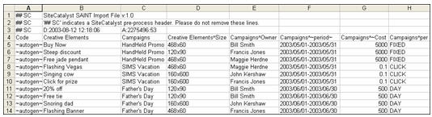

# Classification data files

The importer lets you bulk-upload classifications data to analytics reporting in a file. The import requires a specific file format for successful data uploads.

To help you create valid data files, you can download a template file that provides a file structure into which you can paste the classifications data. For more information, see [Download Classifications Template](/help/components/classifications/importer/c-download-saint-data.md).

See [General File Structure](/help/components/classifications/importer/c-saint-data-files.md) for more information about character limits in classifications.

## General file structure

The following illustration is a sample data file:



A data file must adhere to the following structure rules:

* Classifications cannot have a value of 0 (zero).
* Adobe recommends that you limit the number of import and export columns to 30.
* Uploaded files should use UTF-8 without BOM character encoding.
* Special characters, such as a tabs, newlines, and quotes can be embedded within a cell provided the v2.1 file format is specified and the cell is properly [escaped](/help/components/classifications/importer/t-classifications-escape-data.md). Special characters include:

  ```text
  \t     tab character 
  \r     form feed character 
  \n    newline character 
  "       double quote
  ```

  The comma is not a special character.

* Classifications cannot contain a caret (^) since this character is used to denote a sub-classification.
* Use care when using a hyphen. For example, if you use a hyphen (-) in a Social term, Social recognizes the hyphen as a [!DNL Not] operator (the minus sign). For example, if you specify *`fragrance-free`* as a term using the import, Social recognizes the term as fragrance *`minus`* free and collects posts that mention *`fragrance`*, but not *`free`*.
* Character limits are enforced to classify report data. For example, if you upload a classifications text file for products ( *`s.products`*) with product names longer than 100 characters (bytes), the products will not display in reporting. Tracking Codes and all custom conversion variables (eVars) allow 255 bytes.
* Tab-delimited data file (create the template file using any spreadsheet application or text editor).
* Either a [!DNL .tab] or [!DNL .txt] file extension.
* A pound sign (#) identifies the line as a user comment. Adobe ignores any line that begins with #.
* A double-pound sign followed by SC (## SC) identifies the line as a pre-processing header comment used by reporting. Do not delete these lines.
* Classification exports can have duplicate keys due to newline characters in the key. In an FTP or browser export, this can be resolved by turning on quoting for the FTP account. This will place quotes surrounding each key with newline characters.
* Cell C1 in the first line of the import file contains a version identifier that determines how classifications handle the use of quotes throughout the remainder of the file.

  * v2.0 ignores quotes and assumes they are all part of the keys and values specified. For example, consider this value: "This is ""some value""". v2.0 would interpret this literally as: "This is ""some value""".
  * v2.1 tells classifications to assume that quotes are part of the file formatting used in Excel files. So v2.1 would format the above example to: This is "some value".
  * Problems can arise when v2.1 is specified in the file, but what is actually wanted is v2.0 - namely, when quotes are used in ways that is illegal under Excel formatting. For example, if you have a value: "VP NO REPS" S/l Dress w/ Overlay. With v2.1, this is incorrect formatting (the value should be surrounded by opening and closing quotes and quotes that are part of the actual value should be escaped by quotes) and classifications will not work beyond this point.
  * Make sure that you do one of the following: change your file format to v2.0 by changing the header (cell C1) in the files you upload, OR properly implement Excel quoting throughout your files.

* The first (non-comment) row of the data file contains the column headings used to identify the classification data in that column. The importer requires a specific format for column headings. For more information, see [Column Heading Format](/help/components/classifications/importer/c-saint-data-files.md).
* Immediately following the header row in a data file are the data rows. Each line of data should contain a data field for each column heading.
* The data file supports the following control codes, which Adobe uses to provide structure to the file, and correctly import classifications data: 

<table id="table_0548F2E58B6644208147434EB9B3C21B"> 
 <thead> 
  <tr> 
   <th colname="col1" class="entry"> CONTROL CODE </th> 
   <th colname="col2" class="entry"> DESCRIPTION </th> 
  </tr> 
 </thead>
 <tbody> 
  <tr> 
   <td colname="col1"> <p>&lt;New Line&gt; </p> </td> 
   <td colname="col2"> <p>A new line character is the only supported delimiter between data lines/records in the data file. Typically, you only need to specifically insert these characters when writing a program to automatically generate data files. </p> </td> 
  </tr> 
  <tr> 
   <td colname="col1"> <p>~autogen~ </p> </td> 
   <td colname="col2"> <p>Requests that Adobe automatically generate a unique id for this element. </p> <p>In the campaign context, this control value instructs Adobe to assign an identifier to each creative element. See <a href="/help/components/classifications/importer/c-saint-data-files.md"  > Key </a>. </p> </td> 
  </tr> 
  <tr> 
   <td colname="col1"> <p>~period~ </p> </td> 
   <td colname="col2"> <p>Designates that the data column represents the date range associated with the item. See <a href="/help/components/classifications/importer/c-saint-data-files.md"  > Date </a>. </p> </td> 
  </tr> 
  <tr> 
   <td colname="col1"> <p>Empty field </p> </td> 
   <td colname="col2"> <p>Represents a NULL value for the current field. Use this if a particular data column does not apply to the current record. </p> </td> 
  </tr> 
  <tr> 
   <td colname="col1"> <p>PER Modifiers </p> </td> 
   <td colname="col2"> <p>Designates that the data column represents a <span class="wintitle"> PER Modifier </span> field. See <a href="/help/components/classifications/importer/c-saint-data-files.md"  > PER Modifier Headings </a>. </p> </td> 
  </tr> 
 </tbody> 
</table>

>[!MORELIKETHIS]
>
>* [Common Upload Issues](https://helpx.adobe.com/analytics/kb/common-saint-upload-issues.html)

## Column heading format

>[!NOTE]
>
>Adobe recommends that you limit the number of import and export columns to 30.

Classification files support the following column headings:

### Key

Each value must be unique across the entire system. The value in this field corresponds to a value assigned to the [!DNL Analytics] variable in your Web site's [!DNL JavaScript] beacon. Data in this column might include ~autogen~ or any other unique tracking code.

### Classification column heading

For example, reports and analytics automatically include two classifications for [!UICONTROL Campaign] variables: [!UICONTROL Campaigns] and [!UICONTROL Creative Elements]. To add data to the [!UICONTROL Campaigns] classification, the column heading in the classification data file would be [!UICONTROL Campaigns].

>[!NOTE]
>
>The values in the [!UICONTROL Classifications] column heading must exactly match the classification's naming convention, or the import fails. For example, if the administrator changes [!UICONTROL Campaigns] to [!UICONTROL Internal Campaign Names] in the [!UICONTROL Campaign Set-up Manager], the file column heading must change to match.

Additionally, the data file supports the following additional heading conventions to identify sub-classifications and other specialized data columns:

### Sub-classification heading

For example, [!UICONTROL Campaigns^Owner] is a column heading for the column containing [!UICONTROL Campaign Owner] values. Similarly, [!UICONTROL Creative Elements^Size] is a column heading for the column containing the [!UICONTROL Size] sub-classification of the [!UICONTROL Creative Elements] classification.

### Classification metric headings

For example, [!UICONTROL Campaigns^~Cost] refers to the [!UICONTROL Cost] metric in the [!UICONTROL Campaigns] classification.

### PER modifier heading

*`Per Modifier`* headings are denoted by adding *`~per`* to the classification metric heading. For example, if the *`Metric`* heading is *`Campaigns^~Cost`*, the PER modifier heading is *`Campaigns^~Cost~per`*. Adobe supports the following *`PER Modifier`* keywords:

These characters have special meaning in a data file. Where possible, avoid using these words in attribute names and data.

**FIXED:** Fixed value. Do not perform any scaling.

**DAY:** Multiply the value by the number of days in the report.

**ORDER:** Multiply the value by the number of orders for the line item in the report.

**CHECKOUT:** Multiply the value by the number of checkouts for the line item in the report.

**UNIT:** Multiply the value by the number of units for the line item in the report.

**REVENUE:** Multiply the value by the revenue amount for the line item in the report.

**SCADD:** Multiply the value by the number of times the [!UICONTROL Shopping Cart Add] event was called per line item in the report.

**SCREMOVE:** Multiply the value by the number of times the [!UICONTROL Shopping Cart Remove] event was called per line item in the report.

**INSTANCE:** Multiply the value by the number of instances for the line item in the report.

**CLICK:** Multiply the value by the number of clicks for the line item in the report.

**EVENT:** Multiply the value by the number of times the specified custom event occurred per line item of the report.

**Example:** If Campaign A cost $10,000, the [!UICONTROL Campaigns^~Cost] column contains a value of 10000 and the [!UICONTROL Campaigns^~Cost~per] column contains [!UICONTROL FIXED]. When displaying the Cost for Campaign A in the reports, you will see $10,000 as the fixed cost for Campaign A for the date range.

**Example:** If Campaign B that costs approximately $2 per click, the [!UICONTROL Campaigns^~Cost] column contains 2 and the **[!UICONTROL Campaigns^~Cost~per]** column contains [!UICONTROL CLICK]. When displaying the Cost for Campaign B in the reports, Adobe calculates (2 &#42; [number of clicks]) on the fly for the date range of the report. This gives you a total cost calculation based on the number of clicks performed with Campaign B.

### Date

Campaigns dates are typically ranges (start and end dates) associated with individual campaigns. Dates should appear in YYYY/MM/DD format. For example, 2013/06/15-2013/06/30.

For more information, see [Conversion Classifications](https://experienceleague.adobe.com/docs/analytics/admin/admin-tools/conversion-variables/conversion-classifications.html).

>[!NOTE]
>
>In the May 10, 2018, [!DNL Analytics] Maintenance release, Adobe started to limit the functionality of date-enabled and numeric classifications. These classification types were removed from the Admin and Classification Importer interfaces. No new date-enabled and numeric classifications can be added. Existing classifications can still be managed (uploaded to, deleted) through the standard classification workflow, and will continue to be available in reporting.

## Using dates in conjunction with [!UICONTROL classifications] {#section_966A07B228CD4643B258E73FB8BA150A}

[!UICONTROL Classifications] can be used to assign date ranges to your campaigns or other conversion [!UICONTROL classifications], which allows more accurate campaign measurement. After specifying a value's date range, any matching value that occurs outside the date range will not be classified. This is useful for campaign measurement that wishes to utilize the exact dates a campaign was Live, and not all hits matching the campaign itself. In order to successfully classify a value with a date range, the following must be met:

* The [!UICONTROL classification] must be based on a conversion variable.
* The [!UICONTROL classification] used must be set as Date-Enabled or Numeric 2.
* The involved date range must contain a start date and (optionally) an end date.

To classify campaigns based on date range:

>[!IMPORTANT]
>This option is not available for report suites enabled for the New Classification Architecture.

1. Log in to [!DNL Analytics] and go to Admin > Classifications.
1. Click the **[!UICONTROL Browser Export]** tab, ensure the settings to your date-enabled classification are correct, then click Export File.
1. Open this file in Microsoft Excel or another spreadsheet editor you are familiar with.
1. One of the columns will end with

   ^~period~
   which is the column to enter the date range in.
1. Under this column, enter each value's date range in the following format:

   `YYYY/MM/DD - YYYY/MM/DD`. Please ensure the following:

    * Leave spaces on both sides of the dash.
    * Use a hyphen (-) to separate ranges, not an en-dash or an em-dash.
    * If the month or day is a single digit, that there is a leading zero.
    * There is a start date range; the end date range is optional.

1. Save the file, and upload it to [!DNL Analytics] by going to Admin | Classifications | Import File.

>[!NOTE]
>
>A specific key value cannot have more than one date range.

## Troubleshooting classifications

* [Common Upload Issues](https://helpx.adobe.com/analytics/kb/common-saint-upload-issues.html): Knowledge Base article that describes issues arising from incorrect file formats and file contents.
