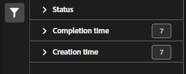

# Classification set consolidations manager

If you have multiple classification sets that contain similar data, you can consolidate them into a single classification set. When you consolidate two or more classification sets, Adobe generates a new classification set that contains all classification data from each individual classification set. Consolidations are useful when you have uploaded data to many report suites or dimensions that contain the same classification data and would like to merge them into a single workflow.

**[!UICONTROL Components]** > **[!UICONTROL Classification sets]** > **[!UICONTROL Consolidations]**

Once a consolidation is run, the original classification sets are removed, with the consolidated classification set taking their place. Click **[!UICONTROL Add]** to [Create a consolidation](process.md).

## Filter classification sets

The left side of the Classification set consolidation manager provides filter settings to locate the desired consolidation. Clicking the filter icon toggles the filter settings visibility. You can filter consolidations by **[!UICONTROL Status]**, **[!UICONTROL Completion time]**, or **[!UICONTROL Creation time]**.

Additional filter options are available above the Classification set consolidation manager columns:

* **[!UICONTROL Search by title]**: Search for consolidations by name.
* **Show/Hide columns**: Toggle visibility for any column besides [!UICONTROL Name].

## Classification set consolidation manager columns

The following columns are available in the Classification set consolidation manager:

* **[!UICONTROL Name]**: The name of the consolidation.
* **[!UICONTROL Current job]**: The current job. <!-- todo: better description -->
* **[!UICONTROL Status]**: The status of the consolidation. <!-- todo: get list of possible statuses -->
* **[!UICONTROL Creation date]**: The date and time that the consolidation was created.
* **[!UICONTROL Completion date]**: The date and time that the consolidation completed (or failed).
