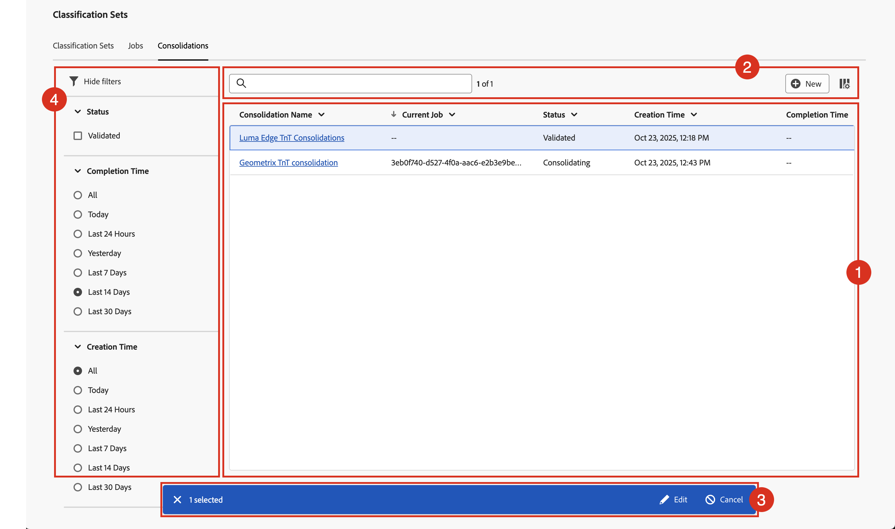

# Manage classification consolidations

If you have multiple classification sets that contain similar classification data, you can consolidate them into a single classification set. When you consolidate two or more classification sets, Adobe generates a new classification set that contains all classification data from each individual classification set. Consolidations are useful when you have uploaded data to many report suites. Or when you have dimensions that contain the same classification data and would like to merge them into a single workflow. 

You must have product admin access for Adobe Analytics to see the Classification set consolidation manager.

To manage classification consolidations:

1. Select **[!UICONTROL Components]** from the Adobe Analytics top menu bar, then select **[!UICONTROL Classification sets]**.
1. In **[!UICONTROL Classification Sets]**, select the **[!UICONTROL Consolidations]** tab.
   

## Classification consolidations manager

The **[!UICONTROL Classification Sets - Consolidations]** manager has the following interface elements:

### Classification consolidations list

The list ➊ displays classification consolidations that are created and validated, and that might be consolidating. The list has the following columns:

| Column | Description |
|---|---|
| **[!UICONTROL Consolidation Name]** | The name of the classification sets consolidation. |
| **[!UICONTROL Current Job]** | The job associated with the classification sets consolidation. |
| **[!UICONTROL Status]** | The status of the classification sets consolidation. Possible values are: **[!UICONTROL Created]**, **[!UICONTROL Canceled]**, **[!UICONTROL Canceling]**, **[!UICONTROL Validating]**, **[!UICONTROL Failed Validation]**, **[!UICONTROL Validated]**, **[!UICONTROL Comparing]**, **[!UICONTROL Comparison Failed]**, **[!UICONTROL Consolidation]**, **[!UICONTROL Submitted]**, **[!UICONTROL Consolidating]**, **[!UICONTROL Consolidation Failed]**, **[!UICONTROL Consolidation Succeeded]**, **[!UICONTROL Waiting for Approval]**, **[!UICONTROL Finalizing]**, **[!UICONTROL Failed]**, or **[!UICONTROL Completed]**.  |
| **[!UICONTROL Creation time]** | The creation time of the classification sets consolidation. |
| **[!UICONTROL Completion Time]** | The completion time of the classification consolidations. |

To resize a column in the classification consolidation list, you can:

* Hover over the column separator and drag the column separator to the desired column width.
* Select  and select **[!UICONTROL Resize column]**. A vertical line with resize button allows you to resize the column to the desired with.

To sort a column in the classification consolidation list

* Select  and select **[!UICONTROL Sort Ascending]** or **[!UICONTROL Sort Descending]**. An arrow (↑↓) indicates which column and how the column is sorted.

### Search and buttons

In the area ➋ on top of the classification consolidations list, you can:

* Search  for classification consolidations. Results are shown in the classification consolidations list. Select  to clear the search.
* Remove any filter that is applied to the classification sets consolidation list. Select  to remove a filter.
* Create a new classification sets consolidation. Select  **[!UICONTROL New]** to open the classification sets consolidation dialog and define a new classification sets consolidation.
* Define the columns of the classification consolidations list. Select  and in the **[!UICONTROL Customize table]** dialog select the columns to show underneath **[!UICONTROL Select columns to show]**. Select **[!UICONTROL Apply]** to apply the column settings.

### Action bar

When you select one or more classification set in the classification set list, a blue action bar ➌ appears. The following actions are available in the action bar:

| Icon | Action | Description |
|---|---|---|
|  | **[!UICONTROL Edit]** | [Edit the classification sets consolidation](process.md#edit-a-consolidation) |
|  | **[!UICONTROL View]** | View details of the classification set consolidation. Depending on the status, you can [approve](process.md#approve) or [cancel](process.md#cancel) the consolidation. |

### Filter panel

Select  to show the filter panel ➍ that allows you to filter the classification consolidations list. You can filter on:

* **[!UICONTROL Status]**. Select one of the possible values to filter the classification consolidations list on status. |
* **[!UICONTROL Completion Time]**. Select one of the possible values to filter the classification consolidations list on completion time.
* **[!UICONTROL Creation Time]**. Select one of the possible values to filter the classification consolidations list on completion time.

Select  **[!UICONTROL Hide filters]** to hide the filters panel.

Note that the filters shown in the filters panel reflect the options for the classification consolidations that are preloaded.
