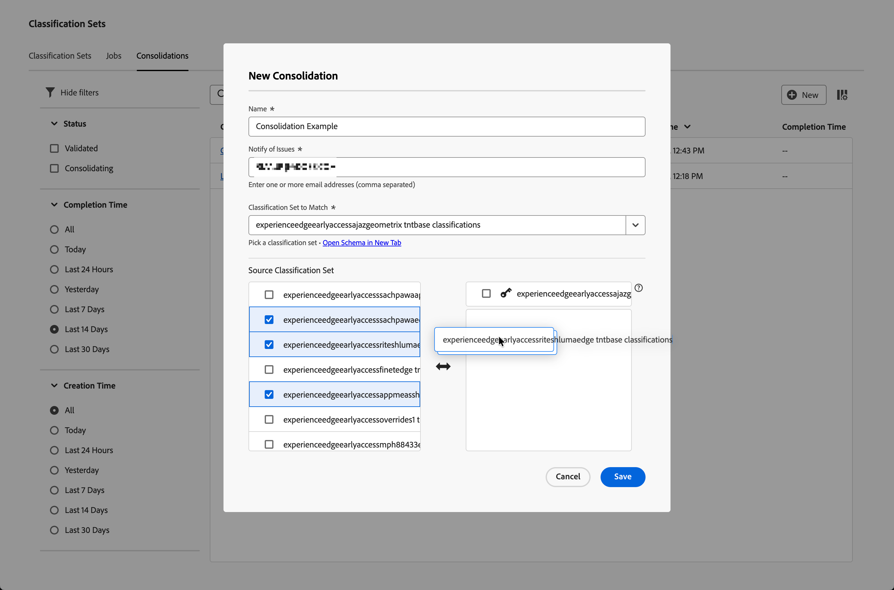
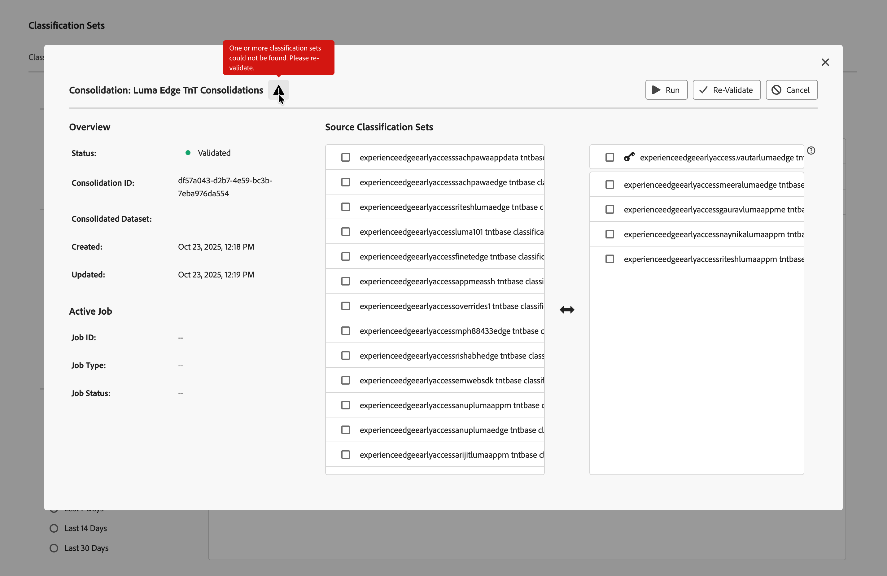
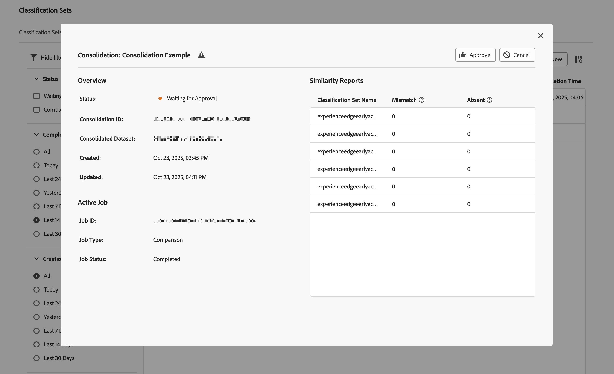

# Create and edit classification consolidations

A classification sets consolidation allows you to take classifications from multiple classification sets and combine them into one. Use this interface to create a classification set consolidation from start to finish. This interface is most valuable to organizations that move from legacy classifications to classification sets. Organizations that use classification sets already do not need to use this consolidation workflow.

## Create a consolidation {#create-a-consolidation}

>[!CONTEXTUALHELP]
>id="classificationsets_consolidation_setpriority"
>title="Classification set priority"
>abstract="The   *classification set* is the base classification set and defines the overall schema and takes precedence in any merge conflicts. The other classification sets are applied in order from top to bottom."

To create a classification consolidation, in the main Adobe Analytics interface:

1. Select **[!UICONTROL Classification sets]** from the **[!UICONTROL Components]** menu.
1. In the **[!UICONTROL Classification Sets]** manager, select the **[!UICONTROL Consolidations]** tab. 
1. In the **[!UICONTROL Classification Sets - Consolidations]** manager, select  **[!UICONTROL New]**.
1. In the **[!UICONTROL New Consolidation]** dialog, 
   
   
   1. Enter a **[!UICONTROL Name]**. For example: `Consolidation Example`.
   1. Enter a **[!UICONTROL Description (optional)]**. For example, `Example classification set`.
   1. Enter one or more email addresses (comma separated) in **[!UICONTROL Notify of issues]**. Email notifications are sent to these users on issues.
   1. Select a classification set from the **[!UICONTROL Classification Set To Match]** drop-down menu. 

      The **[!UICONTROL Source Classification Set]** left list is populated with classification sets that are similar to the selected classification list and are available for consolidation. The right list is populated automatically with the selected  classification set. That base set defined the overall schema and always takes precedence in any merge conflicts. 

   1. Select classification sets that you want to consolidate from the left list and drop the selected sets on the right list underneath the selected  base **[!UICONTROL _classification set_]**.

      The additional classification sets are consolidated in ascending order when you run the consolidation. If a key exists in multiple additional sets, the value for the key from the top ranking classification set is taken. If a key exists in both the  base set and any additional set, the value from the base set is used.
      
      To manage which values for keys are used, move individual and selected classification sets in the list through drag and drop. You can also replace the  **[!UICONTROL _classification set_]** with a selected classification set through drag and drop.

   1. Select **[!UICONTROL Save]** to save the classification consolidation. Select **[!UICONTROL Cancel]** to cancel.

Once saved, a classification consolidation is validated automatically for consolidation. This validation ensures that each individual classification set is valid for this consolidation. Once successful, the entry in the Classifications consolidation list shows the status **[!UICONTROL Validated]**.

After you have create a consolidation, the next steps are:

* [Re-Validate](#re-validate) the classification consolidation when you have made changes to the initial configuration.
* [Run](#run) the classification consolidation.
* [Approve](#approve) the classification consolidation.

## Edit a consolidation {#edit-a-classification}

>[!CONTEXTUALHELP]
>id="classificationsets_consolidations_mismatch"
>title="Mismatch"
>abstract="The percent of key mismatches when the value in the consolidated classification set does not match the source classification set."

>[!CONTEXTUALHELP]
>id="classificationsets_consolidations_absent"
>title="Absent"
>abstract="The percent of keys in the consolidated classification set, but not in the source classification set."

To edit a classification consolidation, in the main Adobe Analytics interface:

1. Select **[!UICONTROL Classification sets]** from the **[!UICONTROL Components]** menu. 
1. In the **[!UICONTROL Classification Sets]** manager, select the **[!UICONTROL Consolidations]** tab.
1. In the **[!UICONTROL Classification Sets Consolidations]** manager:
   1. Select the name of your classification consolidation. The **[!UICONTROL Consolidation: _classification consolidation name_]** dialog appears. The appearance and available actions are dependent on the current status of the consolidation, and whether you still have the option to modify the classification consolidation.

      | Available actions | Description |
      |---|---|
      |  **[!UICONTROL Cancel]** | [Cancel the consolidation](#cancel). |
      |  **[!UICONTROL Re-Validate]** | [Re-validate the consolidation](#re-validate). |
      |  **[!UICONTROL Run]** | [Run the consolidation](#run). |
      |  **[!UICONTROL Approve]** | [Approve the consolidation](#approve). |

### Re-Validate

You can re-validate a classification consolidation in the Consolidation: classification consolidation dialog. An  might provide additional information on issues with your consolidation that require to reconfigure the consolidation.

To re-validate the classification consolidation: 

1. Re-configure the consolidation using the same drag and drop interface as you used to create the consolidation.
1. Select  **[!UICONTROL Re-Validate]**. The validation ensures that each individual classification set is valid for this consolidation. When successful, a toast message is displayed:   **[!UICONTROL Successfully submitted consolidation for validation!]**
1. Select  to close the dialog. Or select  **[!UICONTROL Run]** to run the consolidation or  **[!UICONTROL Cancel]** to cancel the classification.

<!--
Once you have created a consolidation, a list of source datasets appears on the right. The **[!UICONTROL Validate]** button makes sure that each individual classification set is valid for this consolidation. You can reorder the classification steps here to determine priority in cases of mismatched classification values. **The highest classification set in the list overwrites any mismatched values in other classification sets.**

-->

### Run

Once a classification consolidation is successfully validated, you can run the consolidation.

To run a classification consolidation: 

1. Select  **[!UICONTROL Run]**. A toast message displays  **[!UICONTROL Successfully submitted consolidation for processing!]**
1. Select  to close the dialog. 

### Approve

Once a classification consolidation has successfully run, the consolidation status is  **[!UICONTROL Waiting for Approval]**. The approval of a classification consolidation replaces the individual classification sets with the consolidated classification set and the individual classification sets are removed.

To approve a classification set consolidation:

1. Use the **[!UICONTROL Similarity Reports]** report to review the consolidation. This report shows a table with the following columns:

   * **[!UICONTROL Classification Set Name]**: The name of the classification set.
   * **[!UICONTROL Mismatch]**: The percent of rows where key values do not match the source classification set. If the mismatch percent is high, the mismatch can be an indication that the classification data is too different. Check and make sure that the selected classification sets have similar classification data.
   * **[!UICONTROL Absent]**: The percent of rows where key values are in the  classification set but not in the source classification set. All absent rows are added to the consolidated classification set. 

1. If the classification consolidation is ready for approval, Select  **[!UICONTROL Approve]**. An **[!UICONTROL Approve Consolidation?]** dialog prompts for confirmation. Select **[!UICONTROL Approve]** to approve the consolidation. Select **[!UICONTROL Cancel]** to cancel.

Once approved, the consolidated classification set is created. The status is set to **[!UICONTROL Complete]**.

### Cancel

You can cancel a classification consolidation before approval.

To cancel a classification consolidation:

1. Select **[!UICONTROL Cancel]**.

   You are not able to resume a consolidation once the consolidation is canceled.
1. Select **[!UICONTROL Cancel Consolidation]** to cancel the consolidation. Select **[!UICONTROL Go Back]** to revert the cancellation.
