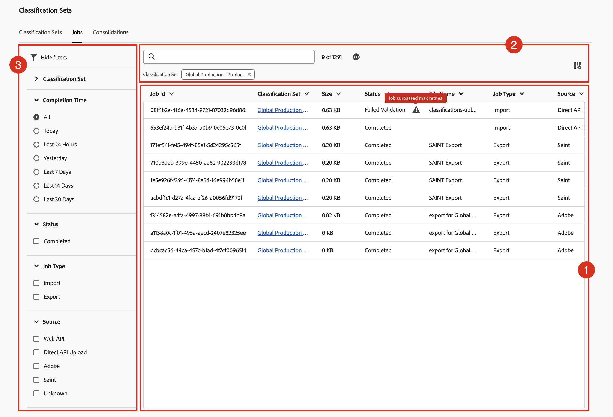

# View and act upon classification jobs

The Classification jobs manager shows current and completed classification jobs that are generated for classification sets. You can also use the manager to download classification data or templates for a particular job.

To view and act upon classification jobs:

1. Select **[!UICONTROL Components]** from the Adobe Analytics top menu bar, then select **[!UICONTROL Classification sets]**.
1. In **[!UICONTROL Classification Sets]**, select the **[!UICONTROL Jobs]** tab.

## Classification jobs manager

The **[!UICONTROL Classification Sets - Jobs]** manager has the following interface elements:

### Classification jobs list

The **[!UICONTROL Classification Jobs]** list ➊ displays classification jobs. The list has the following columns:

| Column | Description |
|---|---|
| **[!UICONTROL Job Id]** | The identifier of the classification job. |
| **[!UICONTROL Classification Set]** | The classification set associated with the classification job. |
| **[!UICONTROL Size]** | The size of the file that was exported or imported as part of the classification job.  |
| **[!UICONTROL Status]** | The status of the classification job. Possible values are: **[!UICONTROL Created]**, **[!UICONTROL Queued]**, **[!UICONTROL Validated]**, **[!UICONTROL Failed validation]**, **[!UICONTROL Processing]**, **[!UICONTROL Done processing]**, **[!UICONTROL Failed processing]** , **[!UICONTROL Completed]**, or **[!UICONTROL Progress]**. If displayed, hover over the alert  to display additional information. |
| **[!UICONTROL File Name]** | Identifies the name or functionality used to import or export the file as part of the classification job. Possible values are: <ul><li>*no value*</li><li>The name of the file that is processed as part of the classification job.</li><li>**[!UICONTROL SAINT Export]**: The job is an export from the [legacy Classifications interface](/help/components/classifications/importer/c-working-with-saint.md).</li><li>**[!UICONTROL export for _classification set_ at _timestamp_]**: The job is a download from the [schema](manage/schema.md#download) interface.</li></ul> |
| **[!UICONTROL Job Type]** | The type of classification job. Possible values are: **[!UICONTROL Import]** or **[!UICONTROL Export]**. |
| **[!UICONTROL Source]** | The source of the classification job. Possible values are: **[!UICONTROL Web API]**, **[!UICONTROL Direct API Upload]**, **[!UICONTROL Adobe]**, **[!UICONTROL SAINT]**, or **[!UICONTROL Unknown]**. |
| **[!UICONTROL Modified Lines]** | The number of modified lines that the classification job modified. |
| **[!UICONTROL Total Lines]** | The number of total lines that the classification job processed. |
| **[!UICONTROL Completion Time]** | The completion time of the classification job. |
| **[!UICONTROL File Download]** | Use  to download the file (template or data) associated with the classification job. |

To resize a column in the classification jobs list, you can:

* Hover over the column separator and drag the column separator to the desired column width.
* Select  and select **[!UICONTROL Resize column]**. A vertical line with resize button allows you to resize the column to the desired with.

To sort a column in the classification jobs list

* Select  and select **[!UICONTROL Sort Ascending]** or **[!UICONTROL Sort Descending]**. An arrow (↑↓) indicates which column and how the column is sorted.

### Search and buttons

In the area ➋ on top of the classification jobs list, you can:

* Search  for classification jobs. Results are shown in the classification jobs list. Select  to clear the search.
* Remove any filter that is applied to the classification jobs list. Select  to remove a filter.
* Select  to load an addition 1000 classification jobs. Initially, the classification set list displays up to 1000 classification jobs. 
* Define the columns of the classification sets jobs list. Select  and in the **[!UICONTROL Customize table]** dialog select the columns to show underneath **[!UICONTROL Select columns to show]**. Select **[!UICONTROL Apply]** to apply the column settings.

### Filter panel

Select  to show the filter panel ➌ that allows you to filter the classification jobs list. You can filter on:

* **[!UICONTROL Classification Set]**. Select one or more classification sets to filter the classification jobs list.
* **[!UICONTROL Completion Time]**. Select one of the possible values to filter the classification jobs list on completion time.
* **[!UICONTROL Status]**. Select one of the possible values to filter the classification jobs list on status. 
* **[!UICONTROL Job Type]**. Select one of the possible values to filter the classification jobs list on job type. 
* **[!UICONTROL Source]**. Select one of the possible values to filter the classification jobs list on source. 

Select  **[!UICONTROL Hide filters]** to hide the filters panel.

Note that the filters shown in the filters panel reflect the options for the classification jobs that are preloaded.

<!--

**[!UICONTROL Components]** > **[!UICONTROL Classification sets]** > **[!UICONTROL Jobs]**

You cannot create jobs from this interface. Create jobs by uploading data to a classification set (either manually or through a configured external location), requesting a download file, or requesting a template file.

## Filter classification sets

The left side of the Classification set job manager provides filter settings to locate the desired job. Clicking the filter icon toggles the filter settings visibility. You can filter Classification sets by **[!UICONTROL Classification set]**, **[!UICONTROL Completion time]**, **[!UICONTROL Status]**, **[!UICONTROL Job Type]**, or **[!UICONTROL Source]**.

Additional filter options are available above the Classification set job manager columns:

* **[!UICONTROL Search by title]**: Search for jobs by filename.
* **[!UICONTROL Load more]**: The Classification set job manager initially displays up to 1000 jobs. If more jobs exist, click this button to load 1000 more jobs.
* **Show/Hide columns**: Toggle visibility for any column besides [!UICONTROL Filename] and [!UICONTROL Completion time].

## Classification set job manager columns

The following columns are available in the Classification set job manager:

* **[!UICONTROL Filename]**: The name of the upload or download file.
* **[!UICONTROL Classification set]**: The name of the Classification set that the file applies to. You can click the Classification set name to reach the Classification set's [Settings](manage/settings.md).
* **[!UICONTROL Size]**: The size of the file.
* **[!UICONTROL Status]**: The status of the job processing the file.
  * **[!UICONTROL Created]**: The job was submitted.
  * **[!UICONTROL Queued]**: The file is ready to be processed, and is waiting for a classification server to process the file.
  * **[!UICONTROL Validated]**: The file is valid and is waiting to be processed.
  * **[!UICONTROL Failed validation]**: The file is formatted incorrectly or otherwise invalid. The file does not go through processing.
  * **[!UICONTROL Processing]**: The file is actively being processed by Adobe.
  * **[!UICONTROL Failed processing]**: The file failed processing.
  * **[!UICONTROL Complete]**: Processing is complete. Classification data is visible in reporting.
  * **[!UICONTROL Failed]**: Generic failure not related to validation or processing.
* **[!UICONTROL Job type]**: The type of job.
* **[!UICONTROL Source]**: The job source.
* **[!UICONTROL File download]**: Only applies to download jobs, such as downloading classification data or downloading templates. When a download is ready, this column provides a download link.
* **[!UICONTROL Modified lines]**: The number of modified lines.
* **[!UICONTROL Completed lines]**: The number of completed lines.
* **[!UICONTROL Completion time]**: The date and time that the job completed (or failed).
-->