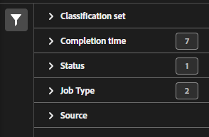

# Classification set jobs manager

The Classification set jobs manager lets you see current and completed classification jobs that were generated from classification sets. You can also use this interface to download classification data or templates for a particular job, or upload additional data to a job.

**[!UICONTROL Components]** > **[!UICONTROL Classification sets]** > **[!UICONTROL Jobs]**

You cannot create jobs from this interface. Create jobs by uploading data to a classification set (either manually or through a configured external location), requesting a download file, or requesting a template file.

## Filter classification sets

The left side of the Classification set job manager provides filter settings to locate the desired job. Clicking the filter icon toggles the filter settings visibility. You can filter Classification sets by **[!UICONTROL Classification set]**, **[!UICONTROL Completion time]**, **[!UICONTROL Status]**, **[!UICONTROL Job Type]**, or **[!UICONTROL Source]**.

Additional filter options are available above the Classification set job manager columns:

* **[!UICONTROL Search by title]**: Search for jobs by filename.
* **[!UICONTROL Load more]**: The Classification set job manager initially displays up to 1000 jobs. If more jobs exist, click this button to load 1000 more jobs.
* **Show/Hide columns**: Toggle visibility for any column besides [!UICONTROL Filename] and [!UICONTROL Completion time].

## Classification set job manager columns

The following columns are available in the Classification set job manager:

* **[!UICONTROL Filename]**: The name of the upload or download file.
* **[!UICONTROL Classification set]**: The name of the Classification set that the file applies to. You can click on the Classification set name to reach the Classification set's [Settings](settings.md).
* **[!UICONTROL Size]**: The size of the file.
* **[!UICONTROL Status]**: The status of the job processing the file.
  * **[!UICONTROL Created]**: The job was submitted.
  * **[!UICONTROL Queued]**: The file is ready to be processed, and is waiting for a classification server to process the file.
  * **[!UICONTROL Validated]**: The file is valid and is waiting to be processed.
  * **[!UICONTROL Failed validation]**: The file is formatted incorrectly or otherwise invalid. The file does not go through processing.
  * **[!UICONTROL Processing]**: The file is actively being processed by Adobe.
  * **[!UICONTROL Failed processing]**: The file failed processing.
  * **[!UICONTROL Complete]**: Processing is complete. Classification data is visible in reporting.
  * **[!UICONTROL Failed]**: Generic failure not related to validation or processing.
* **[!UICONTROL Job type]**: The type of job.
* **[!UICONTROL Source]**: The job source.
* **[!UICONTROL File download]**: Only applies to download jobs, such as downloading classification data or downloading templates. When a download is ready, this column provides a download link.
* **[!UICONTROL Modified lines]**: The number of modified lines.
* **[!UICONTROL Completed lines]**: The number of completed lines.
* **[!UICONTROL Completion time]**: The date and time that the job completed (or failed).
