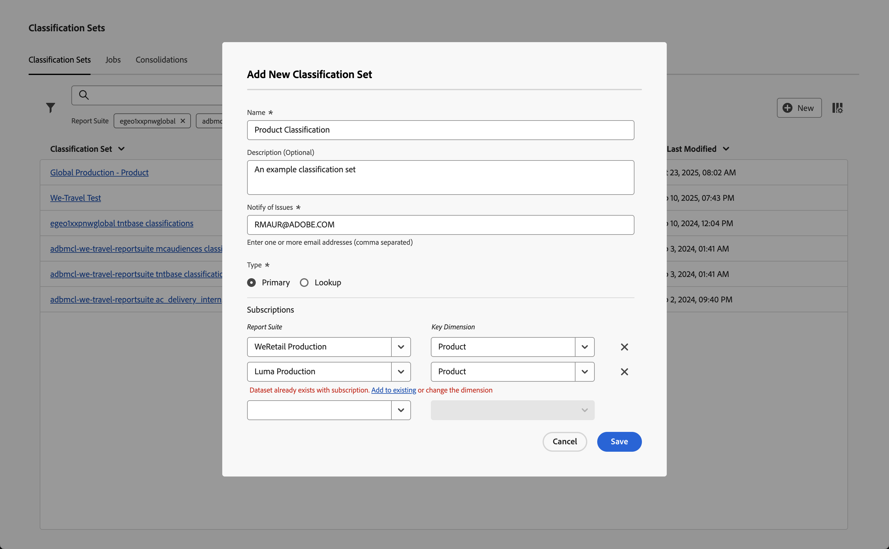
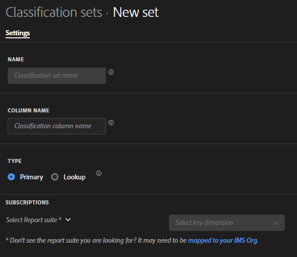

# Create and edit classification sets

You [create](#create-a-classification-set) and [edit](#edit-a-classification-set) classification sets from the Classification Sets manager.

## Create a classification set

To create a classification set, in the main interface:

1. Select **[!UICONTROL Components]** in the main interface, then select **[!UICONTROL Classification sets]**.
1. In **[!UICONTROL Classification Sets]**, select the **[!UICONTROL Classification Sets]** tab.
1. Select  **[!UICONTROL New]**.
1. In the **[!UICONTROL Add New Classification Set]** dialog:

   

   1. Enter a **[!UICONTROL Name]**. For example: `Classification Set Example`.
   1. Enter a **[!UICONTROL Description (optional)]**. For example, `Example classification set`.
   1. Enter one or more email addresses (comma separated) in **[!UICONTROL Notify of issues]**. Email notifications are sent to these users on issues.
   1. Select the **[!UICONTROL Type]** of classification set. Possible types are:
      * **[!UICONTROL Primary]**. A primary classification set applies to dimensions collected in Adobe Analytics. Primary classifications are a way to group (classify) granular dimension values into more meaningful levels of data. For example, you might want to group internal search keywords into internal search categories, to understand themes in your search data. Or classify product SKUs by color or category.
        * Enter one or more **[!UICONTROL Subscriptions]**.  You can define multiple **[!UICONTROL Report Suite]** and **[!UICONTROL Dimension]** combinations to a classification set. 
         
        * Select  to delete a **[!UICONTROL Report Suite]** and **[!UICONTROL Key Dimension]** combination.

        If you add a **[!UICONTROL Report Suite]** and **[!UICONTROL Key Dimension]** combination that already exists in another classification set, you see a red alert underneath the combination. You can select **[!UICONTROL Add to existing]** to open the other classification set and [add classifications to the schema](schema.md) for that other classification set, or change the dimension.
      * **[!UICONTROL Lookup]**. Commonly referred to as child or subclassifications, a lookup table is a classification of a primary classification. A lookup is metadata about a classification value, rather than the original dimension. For example, a *Product* dimension might have a primary classification of *Color code*. A lookup table of *Color name* could then be attached to the *Color code* to explain each color code.
1. Select **[!UICONTROL Save]** to save the classification set. Select **[!UICONTROL Cancel]** to cancel the definition.
1. To define the schema for the classification set, select your newly created classification set from the **[!UICONTROL Classification Sets]** manager to [edit the classification set](#edit-a-classification-set).

## Edit a classification set

To edit a classification set, in the main interface:

1. Select **[!UICONTROL Components]** in the main interface, then select **[!UICONTROL Classification sets]**.
1. In **[!UICONTROL Classification Sets]**, select the **[!UICONTROL Classification Sets]** tab.
1. Select the title of your classification set.
1. In the **[!UICONTROL Classification Set: _classification set title_]** dialog, you can define the [settings](settings.md) and the [schema](schema.md) for the classification set. 
1. Once done, select **[!UICONTROL Save]** to save your changes. Select **[!UICONTROL Cancel]** to cancel.

<!--

### Schema

In the Schema tab 

You can use the Classification set manager to create a classification set.

**[!UICONTROL Components]** > **[!UICONTROL Classification sets]** > **[!UICONTROL Sets]** > **[!UICONTROL Add]**

When creating a classification set, the following fields are available.

* **[!UICONTROL Name]**: A text field used to identify the classification set. This field cannot be edited upon creation, but can be renamed later.
* **[!UICONTROL Column Name]**: The name of the first classification dimension that you want to create. This field is the dimension name used in Analysis Workspace, and the column name when exporting classification data. You can add more column names after the classification set is created.
* **[!UICONTROL Type]**: Radio buttons that indicate the type of classification.
  * **[!UICONTROL Primary]**: Apply to dimensions collected in Analytics. They are a way to group (classify) granular dimension values into more meaningful levels of data. For example, you might want to group internal search keywords into internal search categories, to better understand themes in your search data.
  * **[!UICONTROL Lookup]**: Commonly referred to as child or subclassifications, a lookup table is a classification of a primary classification. It is metadata about a classification value, rather than the original dimension. For example, the Product variable might have a primary classification of 'Color code'. A lookup table of 'Color name' could then be attached to 'Color code' to further explain what each code means.
* **[!UICONTROL Subscriptions]** The report suites and dimensions that this classification set applies to. You can add multiple report suite and dimension combinations to a classification set.

If a classification set exists for a given report suite + variable, the classification is added to the schema instead. A given report suite + variable combination cannot belong to multiple classification sets.

-->