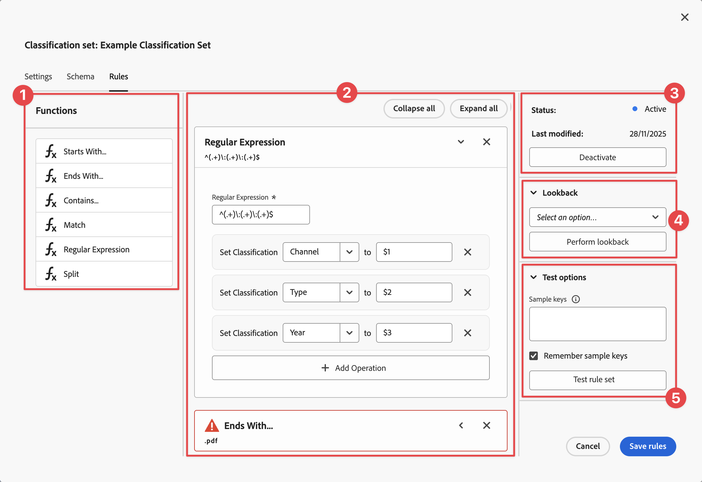
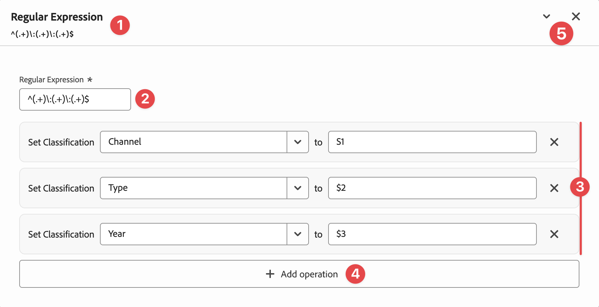
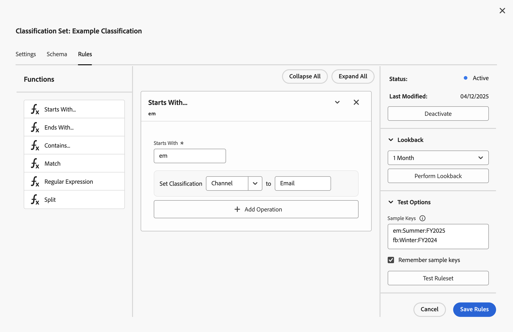
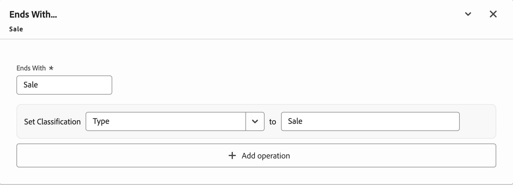
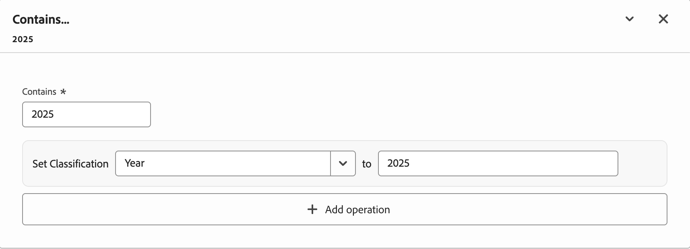
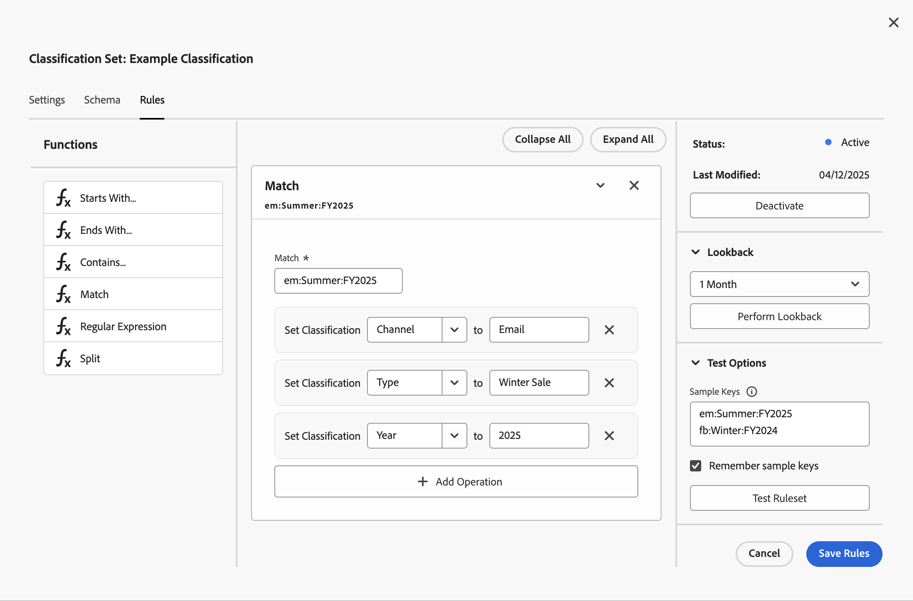
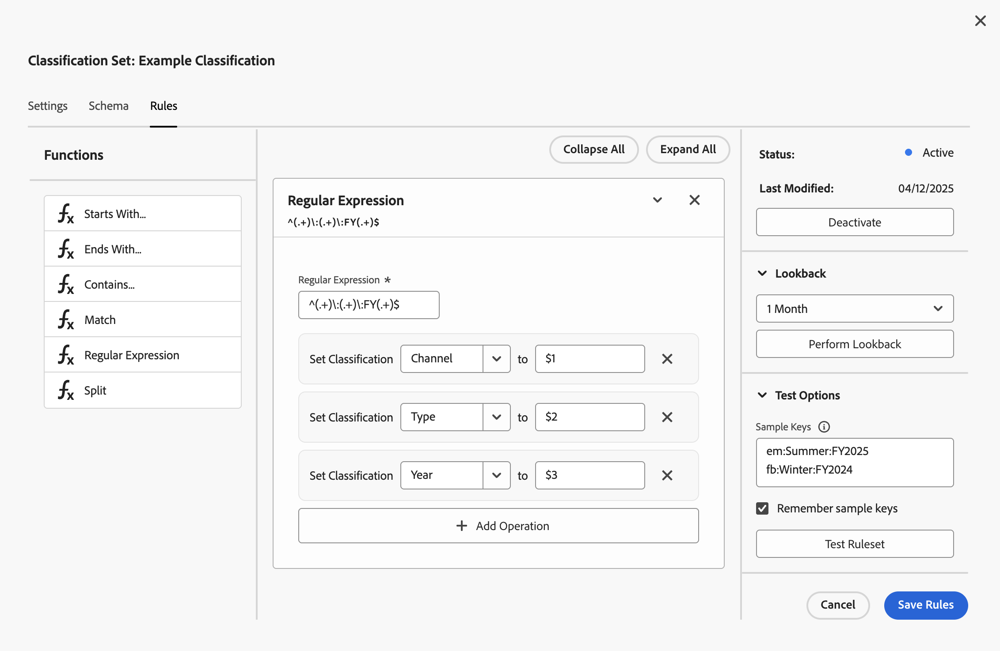
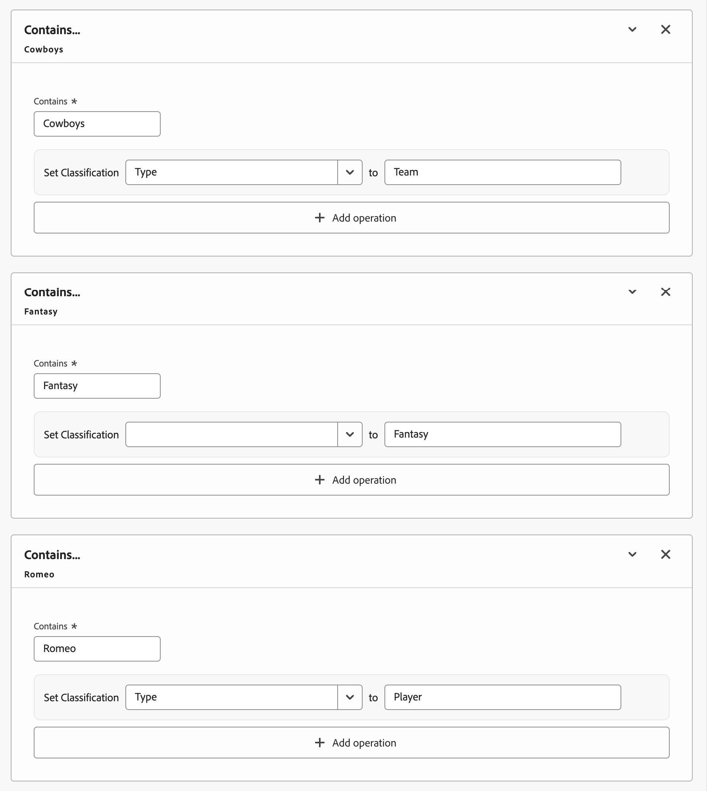

# Classification sets rules

You use rules to support automatic classifications in scenarios where your key dimension is constantly changing. The update of classifications through upload or automation becomes a cumbersome process or lags proper classification for new dimension values. For example, internal campaigns, tracking codes, or product SKUs. The dimension must contain values that allow you to apply one or more rules so you can derive classification data from the values.

You define rules within the context of a classification set, which implies that rules are applied (when activated) to all report suite and key dimension combinations that are subscribed to the classification set. This implementation is somewhat different from how the legacy Classification rule builder works. In the Classification rule bulder you define one or more rules as part of a rule set separately and then associate the rule set with one or more report suites. In the new interface, the rules within the classification set are also referred to as rule set but are defined within the same interface where you configure other classification set attributes.

To define a rule set for a classification set:

1. Select **[!UICONTROL Components]** from the Adobe Analytics top menu bar, then select **[!UICONTROL Classification sets]**.
1. In **[!UICONTROL Classification Sets]**, select the **[!UICONTROL Classification Sets]** tab.
1. In the **[!UICONTROL Classifications Sets]** manager, select the classification set for which you want to define the rules.
1. In the **[!UICONTROL Classification Set: _classification set name_]** dialog, select the **[!UICONTROL Rules]** tab. 

   * If you are accessing the **[!UICONTROL Rules]** interface for the first time for a classification set, or you decided so far to continue to use the legacy rules builder interface, you are presented with a dialog that allows you to select how to get started. The options are:

     * **Migrate existing rules**. Import your current classification rules and continue to work with these rules in the new interface. Your existing rules will be preserved and converted to the new format. 
       * Select **[!UICONTROL Migrate rules]** to continue.
       * In the **[!UICONTROL Confirm migration]** dialog, read the implications of the migration.
         * Select **[!UICONTROL Migrate rules]** to confirm the migration. After the migration is completed, use the [Rule set interface](#rule-set-interface) to create new rules and edit your existing migrated rules.
         * Select **[!UICONTROL Cancel]** to cancel the migration
       
     * **Start fresh**. Create new classification rules from scratch using the new rule builder. Select this option if you want to redesign your classification logic or start fresh with new classification rules. 
       * Select **[!UICONTROL Create new rules]** to continue.
       * In the **[!UICONTROL Confirm start fresh]** dialog, read the implications of a fresh start.
         * Select **[!UICONTROL Start fresh]** to confim a fresh start and discard any existing rules. Use the [Rule set interface](#rule-set-interface) to create new rules.
         * Select **[!UICONTROL Cancel]** to cancel.

     * **Use legacy interface**. Continue to use the previous rule builder interface. You can migrate to the new experience at any time when you're ready. 
       * Select **[!UICONTROL Go to legacy interface]** to continue. You are directed to the legacy **[!UICONTROL Classification Rule Builder]** interface.

   * If you already have migrated rules or created new rules for a classification set, you end up directly in the Rule set interface. 

## Rule set interface

When you create or edit rules, you use the Rule set interface.

| | Name | Description |
|---|---|---|
| 1 | **[!UICONTROL Functions]** | You use the **[!UICONTROL Functions]** area to select and drag and drop your functions to the rule set builder. |
| 2 | **Rule set builder** | You build your rule set using one or more rules. A rule is the implementation of a function and always associated with only one function. A function can have multiple operators. You create a rule by dragging and dropping a function into the rule set builder. The function type defines the interface of the rule.  See the [Rule interface](#rule-interface) for more information. You can insert functions at any place, and the functions are executed in sequence to determine the final values for the classifications. Use **[!UICONTROL Collapse all]** to collapse all rules and use **[!UICONTROL Expand all]** to expand all rules. | 
| 3 | **[!UICONTROL Status]** | Show the status and last modified date of the rule set.  Select **[!UICONTROL Activate]** to activate the rule set.  Select **[!UICONTROL Deactivate]** to deactivate the rule set. |
| 4 | **[!UICONTROL Lookback]** | Specify the lookback window for the rule set. Select an option (from 1 month to 6 months) from the drop-down menu. Select **[!UICONTROL Perform lookback]** to perform a lookback using the selected lookback period. |
| 5 | **[!UICONTROL Test options]** | Use sample key dimension values to test the classifications: <ul><li>Add or paste values in the **[!UICONTROL Sample keys]** text area. Check **[!UICONTROL Remember sample keys]** to ensure sample keys persist across different usage of the rule set interface.</li><li>Select **[!UICONTROL Test rule set]** to test your rule set.</li></ul> |

## Rule interface

You define each individual rule within the rule set in the Rule interface. The interface consistst of the following elements:

| | Description |
|---|---|
| 1 | The name of the selected function and the input entered for the function. |
| 2 | The input for the selected function. The input depends on the selected function. For example, for the Regular Expression function the input is a regular expression and for the Split function the input is a token. Enter the appropriate input for the specific function. For example, `^(.+)\:(.+)\:(.+)$` for a regular expression that identifies three classifications in an internal campaign code. |
| 3 | Each operation sets a specific classification to a value.  Select a classification from the **[!UICONTROL Set Classification]** drop-down menu and enter a value for **[!UICONTROL to]**.  Use  to delete an operation from the list. |
| 4 | Select  **[!UICONTROL Add operation]** to add an additional operation to the function. | 
| 5 | Select  to collapse the rule. Select  to expand the rule. Select  to delete the rule. |

## Function reference 

For each supported function, find details below on required input and sample use cases.

### Starts With…

Sets a classification based on a specific value the key dimension starts with. 

+++ Details 

#### Required input

Enter a value for **[!UICONTROL Starts With]**. For example: `em`.

#### Use case

You want to define a rule to automatically assign `Email` as a value to the **[!UICONTROL Channel]** classification when the value for key dimension Internal Campaign starts with `em` (for example: `em:FY2025:Summer Sale`).

+++

### Ends With…

Sets a classification based on a specific value the key dimension ends with. 

+++ Details 

#### Required input

Enter a value for **[!UICONTROL Ends With]**. For example: `Sale`.

#### Use case

You want to define a rule to automatically assign `Sale` as a value to the **[!UICONTROL Type]** classification when the value for key dimension Internal Campaign contains `Sale` (for example: `em:FY2025:Summer Sale`)..

+++

### Contains…

Sets a classification based on a specific value the key dimension contains. 

+++ Details 

#### Required input

Enter a value for **[!UICONTROL Contains]**. For example: `2025`.

#### Use case

You want to define a rule to automatically assign `2025` as a value to the **[!UICONTROL Year]** classification when the value for key dimension Internal Campaign ends with `2025` (for example: `em:FY2025:Summer Sale`).

+++

### Match

Sets a classification based on a specific value the key dimension matches. 

+++ Details 

#### Required input

Enter a value for **[!UICONTROL Match]**. For example: `em:FY2025:Summer`.

#### Use case

You want to define a rule to automatically assign `2025 Summer Email` as a value to the **[!UICONTROL Type]** classification when the value for key dimension Internal Campaign matches `em:FY2025:Summer`.

+++

### Regular expression

Sets one or more classifications based on a regular expression applied to the key dimension value. 

+++ Details 

#### Required input

Enter a value for **[!UICONTROL Regular Expression]**. For example: `^(.+)\:(.+)\:(.+)$`.

#### Use case

You want to define a rule to automatically assign values to the **[!UICONTROL Channel]**, **[!UICONTROL Type]** and **[!UICONTROL Year]** classifications by applying the regular expression `^(.+)\:(.+)\:(.+)$` and using match groups (`$1`, `$2`, and `$3`) to the values for key dimension Internal Campaign.

#### Reference Table {#section_0211DCB1760042099CCD3ED7A665D716}

| Regular expression | Description |
|---|---|
|  `(?ms)`  | Makes the entire regular expression match against a multi-line input, allowing the . wildcard to match any newline characters  |
|  `(?i)`  | Makes the entire regular expression case insensitive  |
|  `[abc]`  | A single character of: a, b or c  |
|  `[^abc]`  | Any single character except: a, b, or c  |
|  `[a-z]`  | Any single character in the range a-z  |
|  `[a-zA-Z]`  | Any single character in the range a-z or A-Z  |
|  `^`  | Start of line (matches the beginning of the line)  |
|  `$`  | Match the end of the line (or before newline at the end)  |
|  `\A`  | Start of string  |
|  `\z`  | End of string  |
|  `.`  | Match any character (except a new line)  |
|  `\s`  | Any whitespace character  |
|  `\S`  | Any non-whitespace character  |
|  `\d`  | Any digit  |
|  `\D`  | Any non-digit  |
|  `\w`  | Any word character (letter, number, underscore)  |
|  `\W`  | Any non-word character  |
|  `\b`  | Any word boundary  |
|  `(...)`  | Capture everything enclosed  |
|  `(a\b)`  | a or b  |
|  `a?`  | Zero or one of a  |
|  `a*`  | Zero or more of a  |
|  `a+`  | One or more of a  |
|  `a{3}`  | Exactly 3 of a  |
|  `a{3,}`  | 3 or more of a  |
|  `a{3,6}`  | Between 3 and 6 of a  |

+++

## Rule priority

If a key dimension value is matched to multiple rules, and the rules sets contains rules with the same Set Classification operation, the last rule determines the value for the classification. So, you should rank the most important Set Classification operation as part of the last rule in your rule set.

If you create multiple rules that do not share the same Set Classification operation, processing order does not matter.

### Example

You want to classify with the classification **[!UICONTROL Type]** how users search for an athlete using the search string as key dimension. For example, using this rule set:

* When a user searches for `Cowboys Fantasy Tony Romo`, `Romo` is classified as **[!UICONTROL Type]**.
* When a user searches for `Cowboys Fantasy Tony Romeo`, `Fantasy`is classified as **[!UICONTROL Type]**.
* Whem a user searches for `Cowboys vs. Broncos`, `Team`is classified as **[!UICONTROL Type]**. 

