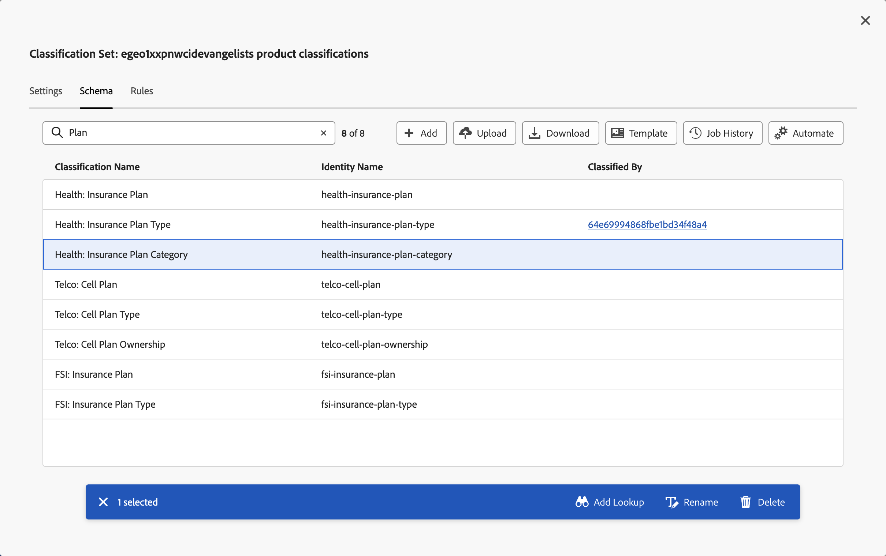
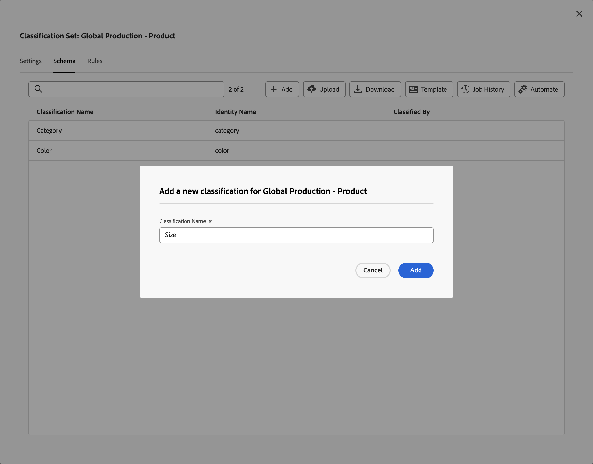
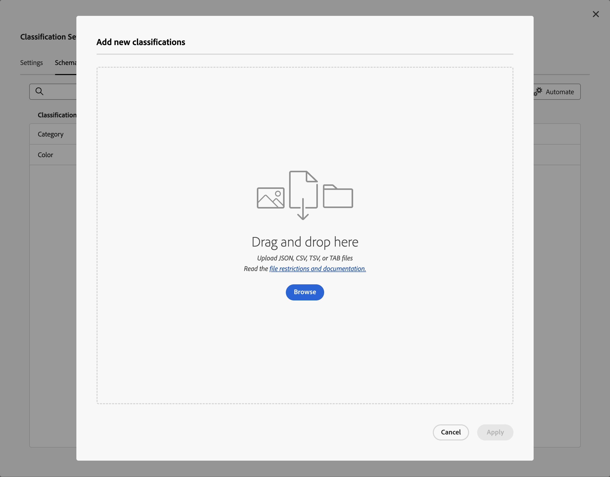
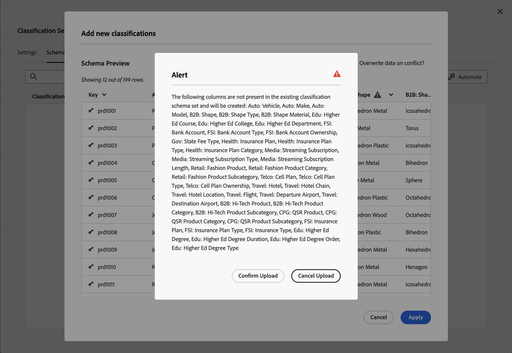
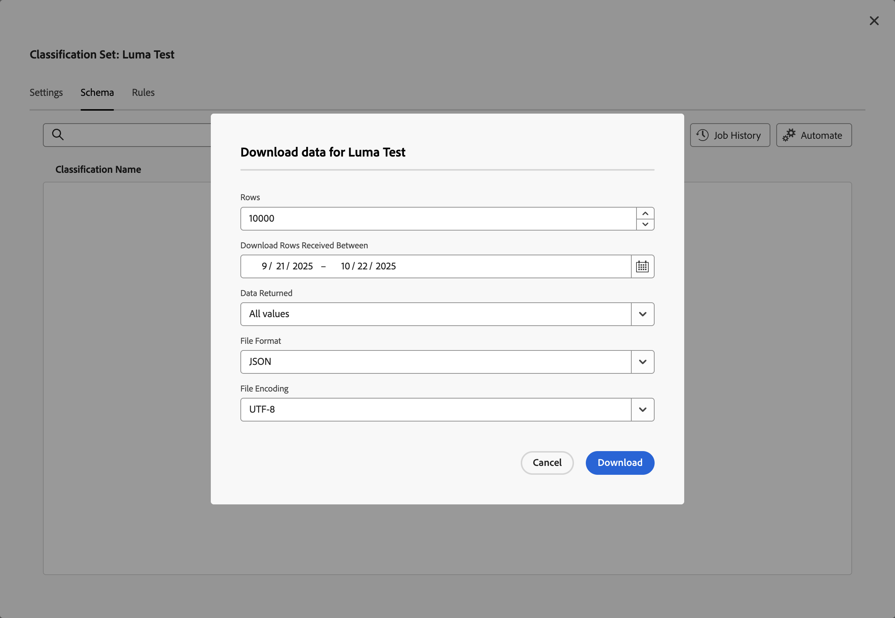
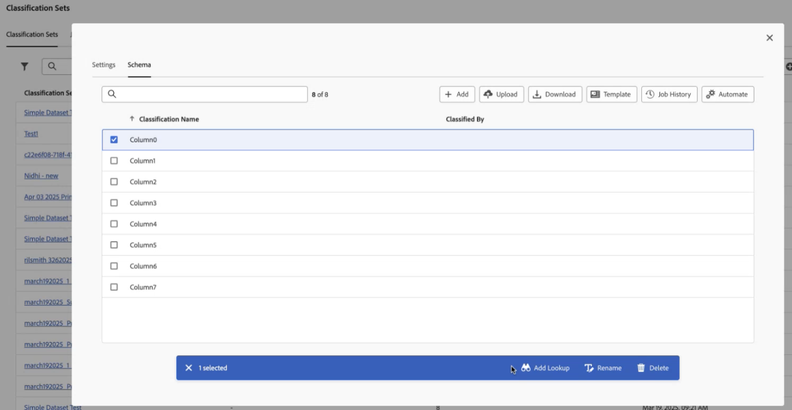
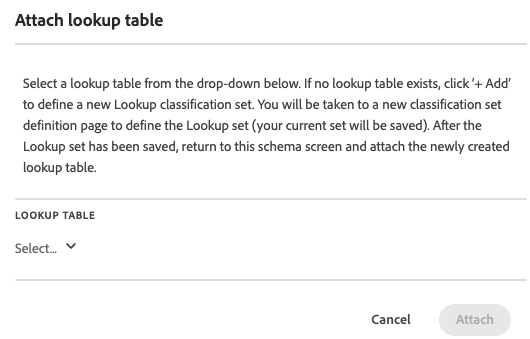

# Classification set schema

You can edit the schema of a classification set. The schema is the list of classifications you want to apply to the key dimensions you have defined for the classification set. For example, if you defined product as the key dimension, and this field contains a product SKU, then you use schema to add classifications like product name, product color, product size, and more.

To define the schema, n the **[!UICONTROL Classifications Sets]** manager, select the classification set.

The **[!UICONTROL Schema]** tab of the **[!UICONTROL Classification Set: _classification set_]** dialog appears and consist of the following interface elements:

## Classification list

The list of classifications has the following columns:

| Column | Description |
|---|---|
| **[!UICONTROL Classification Name]** | The name you provided for the classification |
| **[!UICONTROL Identity Name]** | The derived name by the system for the classification |
| **[!UICONTROL Classified By]** | If used, a link to the lookup classification set that is used to classify this classification. |

## Search

You can quickly search  for one or more classifications. Use  to clear the search.

## Action buttons

The actions are available as buttons on top of the classifications list:

| Icon | Action | Description | 
|---|---|---|
|  | **[!UICONTROL Add]** | Add a classification to the list.  |
|  | **[!UICONTROL Upload]** | Upload a JSON, CSV, TSV, or TAB file. |
|  | Download | Download classification data. |

### Add

To add a new classification, select  **[!UICONTROL Add]**.

 

In the  **[!UICONTROL Add a new classification for _classification set_]** dialog enter the **[!UICONTROL Classification Name]** and select **[!UICONTROL Add]**. The classification is added to the list.

### Upload 

To import classification data into the schema for a classification, select  **[!UICONTROL Upload]**.

 

1. In the **[!UICONTROL Add new classifications]** dialog:

   * Drag a file that contains classification data and drop the file onto **[!UICONTROL Drag and drop here]**. 
   * Select **[!UICONTROL Browse]** and pick a file from your computer or network. 

   You see a **[!UICONTROL Schema Preview]** of the contents of the file. The preview shows the columns of data from the file. To resize a column, select  and select **[!UICONTROL Resize column]**. A handle appears that allows you to resize the column. 
   
   When no classification is defined in the classification set for a column, an alert  explains that a classification is not present in the existing classification schema set and will be created on import. 

1. Select **[!UICONTROL Overwrite data on conflict?]** if you want to overwrite current classification data with the new import. For example:
   
   | | Key | Current Product Color | Import file | New Product Color |
   |---|---|---|---|---|
   |  **[!UICONTROL Overwrite data on conflict?]** | 1234 | green | blue | blue |
   |  **[!UICONTROL Overwrite data on conflict?]** | 1234 | green | blue | green |

1. Select **[!UICONTROL Apply]**. You will see an alert if columns are not present as classifications in the existing schema set. Those columns are added as new classifications when you confirm the upload.

   

   Select **[!UICONTROL Confirm Upload]** to confirm the upload. Select **[!UICONTROL Cancel Upload]** to cancel the upload.

### Download

To download classification data, select  **[!UICONTROL Download]**.

In the **[!UICONTROL Download data for _classification set_]** dialog:

1. Enter the number of **[!UICONTROL Rows]** you want to download. For example: `10000`.
1. To select the period for which you want to download rows of classification data, enter a start and end data for **[!UICONTROL Download Rows Received Between]**. Or use  to use a calendar popup to select the period.
1. To select what data to return, select an option from **[!UICONTROL Data Returned]**.

   * **[!UICONTROL All values]** returns all values for the current classification data.
   * **[!UICONTROL Any columns empty]** returns a column with key values for the existing classification data and columns with no value for those classification data for which no value exist.
   * **[!UICONTROL All columns empty]** returns a key column with values for the existing classification data and columns with no value for each of the classification data.
1. To select the format of the downloaded classification data, select an option from the **[!UICONTROL File Format]** drop-down menu. Options are: 

   * **[!UICONTROL JSON]**.
   * **[!UICONTROL Comma separated values]** (CSV).
   * **[!UICONTROL Excel tab separated values]** (TSV or TAB).

1. To select the file encodig to when the file is downloaded, select an option from the File-Encoding drop-down menu. Options are:
   * **[!UICONTROL UTF-8]**.
   * **[!UICONTROL Latin-1]**.

1. Select **[!UICONTROL Download]** to download the classification data. If you specified options that do not return any data, tou see a **[!UICONTROL Notice]** dialog informing you to change the options for date range and data returned.

## Action bar

View currently configured classification dimensions for this classification set.

**[!UICONTROL Components]** > **[!UICONTROL Classification sets]** > **[!UICONTROL Sets]** > Click the desired classification set name > **[!UICONTROL Schema]**

The following buttons are available:

<!--* **[!UICONTROL Add]**: Adds an empty row so that you can add a classification dimension to the schema.-->
* **[!UICONTROL Upload]**: Manually upload classification data for a classification dimensions. `JSON`, `CSV`, `TSV`, and `TAB` files are supported. Uploading a valid file shows a table preview of data to classify.
  * **[!UICONTROL File encoding]**: Select the correct file encoding using this drop-down. Valid options include [!UICONTROL UTF-8] and [!UICONTROL Latin1].
  * **[!UICONTROL List delimiter]**: Select the correct list delimiter. If using a downloaded file or template file, make sure that the [!UICONTROL List delimiter] here matches the [!UICONTROL List delimiter] when the file was downloaded.
  * **[!UICONTROL Apply]**: Save the uploaded classification data to the classification set.

  

* **[!UICONTROL Download]**: Download key values and their classification columns.
  * **[!UICONTROL Rows]**: The maximum number of rows to include in the download file.
  * **[!UICONTROL Download rows received between]**: A calendar date picker that allows you to filter key values by when they appear in reporting. If a key value was not collected in this date range, it does not appear in the downloaded file.
  * **[!UICONTROL Data returned]**: A drop-down list that lets you filter key values included in the downloaded file based on their associated classification data.
    * **[!UICONTROL All classified values]**: Includes rows where classification data is included in at least one column.
    * **[!UICONTROL All unclassified values]**: Includes rows where classification data is missing in at least one column.
  * **[!UICONTROL File format]**: A drop-down list that determines the file format that the download file is in. Options include [!UICONTROL JSON], [!UICONTROL Comma separated values], and [!UICONTROL Excel tab separated values].
  * **[!UICONTROL File encoding]**: A drop-down list that determines the file encoding. Options include [!UICONTROL UTF-8] and [!UICONTROL Latin1]. UTF-8 is recommended.

  

* **[!UICONTROL Template]**: Download a template file. This file is similar to the [!UICONTROL Download] button, except it does not contain any classification data or key values.
  * **[!UICONTROL File format]**: A drop-down list that determines the file format that the template file is in. Options include [!UICONTROL Comma separated values], and [!UICONTROL Excel tab separated values].
  * **[!UICONTROL File encoding]**: A drop-down list that determines the file encoding. Options include [!UICONTROL UTF-8] and [!UICONTROL Latin1]. UTF-8 is recommended.
  * **[!UICONTROL List delimiters]**: A drop-down list that determines the list delimiter separating classification columns on each row.

  

* **[!UICONTROL Job history]**: A shortcut link that takes you to the [Job manager](../job-manager.md), showing jobs only for this classification set.
* **[!UICONTROL Automate]**: Automatically ingest data from external storage locations.
  * **[!UICONTROL Location account]**: A drop-down list showing existing location accounts that your organization has configured. If your organization hasn't already configured a location account, you can configure one by selecting [!UICONTROL **Create a new account**].
    
    For information about configuring the location account, see [Configure cloud import and export accounts](/help/components/locations/configure-import-accounts.md).

  * **[!UICONTROL Location]**: A drop-down list showing existing locations that your organization has configured. If your organization hasn't already configured a location, you can configure one by selecting [!UICONTROL **Create a new location**]. 

    For information about configuring a location, see [Configure cloud import and export locations](/help/components/locations/configure-import-locations.md). 

  * **[!UICONTROL Delimiter]**: The column delimiter for uploaded files. Options include [!UICONTROL Comma], [!UICONTROL Semicolon], [!UICONTROL Colon], [!UICONTROL Vertical bar], [!UICONTROL Space], [!UICONTROL Forward slash], [!UICONTROL Backward slash], [!UICONTROL Dash], or [!UICONTROL Underscore].

  * **[!UICONTROL Encoding]**: A drop-down list that determines the file encoding. Options include [!UICONTROL UTF-8] and [!UICONTROL Latin1]. UTF-8 is recommended.

The following actions are available only after selecting a classification.

* **Add lookup**: A lookup table is a classification of a classification. It is metadata about a classification value, rather than the variable itself. For example, the Product variable might have a classification of "color code". A lookup table of "color name" might be attached to "color code" to explain what the colors are.

  

* **Rename**: Lets you rename the classification.

* **Delete**: Lets you delete the classification.
