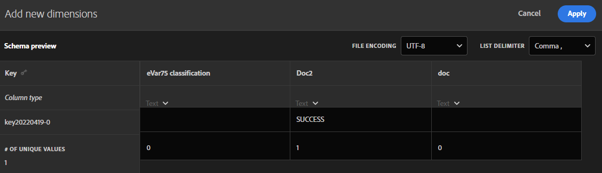
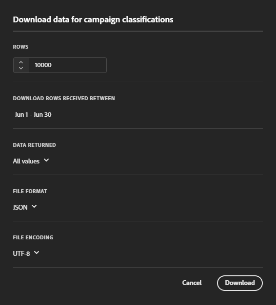
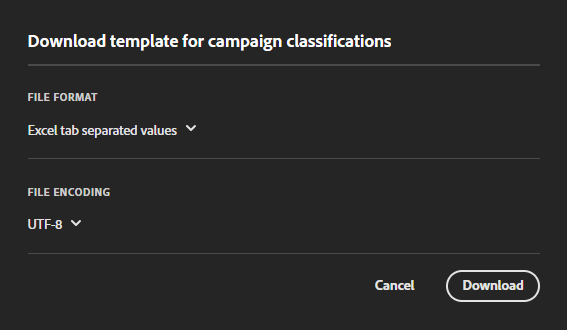

# Schema

View currently configured classification dimensions for this classification set.

**[!UICONTROL Components]** > **[!UICONTROL Classification sets]** > **[!UICONTROL Sets]** > Click the desired classification set name > **[!UICONTROL Schema]**

The following buttons are available:

<!--* **[!UICONTROL Add]**: Adds an empty row so that you can add a classification dimension to the schema.-->
* **[!UICONTROL Upload]**: Manually upload classification data for one or more classification dimensions. `JSON`, `CSV`, `TSV`, and `TAB` files are supported. Uploading a valid file shows a table preview of data to classify.
  * **[!UICONTROL File encoding]**: Select the correct file encoding using this drop-down. Valid options include [!UICONTROL UTF-8] and [!UICONTROL Latin1].
  * **[!UICONTROL List delimiter]**: Select the correct list delimiter. If using a downloaded file or template file, make sure that the [!UICONTROL List delimiter] here matches the [!UICONTROL List delimiter] when the file was downloaded.
  * **[!UICONTROL Apply]**: Save the uploaded classification data to the classification set.

  

* **[!UICONTROL Download]**: Download key values and their classification columns.
  * **[!UICONTROL Rows]**: The maximum number of rows to include in the download file.
  * **[!UICONTROL Download rows received between]**: A calendar date picker that allows you to filter key values by when they appear in reporting. If a key value was not collected in this date range, it does not appear in the downloaded file.
  * **[!UICONTROL Data returned]**: A drop-down list that lets you filter key values included in the downloaded file based on their associated classification data.
    * **[!UICONTROL All classified values]**: Includes rows where classification data is included in at least one column.
    * **[!UICONTROL All unclassified values]**: Includes rows where classification data is missing in at least one column.
  * **[!UICONTROL File format]**: A drop-down list that determines the file format that the download file is in. Options include [!UICONTROL JSON], [!UICONTROL Comma separated values], and [!UICONTROL Excel tab separated values].
  * **[!UICONTROL File encoding]**: A drop-down list that determines the file encoding. Options include [!UICONTROL UTF-8] and [!UICONTROL Latin1]. UTF-8 is recommended.

  

* **[!UICONTROL Template]**: Download a template file. This file is similar to the [!UICONTROL Download] button, except it does not contain any classification data or key values.
  * **[!UICONTROL File format]**: A drop-down list that determines the file format that the template file is in. Options include [!UICONTROL Comma separated values], and [!UICONTROL Excel tab separated values].
  * **[!UICONTROL File encoding]**: A drop-down list that determines the file encoding. Options include [!UICONTROL UTF-8] and [!UICONTROL Latin1]. UTF-8 is recommended.
  * **[!UICONTROL List delimiters]**: A drop-down list that determines the list delimiter separating classification columns on each row.

  

* **[!UICONTROL Job history]**: A shortcut link that takes you to the [Job manager](../job-manager.md), showing jobs only for this classification set.
* **[!UICONTROL Automate]**: Automatically ingest data from external storage locations.
  * **[!UICONTROL Location account]**: A drop-down list showing existing location accounts that your organization has configured. A button is available to create a location account.
  * **[!UICONTROL Location]**: A drop-down list showing existing locations that your organization has configured. A button is available to create a location.
  * **[!UICONTROL Delimiter]**: The column delimiter for uploaded files. Options include [!UICONTROL Comma], [!UICONTROL Semicolon], [!UICONTROL Colon], [!UICONTROL Vertical bar], [!UICONTROL Space], [!UICONTROL Forward slash], [!UICONTROL Backward slash], [!UICONTROL Dash], or [!UICONTROL Underscore].
  * **[!UICONTROL Encoding]**: A drop-down list that determines the file encoding. Options include [!UICONTROL UTF-8] and [!UICONTROL Latin1]. UTF-8 is recommended.
