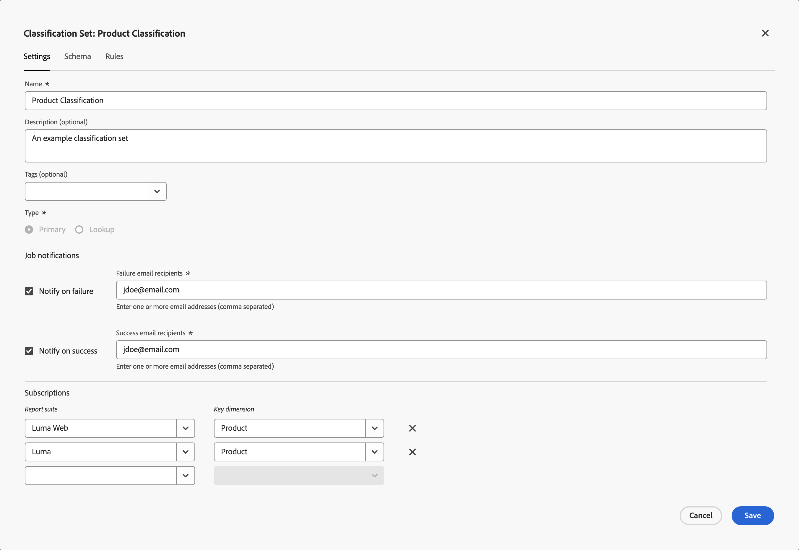
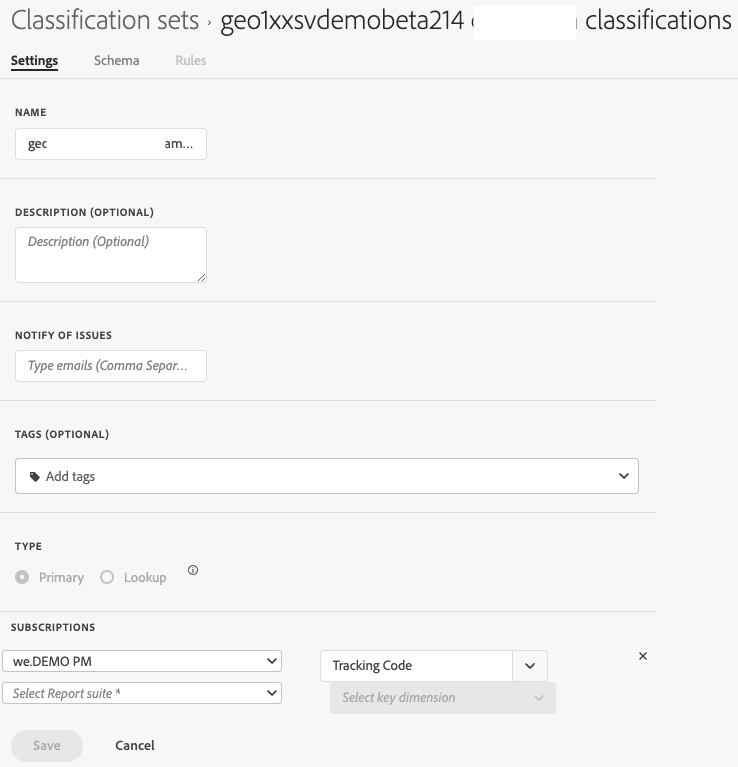

# Classification set settings

You can edit the initial settings of a classification set. 

To edit the settings for a classification set:

1. In the **[!UICONTROL Classifications Sets]** manager, select the classification set for which you want to edit the schema.
1. In the **[!UICONTROL Classification Set: _classification set_]** dialog, select the **[!UICONTROL Settings]** tab. 

1. In the **[!UICONTROL Classification Set: _classification set_]** dialog, where appropriate:

   

   1. Edit the **[!UICONTROL Name]**.
   1. Edit a **[!UICONTROL Description (optional)]**.
   1. Edit the list of email addresses (comma separater) in **[!UICONTROL Notify of issues]**. These users are notified by email of any issues.
   1. Add one or more **[!UICONTROL Tags (optional)]** to the classification set. Select an existing tag from the **[!UICONTROL Tags]** drop-down menu, or enter a new tag. Use  to remove a tag.
   1. Edit the **[!UICONTROL Subscriptions]**.  
      * You can define multiple **[!UICONTROL Report Suite]** and **[!UICONTROL Dimension]** combinations to a classification set. 
      * Select  to delete a **[!UICONTROL Report Suite]** and **[!UICONTROL Key Dimension]** combination.

      See [Creat a classification set](create.md) for more details.

   1. Select **[!UICONTROL Save]** to save the settings. Select **[!UICONTROL Cancel]** to cancel.

<!--

Configure a classification set's settings.

**[!UICONTROL Components]** > **[!UICONTROL Classification sets]** > **[!UICONTROL Sets]** > Click the desired classification set name > **[!UICONTROL Settings]**

The following fields are available in this tab:

* **[!UICONTROL Name]**: The classification set name.
* **[!UICONTROL Description]**: The description for the classification set.
* **[!UICONTROL Notify of issues]**: A comma-delimited list of email addresses that are notified of issues with this classification set.
* **[!UICONTROL Tags]**: Add one or more tags to the selected classification set. Tags allow you to organize or group classification sets so that it is easier to locate them in the future.
* **[!UICONTROL Type]**: The type of classification between [!UICONTROL Primary] and [!UICONTROL Lookup]. Primary classifications are typically used. You cannot alter a classification set's type after it is created.
* **[!UICONTROL Subscriptions]**: The report suite and dimension combinations that the classification set applies to.

-->