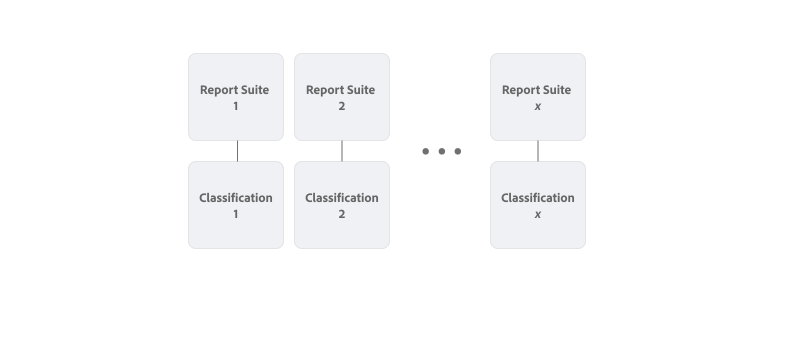
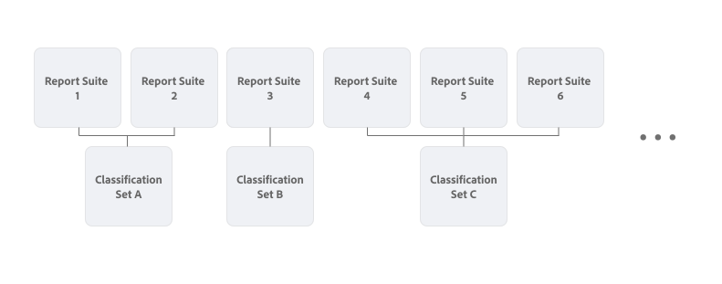

# Classification sets overview

Classification sets provide a single interface to manage classifications and rules. This workflow combines the creation of classifications in Report suite settings with the [Classification importer](/help/components/classifications/sets/manage/set-manager.md). The result is a single intuitive interface to create and manage classification data.


## Classification sets versus legacy classifications

The main difference between classification sets and legacy classifications is the relation of the classifications with a report suite. 

In legacy classifications, each classification is directly linked to a report suite. Very similar classifications (for example for a product catalog) are replicated when used across multiple report suites.



In classification sets you define subscriptions of report suites and key dimension combinations. For example, a product catalog classification that is applicable for multiple report suites and based on a product (SKU) dimension you only have to define once as a classification set. And within that classification set you configure multiple reports suites and key dimension combinations to subscribe to that classification set.




To access **[!UICONTROL Classification sets]** from the **[!UICONTROL Components]** menu in the Adobe Analytics interface, you must be a product admin or belong to a product profile containing the permission item [!UICONTROL Report Suite Tools] > [!UICONTROL Classifications] . Note that legacy classification management interfaces are available from the **[!UICONTROL Admin]** menu.

Classification sets consist of three functional areas:

* [**[!UICONTROL Classification Sets]**](manage/set-manager.md): Create, edit, and delete classification sets.
* [**[!UICONTROL Jobs]**](job-manager.md): View the status of classification sets jobs.
* [**[!UICONTROL Consolidations]**](consolidations/manage.md): Combine multiple classification sets into a single classification set.


## Workflow

The workflow for classification sets typically involves the following steps:

1. Consider for which report suite and dimension combinations you want to create a classification set. An example is to define a product classification set that you create for any report suite for which you want to classify products with more details. For example, details like category and color.
1. [Create a classification set](/help/components/classifications/sets/manage/create.md) with subscriptions for one or more report suite and key dimension combinations that identify products. For example:
   
   | Report Suite | Key Dimension |
   |---|---|
   | Report Suite 1 | Product ID |
   | Report Suite 2 | Product SKU |

1. [Add the classifications](/help/components/classifications/sets/manage/schema.md#add) that you have identified to the classification set schema. For example: 

   | Classification Name | Identity Name |
   |---|---|
   | Category | category |
   | Color | color |

1. Manually create a file containing classification data. [Use a template](/help/components/classifications/sets/manage/schema.md#template) to ensure you use the [supported file format](data-files.md#classification-set-file-formats) and columns for the file. Then add the data to the template file. 
     
   Alternatively you can export data directly from your product catalog in the [supported file formats](data-files.md#classification-set-file-formats) with columns that adhere to the template. For example, a CSV file, like: 

   ```
   Key,Category,Color
   Adobe Nike Tech Fleece Full-Zip Hoodie - Men's,Men,Black
   Adobe Nike Tech Fleece Full-Zip Hoodie - Women's,Women,Black
   Men's North Face Adobe Jacket,Men,Black
   Nike Air Hybrid 2 Golf Bag,Equipment,Blue
   STITCH&reg; Ultimate Garment Bag,Equipment,Brown
   Adobe Analytics Training Tee - Navy,Men,Navy
   AirPods Pro 2,Electronics,White
   Adobe Analytics Training Tee - Green,Men,Green
   Women's North Face Adobe Jacket,Women,Blue
   Adobe Analytics Training Tee - Grey,Men,Gray
   Adobe Analytics One Million Views - Grey,Equipment,Grey
   Adobe and MGM Tee - White,Women,White
   Adobe and MGM Tee - Charcoal,Women,Charcoal
   ```

In the classification data file, you refer to the key dimension for each report suite (for example: **[!UICONTROL Product ID]** and **[!UICONTROL Product SKU]**) using `Key`. And you refer to each classification using the **[!UICONTROL Classification Name]** (for example `Category` or `Color`).

1. [Upload](/help/components/classifications/sets/manage/schema.md#upload) the file that contains the classification data into the classification set schema.

1. [Automate](/help/components/classifications/sets/manage/schema.md#automate) the process of updates to your product catalog that you want to see reflected in classification data through the use of a cloud location.

1. [Download](/help/components/classifications/sets/manage/schema.md#download) your classification data to validate the content.

1. [Inspect the job history](/help/components/classifications/sets/job-manager.md) to see the results of your actions (upload, download, template, and more) on classifications.
1. If you have multiple similar classification sets as a result from a migration from the legacy classification functionality, [consolidate](consolidations/manage.md) these classification sets.


## Improvements

The backend architecture released with classification sets contains several improvements:

* Reduced processing time (from 72 hours back to 24 hours).
* A redesigned user interface to manage classifications.
* The option to use classification data in Adobe Experience Platform through the [Adobe Analytics source connector for classification data](https://experienceleague.adobe.com/en/docs/experience-platform/sources/connectors/adobe-applications/classifications).

The backend architecture released with classification sets also contains several changes:

* When using the browser or automated import, **[!UICONTROL Overwrite on conflict]** is always enabled.
* When using the browser or automated import, the option to export immediately after import is no longer supported. Exports must be initiated separately.
* The Analytics 2.0 `GetDimensions` API endpoint now returns string identifiers for classifications instead of numeric identifiers. Numeric identifiers can still be used, but the recommendation is to use the new string identifiers where possible. Numeric identifiers can be retrieved by using the `?expansion=hidden` query string parameter.

>[!IMPORTANT]
>
>The performance of classification sets mainly depend on the number of unique key values that contain data. Be careful when you do have variables that contain large numbers of unique values. Especially when you combine such variables from multiple report suites and dimensions into a single classification set.

## Limitations

* Classification sets do not yet support rules. Rules functionality is added to the classification sets interface before the [legacy rule builder](/help/components/classifications/crb/classification-rule-builder.md) functionality becomes unavailable.
* There is no migration of legacy classification rules and configurations to classification sets. A migration utility is added to the classification sets interface before the legacy classification functionality becomes unavailable.
