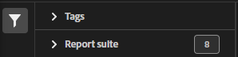

# Classification Set Manager

The Classification Set Manager allows you to create, edit or delete classification sets.

**[!UICONTROL Components]** > **[!UICONTROL Classification sets]** > **[!UICONTROL Sets]**

Classification Sets consist of **Subscriptions** (Report Suites that this Classification Set applies to) and **Classification Names** (The additional dimensions containing classification data).

## Filter Classification Sets

The left side of the Classification Set Manager provides filter settings to locate the desired Classification Set. Clicking the filter icon toggles the filter settings visibility. You can filter Classification Sets by **[!UICONTROL Tags]**, **[!UICONTROL Report suite]**, or **[!UICONTROL Owner]**.

## Classification Set Manager columns

The following columns are available in the Classification Set Manager:

* **[!UICONTROL Classification Set]**: The Classification Set name. Click a Classification Set name to [edit its settings](settings.md).
* **[!UICONTROL Subscriptions]**: The number of subscriptions, or number of Report Suites that this Classification Set applies to.
* **[!UICONTROL Owner]**: The owner of the Classification Set.
* **[!UICONTROL Classifications]**: The number of classification dimensions that the Classification Set contains.
* **[!UICONTROL Automated]**: Indicates if the Classification Set is configured to automatically pull data from an FTP site.
* **[!UICONTROL Last Modified]**: The date and time that the Classification Set was last modified.
* **[!UICONTROL FTP Host + Path]**: If automated, the FTP location that the Classification Set pulls data from.

## Create or edit options

The following buttons are available in the Classification Set Manager:

* **[!UICONTROL Add]**: [Create](create.md) a Classification Set.
* **[!UICONTROL Search by title]**: Search for Classification Sets by name.
* **[!UICONTROL Load more]**: The Classification Set Manager initially displays up to 1000 Classification Sets. Click this button to load 1000 more Classification Sets.
* **Show/Hide columns**: Toggle visibility for any column besides [!UICONTROL Classification Set].

Select one or more Classification Sets by clicking the checkbox next to the desired Classification Set. Selecting a Classification Set reveals the following options:

* **[!UICONTROL Tag]**: Add one or more tags to the selected Classification Set(s), which allows you to organize or group Classification Sets to make them easier to locate in the future.
* **[!UICONTROL Rename]**: Rename the selected Classification Set.
