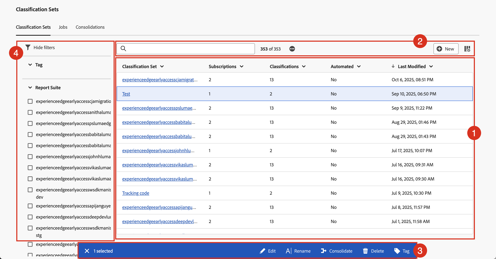

# Manage classification sets

You can create, rename, edit, consolidate, delete, and tag classification sets in the Classification sets management interface. You can also filter on and search for specific classification sets. 

To manage classification sets:

1. Select **[!UICONTROL Components]** from the Adobe Analytics top menu bar, then select **[!UICONTROL Classification sets]**.
1. In **[!UICONTROL Classification Sets]**, select the **[!UICONTROL Classification Sets]** tab.

## Classification sets manager

The **[!UICONTROL Classification Sets]** manager has the following interface elements:

### Classification sets list

The **[!UICONTROL Classification Sets]** list ➊ displays all the classification sets. The list has the following columns:

| Column | Description |
|---|---|
| **[!UICONTROL Classification Set]** | The name of the classification set. Select the name to [edit the classification set](create.md#edit-a-classification-set). |
| **[!UICONTROL Subscriptions]** | The number of subscriptions that the classification set applies to. |
| **[!UICONTROL Classifications]** | The number of classification dimensions that the classification set contains. |
| **[!UICONTROL Automated]** | Is the classification set configured to import data from a cloud location automatically or not? This automation can be configured as part of the [classification sets schema](schema.md). |
| **[!UICONTROL Last modified]** | The timestamp of the last modification of the classification set. |

To resize a column in the classification sets list, you can:

* Hover over the column separator and drag the column separator to the desired column width.
* Select  and select **[!UICONTROL Resize column]**. A vertical line with resize button allows you to resize the column to the desired with.

To sort a column in the classification sets list

* Select  and select **[!UICONTROL Sort Ascending]** or **[!UICONTROL Sort Descending]**. An arrow (↑↓) indicates which column and how the column is sorted.

### Search and buttons

In the area ➋ on top of the classification sets list, you can:

* Search  for classification sets. Results are shown in the classification sets list. Select  to clear the search.
* Remove any filter that is applied to the classification sets list. Select  to remove a filter.
* Select  to load an addition 1000 classification sets. Initially, the classification set list displays up to 1000 classification sets. 
* Select  **[!UICONTROL New]** to [create a new classification set](create.md#create-a-classification-set).
* Define the columns of the classification set list. Select  and in the **[!UICONTROL Customize table]** dialog select the columns to show underneath **[!UICONTROL Select columns to show]**. Select **[!UICONTROL Apply]** to apply the column settings.

### Action bar

When you select one or more classification set in the classification set list, a blue action bar ➌ appears. The following actions are available in the action bar:

| Icon | Action | Description |
|---|---|---|
|  | **[!UICONTROL Edit]** | [Edit the classification set](create.md#edit-a-classification-set) in the classification set builder. |
|  | **[!UICONTROL Rename]** | Rename a classification set. In the **[!UICONTROL Rename: _classification set_]** dialog enter a new name and select **[!UICONTROL Rename]**. |
|  | **[!UICONTROL Consolidate]** | [Consolidate classification sets](/help/components/classifications/sets/consolidations/manage.md). |
|  | **[!UICONTROL Delete]** | Delete a classification set. The **[!UICONTROL Delete _classification set_?]** dialog appears. A deletion of a classification set cannot be undone. Any scheduled projects or consolidations that use this classification set continue to use the definition of this classification set until you re-save the scheduled projects or re-validate the scheduled consolidations. Select **[!UICONTROL Delete]** to delete the classification set. |
|  | **[!UICONTROL Tag]** | Tag the classification set. In the **[!UICONTROL Tag: _classification set_]** dialog, select one or more tags from the **[!UICONTROL Tags]** drop-down menu to add tags. Or enter one or more new tags. Use  to remove a tag.  Select **[!UICONTROL Save]** to save the tags. |

### Filter panel

Select  to show the filter panel ➍ that allows you to filter the classification set list. You can filter on:

* **[!UICONTROL Tags]**. Select one or more tags to filter the classification sets list on tags.
* **[!UICONTROL Report Suite]**. Select one or more report suites to filter the classification sets list on report suites.

Select  **[!UICONTROL Hide filters]** to hide the filters panel.

Note that the filters shown in the filters panel reflect the options for the classification sets that are preloaded.

<!-- old content

The Classification set manager allows you to create, edit, or delete classification sets.

**[!UICONTROL Components]** > **[!UICONTROL Classification sets]** > **[!UICONTROL Sets]**

Classification sets consist of **Subscriptions** (report suite and dimension combinations) and **Classification names** (dimensions containing classification data). Subscriptions are configured under [Settings](settings.md), while classification names are configured under [Schema](schema.md).

## Filter classification sets

The left side of the Classification set manager provides filter settings to locate the desired classification set. Clicking the filter icon toggles the filter settings visibility. You can filter classification sets by **[!UICONTROL Tags]** or **[!UICONTROL Report suite]**.

Note that 1,000 classification sets are preloaded at a time. The filters shown in the left rail reflect the options for the sets that are preloaded.

## Classification set manager columns

The following columns are available in the Classification set manager:

* **[!UICONTROL Classification set]**: The classification set name. Clicking a classification set name edits its [settings](settings.md).
* **[!UICONTROL Subscriptions]**: The number of subscriptions that this classification set applies to.
* **[!UICONTROL Classifications]**: The number of classification dimensions that the classification set contains.
* **[!UICONTROL Automated]**: Determines if the classification set is configured to automatically import data from a cloud location. Automation can be configured in the classification set's [schema](schema.md).
* **[!UICONTROL Last Modified]**: The date and time that the classification set was last modified.

## Create or edit options

The following buttons are available in the Classification set manager:

* **[!UICONTROL Add]**: [Create](create.md) a classification set.
* **[!UICONTROL Search by title]**: Search for classification sets by name.
* **[!UICONTROL Load more]**: The Classification set manager initially displays up to 1000 classification sets. This button loads 1000 more classification sets.
* **Show/Hide columns**: Toggle visibility for any column besides [!UICONTROL Classification set].

Select one or more classification sets by clicking the checkbox next to the desired classification set. Selecting a classification set reveals the following options:

* **[!UICONTROL Tag]**: Add one or more tags to the selected classification sets, which allows you to organize or group classification sets to make them easier to locate in the future.
* **[!UICONTROL Delete]**: Deletes the classification set. Classification dimensions based on this classification set are no longer available. Scheduled projects using the deleted classification set continue using dependent dimensions until you resave the scheduled project.
* **[!UICONTROL Consolidate]**: Start a new [consolidation](../consolidations/process.md).
* **[!UICONTROL Rename]**: Rename the selected classification set.

-->