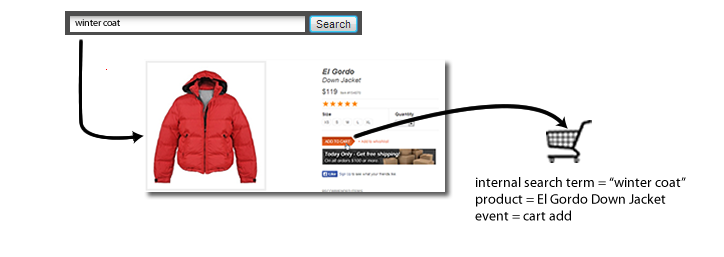

# eVar (Merchandising)

*This help page describes how merchandising eVars work as a dimension. For information on how to implement merchandising eVars, see [eVars](/help/implement/vars/page-vars/evar.md) in the Implementation user guide.*

For a detailed discussion of how merchandising eVars work, see [Merchandising eVars and product finding methods](https://experienceleague.adobe.com/docs/analytics/admin/admin-tools/conversion-variables/merchandising-evars.html?lang=en).

When measuring the success of external campaigns or external search terms, you typically want a single value to receive credit for any success events that occur. For example, if a customer clicks a link in an email campaign to visit your website, all purchases made as a result should be credited to that campaign.

What about events that are driven by internal search or by category browsing when a customer looks for multiple items? For example, a customer searches your site for `"goggles"`, then adds a pair to their cart: 


Before checkout, the customer searches for `"winter coat"`, then adds a down jacket to the to their cart: 



When the visitor completes this purchase, you would have an internal search for `"winter coat"` credited with the purchase of a pair of goggles (assuming the eVar uses the default allocation of 'Most recent'). Good for `"winter coat"`, but bad for marketing decisions: 

|  Internal Search Term  | Revenue  |
|---|---|
|  winter coat  | $157  |

## How merchandising variables solve this problem

Merchandising eVars let you assign the current value of an eVar to a product at the time a success event takes place. This value remains tied to that product, even if one or more new values are later set for that particular eVar.

If merchandising is enabled for the eVar in the previous example, the search term `"goggles"` is tied to the snow goggles, and the search term `"winter coat"` is tied to the down jacket. Merchandising eVars allocate revenue at the product level, so each term receives credit for the amount of revenue for the product to which the term was associated:

|  Internal Search Term  | Revenue  |
|---|---|
|  winter coat  | $119  |
|  goggles  | $38  |

See [Merchandising eVars](/help/implement/vars/page-vars/evar-merchandising.md) for implementation instructions.

## Instances on merchandising variables

The [Instances](../metrics/instances.md) metric is not recommended for use on merchandising variables.

* For merchandising variables using product syntax, instances are not incremented at all.
* For merchandising variables using conversion variable syntax, instances are counted each time the eVar is set. However, it attributes to the dimension item `"None"` unless all of the following happen on the same hit:
  * The merchandising eVar is set with a value.
  * The `products` variable is defined with a value.
  * A binding event is set.

```js
// This merchandising eVar uses conversion variable syntax, and counts an instance.
// However, if the binding event and products variable are not both set, the instance attributes to "None".
s.eVar1 = "Tower defense";

// This merchandising eVar uses product syntax, and does not count an instance.
s.products = "Games;Wizard tower;;;;eVar2=Tower defense";
```

Since most use cases for conversion variable syntax require the eVar and products variable on different hits, using the 'Instances' metric is not realistic.
