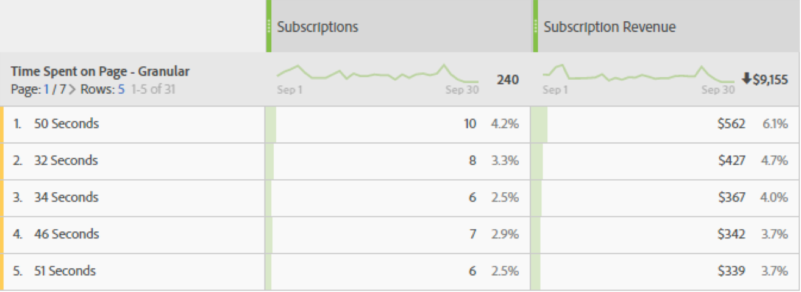

# Time spent on page

The 'Time spent on page' [dimension](overview.md) records the amount of time a visitor spent on the page. It uses the following steps to measure calculation:

1. For a given hit, look at the timestamp.
2. Compare this hit with the timestamp of the next hit in the visit. Both page view and link tracking hits count.
3. The amount of time that elapsed between these two hits contributes to the time spent.

This dimension is valuable when you want to understand how long visitors interact with a given metric on your site.

>[!TIP]
>
>Time spent is not measured for the last hit of the visit since there is not subsequent image request to measure elapsed time. This concept also applies to visits consisting of a single hit (a bounce).

This dimension is hit-based, meaning that the value is different for every hit. Compare this dimension to [Time spent per visit](time-spent-per-visit.md), which is a visit-based dimension. Higher time spent means that a visitor stayed longer on a page (hit).

## Populate this dimension with data

This dimension works out of the box for all implementations. If a report suite contains data, this dimension works.

## Dimension items

Multiple dimensions exist for time spent on page:

* **Time spent on page - bucketed**: The amount of time is bucketed. Dimension items range from `"Less than 15 seconds"` to `"More than 30 minutes"`. Time between hits typically does not last longer than 30 minutes; however, time between hits can exceed 30 minutes if using timestamped hits or data sources.
* **Time spent on page - granular**: Each number of seconds is a unique dimension item.

See [Time spent overview](../metrics/time-spent.md) for more general information on time spent.
