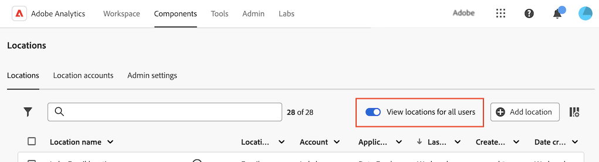

# Configure cloud import and export locations

<!-- This page is almost duplicated with the "Configure cloud export locations" article in CJA. Differences are that Snowflake isn't supported here and there is a Suffix field for each account type. -->

>[!NOTE]
>
>Consider the following when creating and editing locations:<ul><li>System administrators can restrict users from creating locations, as described in [Configure whether users can create locations](/help/components/locations/locations-manager.md#configure-whether-users-can-create-locations). If you can't create locations as described in this section, contact your system administrator.</li><li>A location can be edited only by the user who created it or by a system administrator.</li></ul>

After you [configure a cloud account](/help/components/locations/configure-import-accounts.md), you can configure a location on that account. A single location can be used for any one of the following purposes (a single location cannot be associated with multiple purposes):

* Exporting files using [Data Feeds](/help/export/analytics-data-feed/create-feed.md)
* Exporting reports using [Data Warehouse](/help/export/data-warehouse/create-request/dw-request-report-destinations.md)
* Exporting files when using [Report Builder](/help/analyze/report-builder/report-builder-export.md)
* Importing schemas using [Classification sets](/help/components/classifications/sets/overview.md)

You must configure Adobe Analytics with the necessary information to access your cloud account. This process consists of adding and configuring the account (such as Amazon S3 Role ARN, Google Cloud Platform, and so forth) as described in [Configure cloud import and export accounts](/help/components/locations/configure-import-accounts.md), and then adding and configuring the location within that account (as described in this article).

For information about how to view and delete existing locations, see [Locations manager](/help/components/locations/locations-manager.md).

## Begin creating or editing a location

1. In Adobe Analytics, select [!UICONTROL **Components**] > [!UICONTROL **Locations**].

1. On the [!UICONTROL Locations] page, select the [!UICONTROL **Locations**] tab.

1. (Conditional) If you are a system administrator, you can enable the [!UICONTROL **View locations for all users**] option to view locations created by all users in your organization. 
   

1. To add a new location, select [!UICONTROL **Add location**]. (If you haven't already added an account, add one as described in [Configure cloud import and export accounts](/help/components/locations/configure-import-accounts.md).)

   The [!UICONTROL **Add location**] dialog displays

   Or

   To edit an existing location, select the 3-dot menu next to the location name, then select [!UICONTROL **Edit**].
   
   The [!UICONTROL **Location details**] dialog displays.

1. Specify the following information:

   |Field | Function | 
   |---------|----------|
   | [!UICONTROL **Name**] | The name of the location.  | 
   | [!UICONTROL **Description**] | Provide a short description of the account to help differentiate it from other accounts of the same account type. |
   | [!UICONTROL **Use with**] | Select whether you want to use this location with [!UICONTROL **Data Feeds**], [!UICONTROL **Data Warehouse**], [!UICONTROL **Classification sets**], or **[!UICONTROL Report Builder]**. 
Consider the following when making a selection:
<ul><li>A single location cannot be used for multiple purposes. For example, a location that is used for Data Feeds cannot also be used for Data Warehouse or Classification sets.</li><li>To avoid file conflicts within a location, don't change the value of the [!UICONTROL **Use with**] field after the location has been used.</li><li>If you are creating a location for an Email account, select [!UICONTROL **Data Warehouse**] in this field. Email locations are not supported iwth Data Feeds and Classification sets.</li></ul> | 
   | [!UICONTROL **Make location available to all users in your organization**] | Enable this option to allow other users in your organization to use the location.
Consider the following when sharing locations:
<ul><li>Locations that you share cannot be unshared.</li><li>Shared locations can be edited only by the owner of the location.</li><li>Locations can be shared only if the account that the location is associated with is also shared.</li></ul> |
   | [!UICONTROL **Location account**] | Select the location account where you want to create this location. For information about how to create an account, see [Configure cloud import and export accounts](/help/components/locations/configure-import-accounts.md). | 

1. To complete the form for configuring the location, continue with the section below that corresponds to the account type that you selected in the [!UICONTROL **Location accounts**] field. (Additional legacy account types are also available, but are not recommended.)

### Amazon S3 Role ARN

To configure an Amazon S3 Role ARN location, specify the following information:

1. [Begin creating or editing a location](#begin-creating-or-editing-a-location), as described above.

   |Field | Function | 
   |---------|----------|
   | [!UICONTROL **Bucket**] | The bucket within your Amazon S3 account where you want Adobe Analytics data to be sent. 
Ensure that the User ARN that was provided by Adobe has the `S3:PutObject` permission in order to upload files to this bucket. 

Bucket names must meet specific naming rules. For example, they must be between 3 to 63 characters long, can consist only of lowercase letters, numbers, dots (.), and hyphens (-), and must begin and end with a letter or number. [A complete list of naming rules are available in the AWS documentation](https://docs.aws.amazon.com/AmazonS3/latest/userguide/bucketnamingrules.html). 
 |  
   | [!UICONTROL **Prefix**] | The folder within the bucket where you want to put the data. Specify a folder name, then add a backslash after the name to create the folder. For example, folder_name/ | 

   {style="table-layout:auto"}

1. Select [!UICONTROL **Save**].

   You can now import or export data to or from the account and location that you configured. To export data, use [Data Feeds](/help/export/analytics-data-feed/create-feed.md) or [Data Warehouse](/help/export/data-warehouse/create-request/dw-request-report-destinations.md). To import data, use [Classification sets](/help/components/classifications/sets/overview.md).

   Imported data is not deleted from the cloud destination after it is imported. 

   >[!NOTE]
   >
   >   If you previously used [FTP to import classifications](/help/components/classifications/importer/c-uploading-saint-data-files-via-ftp.md) to Adobe Analytics, you needed to upload a FIN file. This FIN file is not needed when importing from cloud accounts.

### Google Cloud Platform

To configure a Google Cloud Platform location, specify the following information:

1. [Begin creating or editing a location](#begin-creating-or-editing-a-location), as described above.

   |Field | Function | 
   |---------|----------|
   | [!UICONTROL **Bucket**] | The bucket within your GCP account where you want Adobe Analytics data to be sent. Ensure that you have granted permission to the Principal provided by Adobe to upload files to this bucket. |  
   | [!UICONTROL **Prefix**] | The folder within the bucket where you want to put the data. Specify a folder name, then add a backslash after the name to create the folder. For example, folder_name/ | 

   {style="table-layout:auto"}

1. Select [!UICONTROL **Save**].

   You can now import or export data to or from the account and location that you configured. To export data, use [Data Feeds](/help/export/analytics-data-feed/create-feed.md) or [Data Warehouse](/help/export/data-warehouse/create-request/dw-request-report-destinations.md). To import data, use [Classification sets](/help/components/classifications/sets/overview.md).

   Imported data is not deleted from the cloud destination after it is imported. 

   >[!NOTE]
   >
   >   If you previously used [FTP to import classifications](/help/components/classifications/importer/c-uploading-saint-data-files-via-ftp.md) to Adobe Analytics, you needed to upload a FIN file. This FIN file is not needed when importing from cloud accounts.
   

### Azure SAS

To configure an Azure SAS location, specify the following information:

1. [Begin creating or editing a location](#begin-creating-or-editing-a-location), as described above.

   |Field | Function | 
   |---------|----------|
   | [!UICONTROL **Container**] | The container within the account you specified where you want Adobe Analytics data to be sent. | 
   | [!UICONTROL **Prefix**] | The folder within the container where you want to put the data. Specify a folder name, then add a backslash after the name to create the folder. For example, `folder_name/` |

   {style="table-layout:auto"}

1. Select [!UICONTROL **Save**].

   You can now import or export data to or from the account and location that you configured. To export data, use [Data Feeds](/help/export/analytics-data-feed/create-feed.md) or [Data Warehouse](/help/export/data-warehouse/create-request/dw-request-report-destinations.md). To import data, use [Classification sets](/help/components/classifications/sets/overview.md).

   Imported data is not deleted from the cloud destination after it is imported. 

   >[!NOTE]
   >
   >   If you previously used [FTP to import classifications](/help/components/classifications/importer/c-uploading-saint-data-files-via-ftp.md) to Adobe Analytics, you needed to upload a FIN file. This FIN file is not needed when importing from cloud accounts.
 

### Azure RBAC

To configure an Azure RBAC location, specify the following information:

1. [Begin creating or editing a location](#begin-creating-or-editing-a-location), as described above.

   |Field | Function | 
   |---------|----------|
   | [!UICONTROL **Account**] | The Azure storage account. | 
   | [!UICONTROL **Container**] | The container within the account you specified where you want Adobe Analytics data to be sent. Ensure that you grant permissions to upload files to the Azure application that you created earlier. | 
   | [!UICONTROL **Prefix**] | The folder within the container where you want to put the data. Specify a folder name, then add a backslash after the name to create the folder. For example, `folder_name/` |

   {style="table-layout:auto"}

1. Select [!UICONTROL **Save**].

   You can now import or export data to or from the account and location that you configured. To export data, use [Data Feeds](/help/export/analytics-data-feed/create-feed.md) or [Data Warehouse](/help/export/data-warehouse/create-request/dw-request-report-destinations.md). To import data, use [Classification sets](/help/components/classifications/sets/overview.md).

   Imported data is not deleted from the cloud destination after it is imported. 
   
   >[!NOTE]
   >
   >   If you previously used [FTP to import classifications](/help/components/classifications/importer/c-uploading-saint-data-files-via-ftp.md) to Adobe Analytics, you needed to upload a FIN file. This FIN file is not needed when importing from cloud accounts.

### Email

To configure an email location, specify the following information:

1. [Begin creating or editing a location](#begin-creating-or-editing-a-location), as described above.

   |Field | Function | 
   |---------|----------|
   | [!UICONTROL **Subject**] | The subject of the email message. | 
   | [!UICONTROL **Notes**] | The content of the email message. |

   {style="table-layout:auto"}

1. Select [!UICONTROL **Save**].

   You can now export data to the account and location that you configured when using [Data Feeds](/help/export/analytics-data-feed/create-feed.md). (Email locations are not supported with [Data Warehouse](/help/export/data-warehouse/create-request/dw-request-report-destinations.md) or [Classification sets](/help/components/classifications/sets/overview.md)). 

### Legacy account types

These legacy account types are available only when exporting data with [Data Feeds](/help/export/analytics-data-feed/create-feed.md) and [Data Warehouse](/help/export/data-warehouse/create-request/t-dw-create-request.md). These options are not available when importing data with [Classification sets](/help/components/classifications/sets/manage/schema.md).

+++FTP

Data feed data can be delivered to an Adobe or customer-hosted FTP location. Specify the directory  Use the path field to place feed files in a folder. 

|Field | Function | 
|---------|----------|
| [!UICONTROL **Directory path**] | Enter the path to the directory on the FTP server. Folders must already exist; feeds throw an error if the specified path does not exist.  For example, `/folder_name/folder_name`. | 

{style="table-layout:auto"}

+++

+++SFTP

Data feed data can be delivered to an Adobe or customer-hosted SFTP location. The destination site must contain a valid RSA or DSA public key. You can download the appropriate public key when creating the feed. 

|Field | Function | 
|---------|----------|
| [!UICONTROL **Directory path**] | Enter the path to the directory on the FTP server. Folders must already exist; feeds throw an error if the specified path does not exist.  For example, `/folder_name/folder_name`. | 

{style="table-layout:auto"}

+++

+++S3

You can send warehouse data directly to Amazon S3 buckets. This destination type requires a Bucket name, an Access Key ID, and a Secret Key. See [Amazon S3 bucket naming requirements](https://docs.aws.amazon.com/awscloudtrail/latest/userguide/cloudtrail-s3-bucket-naming-requirements.html) within the Amazon S3 docs for more information.

The user you provide for uploading data warehouse data must have the following [permissions](https://docs.aws.amazon.com/AmazonS3/latest/API/API_Operations_Amazon_Simple_Storage_Service.html):

* s3:GetObject
* s3:PutObject
* s3:PutObjectAcl

The following 16 standard AWS regions are supported (using the appropriate signature algorithm where necessary):

* us-east-2
* us-east-1
* us-west-1
* us-west-2
* ap-south-1
* ap-northeast-2
* ap-southeast-1
* ap-southeast-2
* ap-northeast-1
* ca-central-1
* eu-central-1
* eu-west-1
* eu-west-2
* eu-west-3
* eu-north-1
* sa-east-1

>[!NOTE]
>
>The cn-north-1 region is not supported.

+++

+++Azure Blob

Data warehouse support Azure Blob destinations. Requires a container, account, and a key. Amazon automatically encrypts the data at rest. When you download the data, it gets decrypted automatically. See [Create a storage account](https://docs.microsoft.com/en-us/azure/storage/common/storage-quickstart-create-account?tabs=azure-portal#view-and-copy-storage-access-keys) within the Microsoft Azure docs for more information.

>[!NOTE]
>
>You must implement your own process to manage disk space on the data warehouse destination. Adobe does not delete any data from the server.

+++

