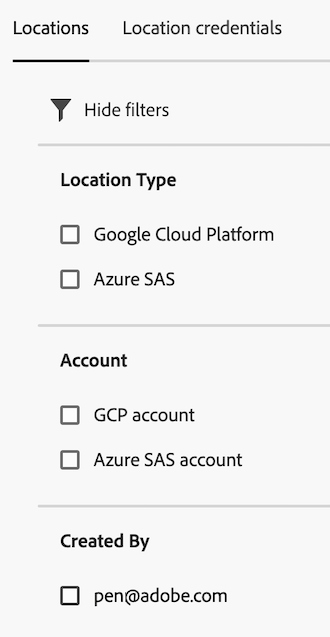

# Locations manager

The Locations manager allows you to create, edit, or delete locations.

**[!UICONTROL Components]** > **[!UICONTROL Locations]** 

In order to import Adobe Analytics classification data from a cloud destination, you first need to add and configure the location where you want the classification data to be collected. This page explains the various options available on the Locations page.

## Filter locations

The left side of the Locations manager provides filter settings to find the desired locations. 

1. Select the filter icon. 

   You can filter locations by **[!UICONTROL Location Type]**, **[!UICONTROL Account]**, or **[!UICONTROL Created By]**.

   

## Locations manager columns

The following columns are available in the Locations manager:

* **[!UICONTROL Location name]**: The location name. Select the 3-dot menu next to a location name to either [edit the location](/help/components/locations/configure-import-locations.md) or delete it.
* **[!UICONTROL Location type]**: The type of account associated with the location.
* **[!UICONTROL Account]**: The specific account associated with the location.
* **[!UICONTROL Last used]**: The date when the location was last used.
* **[!UICONTROL Created by]**: The user who created the location.
* **[!UICONTROL Date created]**: The date that the location was created.

## Create or edit options

The following options are available in the Locations manager:

* **[!UICONTROL Add location]**: Create a location. 

  For more information, see [Configure cloud import locations](/help/components/locations/configure-import-locations.md).
* **[!UICONTROL Search field]**: Search for locations by name.
* **[!UICONTROL Load more]**: The Locations manager initially displays up to 1,000 locations. This button loads 1,000 more locations.
* **Customize table**: The Customize table icon  allows you to choose which columns are displayed in the table.

Select the checkbox next to a location to reveal the following options:

* **[!UICONTROL Edit]**: Allows you to edit the selected location. For information about available fields that you can edit, see [Configure cloud import locations](/help/components/locations/configure-import-accounts.md).
* **[!UICONTROL Delete]**: Deletes the selected locations. This option allows you to select multiple locations. 