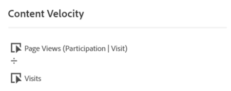
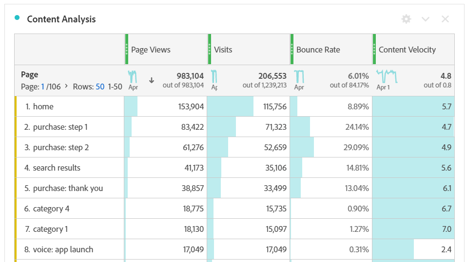

# Content Velocity

'Content Velocity' is a calculated metric template that helps you measure how impactful a dimension is on downstream content. It uses the formula `Page views (Visit participation) divided by Visits`.

[!UICONTROL Content Velocity] is commonly used in content analysis alongside other key metrics such as [!UICONTROL Page Views], [!UICONTROL Visits], and [!UICONTROL Bounce Rate].

