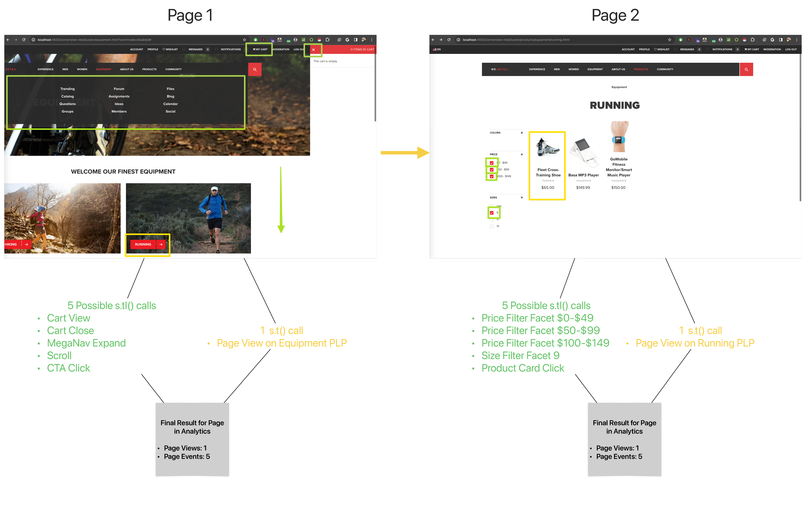

# Page events

The 'Page events' [metric](overview.md) shows the number of times any link tracking call was made. This metric is helpful when you want to understand which pages have the most engaging content. Measurement for this metric is most valuable when a visitor can perform an action on the page without navigating to a new page.

## How this metric is calculated

This metric counts all [Link tracking calls (`tl()`)](/help/implement/vars/functions/tl-method.md) in a report suite. All link types are included in this metric, specifically [Custom links](../dimensions/custom-link.md), [Download links](../dimensions/download-link.md), and [Exit links](../dimensions/exit-link.md). It does not include [Page view tracking calls (`t()`)](/help/implement/vars/functions/t-method.md).

## Example

In a typical journey of an ecommerce site, a Visitor could have several interacitons on a single page.  A typical Analytics Implementation will have these interactions configured as `tl()` server calls and reserving the `t()` call for one page load.  This provides enriched event tracking to see how many events can happen on a single page, providing the analyst with a deeper understanding how much engagement is happening before finally continuting the journey.  See the below journey as an example.

## Compare to similar metrics

* **Page events vs. [Page views](page-views.md)**: Page events count the number of link tracking calls (`tl()`), and exclude page view tracking calls (`t()`). Page views are the opposite; it counts the number of page view tracking calls, and excludes links.
