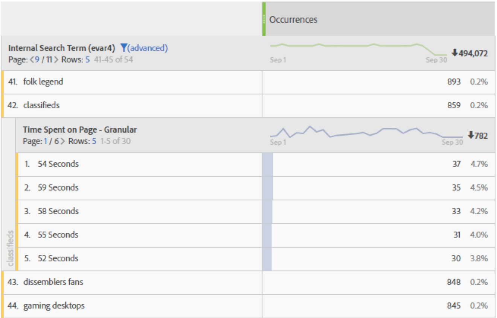
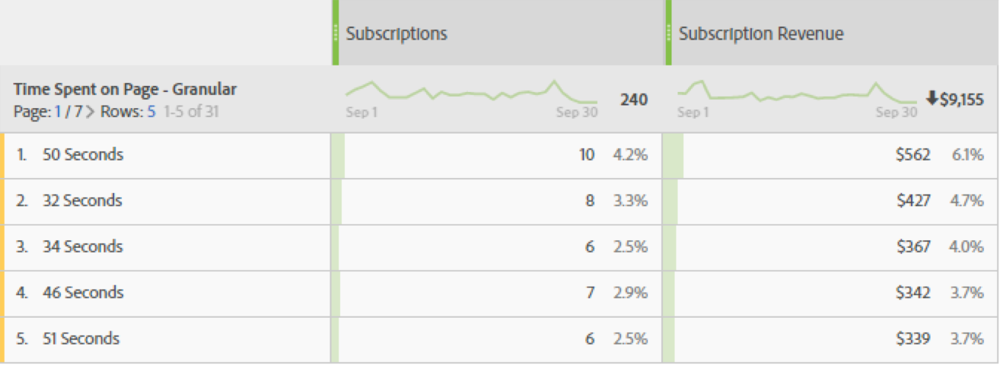

# Time spent overview

Various [!UICONTROL 'time spent'] metrics and dimensions are offered across Adobe Analytics products.

## 'Time spent' metrics

|Metric|Definition|Available in|
|---|---|---|
| [!UICONTROL Total seconds spent] | Represents the total amount of time visitors interact with a specific dimension item. Includes the instance of a value & persistence across all subsequent hits. In the case of props, time spent is counted across subsequent link events as well. | Analysis Workspace, Reports & Analytics, Report Builder (called ‘total time spent’), Data Warehouse |
| [!UICONTROL Time spent per visit] (Seconds)|*Total seconds spent / (visit-bounces)* Represents the average amount of time visitors interact with a specific dimension item during each visit. | Analysis Workspace, Reports & Analytics |
| [!UICONTROL Time spent per visitor] (Seconds)|*Total seconds spent / unique visitor* Represents the average amount of time visitors interact with a specific dimension item across the visitor’s lifetime (length of their cookie).|Analysis Workspace, Reports & Analytics |
| [!UICONTROL Average time spent on site] (Seconds)|Represents the total amount of time visitors interact with a specific dimension item, per sequence with a dimension item. It is not just limited to “site” averages as the name suggests. See the "How Time Spent is Calculated" section for more information on sequences. **Note**: This metric very likely differs from 'Time Spent per Visit' at a dimension item level due to the differences in the denominator in the calculation. | Analysis Workspace, Reports & Analytics (shown in minutes), Report Builder (shown in minutes) |
| [!UICONTROL Average time on site]|This is the same metric as *Average time spent on site (Seconds)*, except formatted as Time (hh:mm:ss) | Analysis Workspace |
| [!UICONTROL Average time spent on page]|Deprecated metric.  Instead, we recommend that you use ‘Average time spent on site’ if average time for a dimension item is needed. | Report Builder (when a dimension is in the request) |
| [!UICONTROL Total session length], a.k.a. [!UICONTROL Previous session length]|Mobile App SDK only.  Determined the next time the app is launched, for the previous session. Calculated in seconds, this metric does not count when the app is in the background, only when in use. This is a session-level metric. Example: We install app ABC and launch and use it for 2 minutes and then close the app. No data is sent about this session time. The next time we launch the app, [!UICONTROL Previous Session Length] will be sent with a value of 120. | Analysis Workspace, Reports & Analytics, Report Builder, Mobile Services UI |
| [!UICONTROL Average session length] (mobile) | *Total Session Length / (Launches – First Launches)* Mobile App SDK only. This is a session-level metric. | Report Builder, Mobile Services UI |

## 'Time spent' dimensions

| Dimension | Definition | Available in |
| --- | --- | --- |
| [!UICONTROL Time spent per visit - granular] | The total time spent during the visit truncated to the nearest second, and applied to every hit that was part of the visit. This is a visit-level dimension. | Analysis Workspace |
| [!UICONTROL Time spent per visit - bucketed] | The granular dimension bucketed into 9 different ranges. This is a visit-level dimension. Ranges include:<ul><li>Less than 1 minute</li><li>1-5 minutes</li><li>5-10 minutes</li><li>10-30 minutes</li><li>30-60 minutes</li><li>1-2 hours</li><li>2-5 hours</li><li>5-10 hours</li><li>10-15 hours</li></ul>**Note**: There cannot be buckets higher than this, because a visit expires after 12 hours of activity. | Analysis Workspace, Reports & Analytics, Report Builder |
| [!UICONTROL Time spent on page - granular] | The total time spent on each hit, truncated to the nearest second. This is a hit-level dimension and includes both page views and link events. Despite its name, it is not limited to the “page” dimension.| Analysis Workspace |
| [!UICONTROL Time spent on page - bucketed] | The granular dimension bucketed into 10 different ranges; however, the bucketed dimension only counts page views (and excludes link events). This is a hit-level dimension. Ranges include:<ul><li>less than 15 seconds</li><li>15 to 29 seconds</li><li>30 to 59 seconds</li><li>1 to 3 minutes</li><li>3 to 5 minutes</li><li>5 to 10 minutes</li><li>10 to 15 minutes</li><li>15 to 20 minutes</li><li>20 to 30 minutes</li><li>more than 30 minutes</li></ul> | Analysis Workspace, Reports & Analytics |

## How 'Time Spent' is calculated

Adobe Analytics uses explicit values (including link events and video views) to calculate [!UICONTROL Time Spent].

>[!NOTE]
>
>Without link events like [!UICONTROL Video Views] or [!UICONTROL Exit Links], time spent on the last hit of a visit cannot be known. For similar reasons, [!UICONTROL Bounce Visits] (i.e. visits with a single hit) also does not have a 'time spent' associated with it.

The **numerator** in all time spent calculations is total seconds spent.

The **denominator** is not available as a separate metric in Adobe Analytics. For hit-level 'time spent' metrics, the denominator is sequences. A sequence is a consecutive set of hits where a given variable contains the same value (whether by being set, spread forward, or persisted). 'Spread forward' refers to the persistence of props between page views (i.e. across subsequent link events), for the purposes of calculating time spent.

* For example, in the case of [!UICONTROL Page Name] or other dimensions at the hit level, the denominator is essentially [!UICONTROL 'Instances'] or [!UICONTROL 'Page Views'], but with reloads and unset values (e.g. link events) counted as a single interaction (a sequence). 

* Bounce and exit hits are also removed from the denominator because 'time spent' cannot be known.

## FAQs

**Q1: Can all 'time spent' metrics be applied to any dimension?**

A: The 'time spent' metrics that can be applied to any dimension are:

* [!UICONTROL Total seconds spent]

* [!UICONTROL Time spent per visit] (Seconds)

* [!UICONTROL Time spent per visitor] (Seconds)

* [!UICONTROL Average time spent on site] (Seconds)

**Q2: Which time spent dimension is best used in breakdowns with other dimensions?**

A: The [!UICONTROL Time Spent on Page – granular] dimension is a hit-level dimension. Breaking this down by another dimension will tell you the seconds that a hit lasted where the breakdown dimension was also present. 
In the example below, the search term “classifieds” is associated with hit times of 54 seconds, 59 seconds, etc, perhaps indicating visitors are spending time reading content returned for that term.

 
**Q3: What metric is appropriate against the dimension of [!UICONTROL Time Spent on Page – granular]?**

A: Any metric. The dimension will show the time spent on the exact hit where the event occurred. Higher time spent means a visitor stayed longer on a page (hit) where the event occurred.

**Q4: How does [!UICONTROL Average Time Spent on Site] differ from [!UICONTROL Time Spent per Visit]?**

A: The difference is the denominator in the metric:

* [!UICONTROL Average time spent on site] uses the sequences that include a dimension item.

* [!UICONTROL Time spent per visit] uses the visit count

As a result, these metrics may yield similar results at a visit level, but will be different at a hit level.

**Q5: Why do breakdown totals with [!UICONTROL Average Time Spent on Site] not match the parent line item?**

A: Because [!UICONTROL Average Time Spent on Site] depends on unbroken sequences of a dimension, and the inner report doesn't depend on the outer report when calculating these runs.

For example consider the following visit.

|hit#|1|2|3|
|---|---|---|---|
|**Seconds spent**|30|100|10|
|**Page Name**|Home|Product|Home|
|**date**|Jan 1|Jan 1|Jan 1|

When calculating the time spent for the Homepage it would be (30+10)/2=20, but breaking that down by day would give (30+10)/1=40 since the day has a single unbroken run of January 1st.

As a result, these metrics may yield similar results at a visit level, but will be different at a hit level.

## Examples of [!UICONTROL Time Spent] calculations

Assume the following set of server calls are for a single visitor within a single visit:

|Visit hit#|1|2|3|4|5|6|7|
|---|---|---|---|---|---|---|---|
|**Visit elapsed time (in sec)**|0|30|80|180|190|230|290|
|**Seconds spent**|30|50|100|10|40|60|-|
|**Hit type**|Page|Link|Page|Page|Page|Page|Page|
|**Page Name**|Home|-|Product|Home|Home (reload)|Cart|Order confirmation|
|||||||||
|**prop1**|A (set)|A (spread forward)|not set|B (set)|B (set)|A(set)|C (set)|
|**prop1 seconds spent**|30|50|-|10|40|60|-|
|||||||||
|**eVar1**|Red (set)|Red (persisted)|(expired)|Blue (set)|Blue (set)|Blue (persisted)|Red (set)|
|**eVar1 seconds spent**|30|50|-|10|40|60|-|

Based on the table above, time spent metrics are calculated as follows:

|prop1|Total seconds spent|Time spent per visit|Time spent per visitor|Count of sequences|Average time spent on site|
|---|---|---|---|---|---|
|A|30+50+60=140|140/1=140|140/1=140|2|140/2=70|
|B|10+40=50|50/1=50|50/1=50|1|50/1=50|
|C|0|0|0|0|0|
|Unattributed time|100|-|-|-|-|

|eVar1|Total seconds spent|Time spent per visit|Time spent per visitor|Count of sequences|Average time spent on site|
|---|---|---|---|---|---|
|Red|30+50=80|80/1=80|80/1=80|1|80/1=80|
|Blue|10+40+60=110|110/1=110|110/1=110|1|110/1=110|
|Unattributed time|100|-|-|-|-|

Time spent per visit (granular): 290
Time spent on page (granular): 10, 30, 40, 50, 60, 100

Some additional notes in support of the example:

* All time spent calculations are based on the visit elapsed time which starts at zero on the first hit of the visit. 

* “Seconds spent” is the difference between the timestamp of the current hit and the timestamp of the next hit. As a result, the last hit of the visit (and bounces) have no time spent.

* A “sequence” is a consecutive set of hits where a given variable contains the same value (whether by being set, spread forward, or persisted). For example, prop1 “A” has two sequences: hits 1 & 2 and hit 6. Values on the last hit of the visit do not start a new sequence because the last hit has no time spent. Average time spent on site uses sequences in the denominator.

    * For the purposes of time spent only, props are “spread forward” from page hits to subsequent link hits as shown above for prop1 on hit 2. This allows the value that was set for prop1 on hit 1 (“A”) to accumulate time spent on hit 2.
    
    * eVars accumulate time spent on any hit where the eVar is set or persisted. eVar persistence is defined by the eVar settings in Analytics > Admin.
