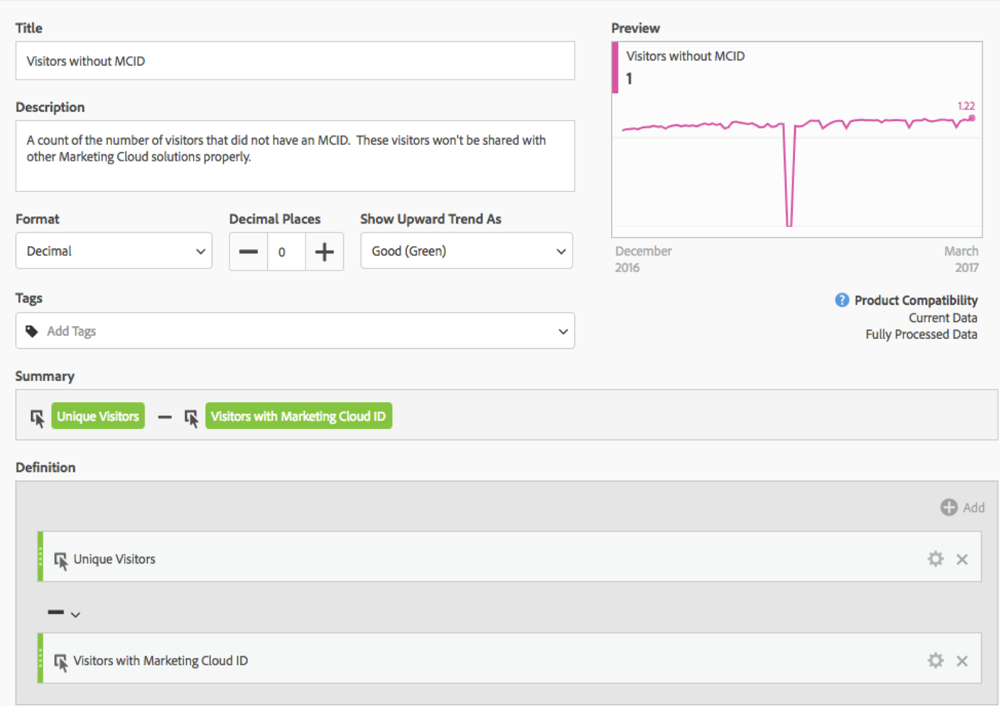
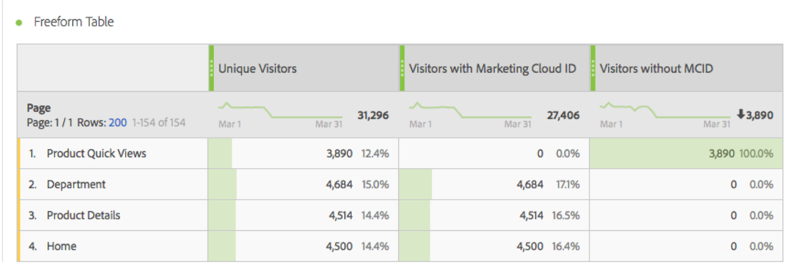

# Visitors with Experience Cloud ID

The 'Visitors with Experience Cloud ID' metric shows the number of unique visitors who were identified by Adobe using the [Experience Cloud ID service](https://experienceleague.adobe.com/docs/ id-service/using/home.html). This dimension is helpful to compare with the [Unique visitors](unique-visitors.md) metric to make sure the majority of visitors to your site uses the ID service. If a large portion of visitors don't use the ID service cookies, it can indicate an issue within your implementation.

>[!NOTE]
>
>This metric is especially important for debugging if you use multiple Experience Cloud services, such as Adobe Target or Adobe Audience Manager. Segments shared across Experience Cloud products do not include visitors without an Experience Cloud ID.

## How this metric is calculated

This metric is based on the [Unique visitors](unique-visitors.md) metric, except it only includes individuals identified using the `mid` query string (based on the [`s_ecid`](https://experienceleague.adobe.com/docs/ core-services/interface/ec-cookies/cookies-analytics.html) cookie).

## Debug your Experience Cloud ID setup

The 'Visitors with Experience Cloud ID' metric can be useful in troubleshooting Experience Cloud integrations, or identifying areas of your site that don't have the ID service deployed.

Drag the 'Visitors with Experience Cloud ID' side-by-side with Unique visitors to compare them:

In this example, notice that each page has the same number of 'Unique Visitors' as 'Visitors with a Experience Cloud ID'. However, the total number of Unique Visitors is greater than the total number of Visitors with Experience Cloud ID. You can create a [calculated metric](../c-calcmetrics/cm-overview.md) to find out which pages are not setting the ID service. You can use the following defintion:

By adding the calculated metric to the report, you can sort the Pages report so that the pages with the highest number of visitors without an MCID are surfaced:

Note that the "Product Quick Views" dimension item are not properly implemented with the Identity Service. You can work with appropriate teams within your organization to update these pages as soon as possible. You can construct a similar report with any type of dimension such as [Browser type](../dimensions/browser-type.md), [Site section](../dimensions/site-section.md), or any [eVar](../dimensions/evar.md).
