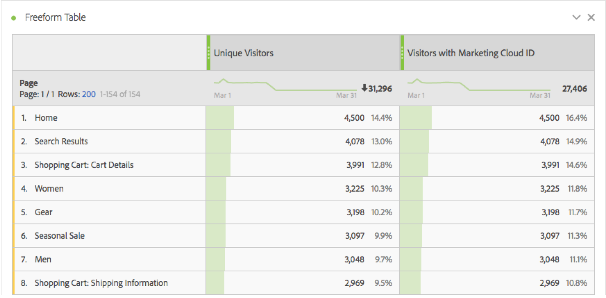
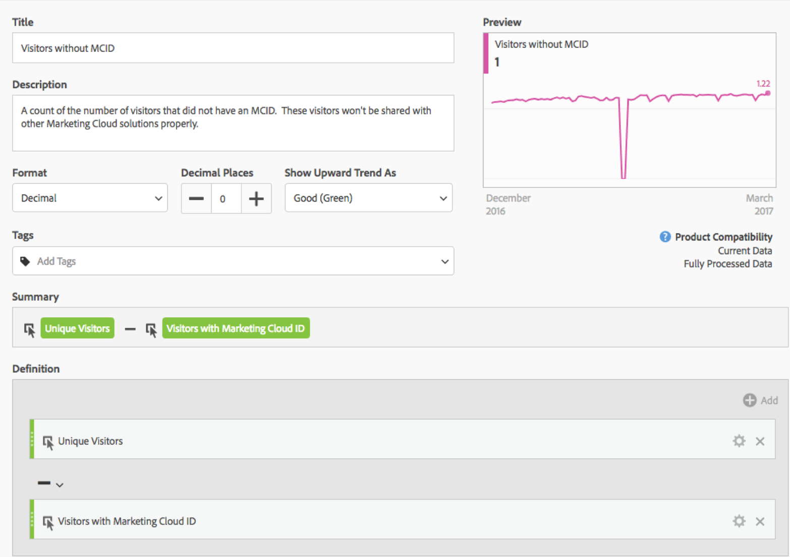

# Visitors with Experience Cloud ID

The '[!UICONTROL Visitors with Experience Cloud ID]' [metric](overview.md) shows the number of unique visitors who were identified by Adobe with an ECID (using the [Visitor ID Service](https://experienceleague.adobe.com/en/docs/id-service/using/home) or [Experience Platform Identity Service](https://experienceleague.adobe.com/en/docs/experience-platform/identity/home)). This metric is helpful to compare with the [Unique visitors](unique-visitors.md) metric to make sure the majority of visitors to your site uses an ECID. If a large portion of visitors don't use this identifier, it can indicate an issue within your implementation.

>[!NOTE]
>
>This metric is especially important for debugging if you use multiple CX Enterprise services, such as Adobe Target or Adobe Audience Manager. Segments shared across CX Enterprise products do not include visitors without an ECID.

## How this metric is calculated

This metric is based on the [Unique visitors](unique-visitors.md) metric, except it only includes individuals identified using the `mid` query string (based on the [`s_ecid`](https://experienceleague.adobe.com/en/docs/core-services/interface/data-collection/cookies/analytics) cookie).

## Debug your ECID setup

The '[!UICONTROL Visitors with Experience Cloud ID]' metric can be useful in troubleshooting CX Enterprise integrations, or identifying areas of your site that don't have the Visitor ID Service or Experience Platform Identity Service deployed.

Drag the '[!UICONTROL Visitors with Experience Cloud ID]' side-by-side with Unique visitors to compare them:

In this example, notice that each page has the same number of '[!UICONTROL Unique Visitors]' as '[!UICONTROL Visitors with Experience Cloud ID]'. However, the total number of '[!UICONTROL Unique Visitors]' is greater than the total number of '[!UICONTROL Visitors with Experience Cloud ID]'. You can create a [calculated metric](../calculated-metrics/cm-overview.md) to find out which pages are not using an ECID using the following definition:

By adding the calculated metric to the report, you can sort the Pages report so that the pages with the highest number of visitors without an ECID are surfaced:

Note that the "Product Quick Views" dimension item are not properly implemented with an ECID. You can work with appropriate teams within your organization to update these pages as soon as possible. You can construct a similar report with any type of dimension such as [Browser type](../dimensions/browser-type.md), [Site section](../dimensions/site-section.md), or any [eVar](../dimensions/evar.md).
