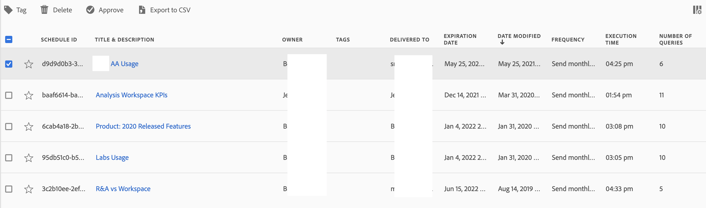

# Scheduled projects

Scheduled Analysis Workspace projects can be managed under **Analytics > Components > Scheduled Projects**.

When managing scheduled projects, you can edit and delete recurring project schedules. Search for a schedule in the search bar or by using the filter options in the left rail. You can filter by [!UICONTROL Tags], [!UICONTROL Owners], [!UICONTROL Favorites], and more.

## Available columns

| Field | Description |
| --- | --- |
| [!UICONTROL Favorites] | Selecting the star icon makes this schedule a favorite. |
| [!UICONTROL Schedule ID] | This ID is used mainly for debugging purposes. |
| [!UICONTROL Title and description] | Title and description of this project. |
| [!UICONTROL Owner] | The person who created and owns the project. |
| [!UICONTROL Tags] | (optional) Tagging is a good way to organize projects. All users can create tags and apply one or more tags to a project. However, you can see tags only for those projects that you own or that have been shared with you.  |
| [!UICONTROL Delivered to] | The recipient(s) of this scheduled project. |
| [!UICONTROL Expiration date] | For any scheduled project frequency, you can set the expiration date for up to one year in the future. |
| [!UICONTROL Frequency] | How often you want to have this schedule project sent to the recipient(s). |
| [!UICONTROL Execution time] | At what time of day this scheduled project gets sent. |
| [!UICONTROL Number of queries] | The number of queries against this project. | 

## Common actions

The following are common actions in the Scheduled Projects manager:

|Action|Description|
|---|---|
|**[!UICONTROL Edit]**|Select the title of the schedule to update its delivery settings.|
|**[!UICONTROL Delete]**|Select the scheduled project in the list and then click Delete from the menu. This will delete the selected schedule for the project; the project itself will not be deleted.|
|**[!UICONTROL Tag]**|Select the scheduled project in the list and then choose "Tag" or "Approve" to organize your schedules and make them easier to search for.|
|**[!UICONTROL View failed schedules]**|Navigate to the left rail > Other filters > Failed to see schedules that have failed.|
|**[!UICONTROL View expired schedules]**|Navigate to the left rail > Other filters > Expired to see schedules that have expired. Click the title of the schedule to setup a new delivery schedule.|
|**[!UICONTROL View schedule ID]**|Navigate to column options in the top right and add the Schedule ID column to the table. The scheduled ID is often useful for debugging.|

The Scheduled Projects manager shows the items that a specific user created. If the user account is disabled in the application, all scheduled deliveries stop. Scheduled project ownership can be transferred to a new user under **Admin** > **Analytics Users & Assets** > **Transfer Assets**.