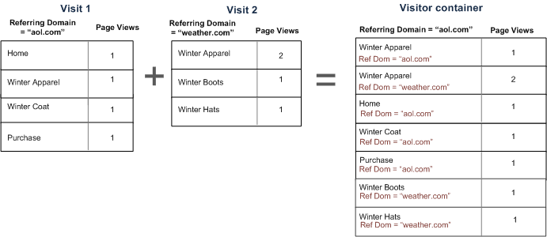

# Segment containers

A Segment sets conditions to filter a visitor based on his or her attributes or interactions with your site. To set conditions in a segment, you set rules to filter visitors based on visitor characteristics and/or navigation traits. To further break down visitor data, you can filter based on specific visits and/or page view hits for each visitor. The Segment Builder provides a simple architecture to build these subsets and apply rules as nested, hierarchical Visitor, Visit, or Hit containers.

The container architecture employed in the Segment Builder defines **[!UICONTROL Visitor]** as the outermost container, containing overarching data specific for the visitor across visits and page views. A nested **[!UICONTROL Visit]** container lets you set rules to break down the visitor's data based on visits, and a nested **[!UICONTROL Hit]** container lets you break down visitor information based on individual page views. Each container lets you report across a visitor's history, interactions broken down by visits, or break down individual hits.


Here is a video overview of segment containers:

>[!VIDEO](https://video.tv.adobe.com/v/25401/?quality=12)

## Visitor container 

The Visitor container includes every visit and page view for visitors within a specified time frame. A segment at the Visitor level returns the page that meets the condition plus all other pages viewed by the visitor (and only constrained by defined date ranges). As the most broadly-defined container, reports generated at the Visitor container level will return page views across all visits and lets you generate a multi-visit analysis. Consequently, the Visitor container is the most susceptible to change based on defined date ranges.

Visitor containers can include values based on a visitor's overall history:

* Days Before First Purchase 
* Original Entry Page 
* Original Referring Domains

## Visit container

The Visit container lets you identify page interactions, campaigns, or conversions for a specific web session. A segment at the Visit level returns the page that meets the condition plus all other pages viewed as part of the visit session (and only constrained by defined date ranges). The Visit container is the most commonly used container because it captures behaviors for the entire visit session once the rule is met and lets you define which visits you want to include or exclude in building and applying a segment. It can help you answer the question of how many visitors viewed the News and Sports section in the same visit? Or pages that attributed to a successful conversion to a sale?

Visit containers include values based on occurrence per visit:

* Visit Number 
* Entry Page 
* Return Frequency 
* Participation Metrics 
* Linearly allocated metrics

## Hit container

The Hit container defines which page hits you would like to include or exclude from a segment. It is the most narrow of the containers available to let you identify specific clicks and page view where a condition is true, letting you view a single tracking code, or isolate behavior within a particular section of your site. You may also want to pinpoint a specific value when an action occurs, such as the marketing channel when an order was placed.

Hit containers include values based single page breakdowns:

*   Products 
*   List Props 
*   List eVars 
*   Merchandising eVars (in context of events) 

    >[!NOTE]
    >
    >If you use this container on a value that persists, such as an evar, it will pull in every hit where that value is persisting. In the case of a tracking code that expires after a week, that value could be persisting across multiple visits.

## Logic Group container

The Logic Group container allows you to provide a separate container within the segment rules to filter entities not based on hierarchy. For example, you may want to provide a container nested within the segment that filters based on Visitor. This type of logic requires you to break the hierarchy (as you are already have a top-level Visitor container) to filter only for selected visitors. This can be accomplished using the Logic Group container. See [Logic Group examples](/help/components/segmentation/segmentation-workflow/seg-sequential-build.md) for additional information.

## Nesting containers {#nest-containers}

When creating segment containers within other containers, you are in essence creating a segment within a segment. The following logic is used with nested containers:

1. Determine what data is included using the outermost container. Any data that does not match this outer rule is discarded in the segmented report.
1. Apply the nested rule to the remaining data. The nested rule does NOT apply to any hits that the first rule throws out.
1. Repeat until all nested container rules have been calculated. The remaining data is then included in the resulting report.

You can use nesting between containers as well as between rules within a container. Here is what you can nest in each container:  

|  Container Name  | What you can nest inside  |
|---|---|
|  Hit  | Events only  |
|  Visit  | Hit container, Events  |
|  Visitor  | Visit container, Hit container, Events  |
|  Logic Group  | Visitor container, Visit container, Hit container  |

### Include multiple containers within a single definition

Including multiple segments in a new compound segment lets you refine data even further. Dragging two existing segments together acts as an "OR" statement when filtering visitors. All containers in the canvas are reviewed against all data, and any data that matches any of the containers is included in the reporting.

For example, dragging a Visit container where Country = United States with a Visit container where Order = True

```
Country = United States + Order = True
```

will build a segment that behaves in this order:

1. This segment would first look at your entire data and identify all visitors within the United States.
1. The segment would then look at all your data again, searching to see if any visitors made an an order.
1. Both sets of data would then be applied to the report.

## Containers for sequential segments {#containers-sequential}

Sequential segmentation employs the same basic containers, including [!UICONTROL Visitors], [!UICONTROL Visits], and [!UICONTROL Hits] (including page views or other dimensions) nested hierarchically.


[!UICONTROL Visitors] constitute the highest-order container in sequential segmentation, with [!UICONTROL Visits] contained within the [!UICONTROL Visitors] container, and [!UICONTROL Hits] contained within the [!UICONTROL Visitors] or [!UICONTROL Visits] containers. This [container hierarchy](/help/components/segmentation/seg-overview.md#section_7FDF47B3C6A94C38AE40D3559AFFAF70) must be maintained to build well-ordered sequential segments.

**To build sequential segments**, containers are nested and sequential logic joined using the [!UICONTROL THEN] operator that requires each container to be true based on the sequence of the visitor.


The only exception to this hierarchy of containers is when using the [Logic Group container](/help/components/segmentation/segmentation-workflow/seg-sequential-build.md). The [!UICONTROL Logic Group] container lets you nest a hit within a container without order to capture events and dimensions but outside of a sequential order.


## Reports based on container data {#reports}

Containers allow you to filter different data differently based on reporting values when breaking down segments and applying them to reports.

Data captured at each level of the Visitor > Visit > Hit containers hierarchy affects how you build your segments. If you take the same segment applied to the same report using the same data set, you will get different values based on the container from which you generate the report. Factors such as container reporting level and persistence of values across hits can mean big changes in your reporting accuracy.

### Basics of container data {#container-data}

For example, the visitor depicted below visited a site on the first visit, landed on the Home page and then visited three additional pages and converted the visit to a sale. On a separate visit, the visitor landed this time through Product page, then to the Home page, back to the Product page, and then closed the session after looking at Winter Hats. Based in the data captured for each container for the segment, different values will be shown in the report.

The *Pages equals Winter Coat* segment below is applied to the **Pages Report**.


Based on the container selected, the report displays different results.


### Reporting from the Hit container

When this condition is within a Hit container, then the report lists only pages where *Page = Winter Coats* is true. Since only one page matches this condition in a container of only one page, only the Winter Coats page is displayed.


Reporting from the Hit container, you can see how reporting from different containers affect overall reporting values. Viewing the segment report, notice that page views are approximately equal to visits (about 2,000 visitors saw duplicate pages within a visit which adds to the total number of page views), and unique visitors are approximately equal to the number of visits (about 2,000 unique visitors visited more than once.) 


>[!IMPORTANT]
>
>Regardless of how you view the data—from the Hit, Visit, or Visitor containers—they all have the same number of visitors, 63, 541, in this example. Regardless of how you generate the report, the initial visitor condition—Visitors who viewed the Winter Coats page—remains intact. It is the subset of data from which you are reporting at the different levels.

### Reporting from the Visit container

If this same condition is within a Visit container, then the report lists all pages in the visit where *Page equals Winter Coats* is true. It filters the Winter Coats page, but also captures all other pages in the visit where the condition is true. Because the visitor also visited the Home, Product, and Purchase pages within the visit where the condition was met, these additional pages are listed in the report when reported using Visitor container data.


Showing segment values from the Visit container, you can see that the number of page views has increased significantly. This is because reporting from the Visit container identifies all pages that meet the conditions, plus all other pages viewed in the visit (with all page views captured in each Visit container).


### Reporting from the Visitor container

If this same condition is within a Visitor container, the report lists all pages viewed by any visitor where *Page equals Winter Coats* is true. This means that if a visitor viewed the Winter Coats page, then all of the pages in the Visitor container—including page views in other visits—will be listed. Consequently, pages that don't match the condition will be listed in the report because the visitor viewed them at a previous time. All pages in the Visitor container will be listed in the report, even if they occurred previously and do not specifically meet the conditions.


Showing segments from the Visitor container, you can see that the Page Views and Visits have increased. This is because from the visitor level, if the visitor visited the Winter Coats page only once (making the condition true), then all other page views and all other visits is captured for that visitor.


In summary, understanding how segmentation works on various data breakdowns is key to interpreting the data it returns.

## Reporting based on the container {#reporting}

Every breakdown of segment data has a scope to which it is applied. Most breakdowns are based on *Page Views*, however, many valuable segments are based on the *Visit* container, and to a lesser degree the *Visitor* container. It is important to understand reporting based on the scope of your container.

Based on the *Page = Winter Coats* segment example used previously, the issues listed below define other aspects of your segment based on how the container data is applied and how the scope of the data should match the segment type.

### Segment container based on matching segment rule

Applying the segment container against a natural scope of data brings expected results where the line items match the segment rule.

* **Hit container where page equals "Winter Coat"**: Viewing a *Page* report with this segment returns only the values equaling "Winter Coat." All other pages are excluded from reporting.
* **Visit container where entry page equals "Winter Apparel"**: Viewing an *Entry Page* report with this segment only returns the second visit because its entry page matches the segment rule.
* **Visit container where visit number equals 1**: Viewing a Visit All page views from the first visit are included in the report because it matches the segment rule.

### Page Views at the Visit container level

Many segment rules identify page views per visit. When this occurs, the entire Visitor container is applied, if only a single hit matches the rule. This segment report is especially valuable because page views based on visits provide insight based on page views per visit.

* **Visit container where page equals "Winter Coat" page**: In a Page report at the Visitor container level displays all page views of visits that included a view of the "Winter Apparel" page. If a page matches the segment rule, all page views associated with that visit are included in the report.
* **Visit container where page equals "Home" page**: In a Page report with this segment only displays data from the first visit. This is because in the second visit the visitor did not view a "Home" page.
* **Visitor container where page equals "Winter Apparel"**: In a Page report, this segment retrieves all data from both visits because in both visits the visitor viewed the "Winter Apparel" page.

### Segment container identifying Hits smaller than Page Views

Using segment with a smaller container than the breakdown scope returns unexpected data. Using a smaller breakdown still pulls in all hits from that scope of data.

* **Hit container where entry page equals Product page**: Every page associates with the visit's entry page, making it a visit-based breakdown. Using this segment not only pulls in the entry page Product Page, but also all hits in that visit as well.
* **Hit container where List Var 1 contains ValueA**: If multiple values were defined on the same hit as the list var, then all variable values are included in the segment. There is no way to separate values that occur in the same page view because the Hit container is the smallest segment container to break down hits.
* **Hit container where Page equals "Purchase"**: If using page views as a metric, only the Purchase page is displayed (as expected). If using a Revenue Participation report, then all pages in the first visit receive $100, since participation metrics are visit-based.
* **Hit container where Page equals "Winter Coat"**: If using page views as a metric, only the Winter Coat page is displayed (as expected). If using a Revenue Participation report, no pages receive credit because this dimension requires a persistent dimension. The page view that actually made the purchase (the Purchase page) is not included in the Hit container, so no revenue participation is given to any item. However, running a report from the Visit container would include all page views in that visit and would distribute revenue participation ($100) across all pages viewed in the session.

## Persistence across containers {#persistence}

Filtering by dimensions that persist across a range of pages, such as a Campaign eVar or a Referring dimension, affects the data collected at the container level and needs to be understood for reporting accuracy.

Segment data can vary based on the persistence of a dimension or applied variable across selected pages. Some dimensions, such as the Page dimension, provide unique values at the page level and are filtered based on data from the Hit container. (See the [Reports based on Container Data](/help/components/segmentation/seg-overview.md) example). Other dimensions, such as the Referring Domain dimension, persist across multiple pages for a visit. Some dimensions or applied variables, such as Visit Duration, span across a visitor's entire history.


In contrast to the Page dimension, the Referring Domain value is attached to each page in this visit. For example, the visitor below arrives at the Home page from a referred site. Consequently, all pages within that visit are assigned the same referring domain value.

The *Referring Domain equals aol.com* segment below is applied to the **Pages Report**.


In a new visit, the visitor is referred from another site. Consequently, all pages in the new visit are assigned the new referring domain value for each page view.

### Reporting from the Hit container

Because all page views within the same visit are assigned the same Referring Domain value, reporting at the Hit container level where *Referring Domain = "aol.com"* returns all pages listed in the table below.


Showing data from the Hit container, just over 92,000 page views were viewed in over 33,000 Visits by just over 32,000 Visitors. On average, there were three page views in each visit, and almost all visits were by unique visitors.


### Reporting from the Visit container

If this same condition is filtered in the Visit container for a Pages report, then all pages in the visit where *Referring Domain = "aol.com"* is true. Because the value of the referring domain is set at the visit level, reports at the Page View and Visit levels are the same.


In this example, because all pages have the same referring domain value based on the visit, the report from the Visit container level is (almost) the same to the report from the Page View container (with slight offset—98, 234 to 98,248—due to data anomalies).


### Reporting from the Visitor container

From the Visitor container, the Page report lists all pages viewed by any visitor where *Referring Domain equals "aol.com"* is true. Consequently, if a visitor had *"aol.com"* as a referring domain at anytime in the history (within the defined time period), then all of the pages in the Visitor container—including page views in other visits—will be listed. Even pages that don't match the primary condition will be listed in the report because these pages are included in the Visitor container. All pages in the Visitor container will be listed in the report, even if they occurred previously and do not specifically meet the conditions.

In a Referring Domain report, *Referring Domain = "aol.com"* is true in four page views, but *Referring Domain = "weather.com"* is true in the other pages the visitor hit. From the Visitor container, you get a list of Visitors where "aol.com" is true, but it also gives you pages where the referring domain is "weather.com", not the value that matched your initial request in the segment.



When you view data from the Visitor container, notice that the page views have increased significantly (from 98,248 to 112, 925). This is because all page views by the visitor—including those with other referring domain values saved to at the Visitor container level—have been listed (as well as the additional visits by that visitor, increasing visits from 33,203 to 43,448).


## Summary

* The Visitor container returns all pages seen by a visitor where at least one page meets the criteria. So, if a page is only seen on visit 1 on day 1, then all pages viewed by the visitor across multiple visits are included in the data.
* The Visit container returns all the pages seen in a visit where at least one page meets the criteria. So, if a page is only seen on visit 1 on day 1, then all pages viewed across the entire visit are included in the data.
* Be careful when the condition you are segmenting on is on an eVar or other type of persistent variable. For example, you might use the condition "where campaign contains email" and it expires after 7 days. So, if the campaign is set on the first visit, it will persist for 7 more days. Each visit will be included even though the campaign was only set on the first visit. The other visits will also be included (as long as they are in the date range of the report). If you want to eliminate persistent values from being included, either use the event "instance of", or an equivalent Prop variable, if available.
