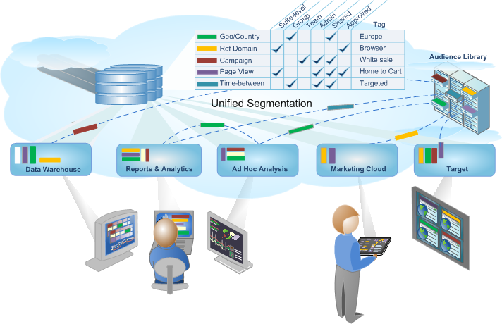

# Analytics segmentation

Adobe Analytics lets you build, manage, share, and apply powerful, focused audience segments to your reports using Analytics capabilities, the Adobe Experience Cloud, Adobe Target, and other integrated Adobe products.

Analytics segmentation includes the [Segment Builder](/help/components/segmentation/segmentation-workflow/seg-workflow.md) to construct segments and run a pre-test, and the [Segment Manager](/help/components/segmentation/segmentation-workflow/seg-workflow.md) to collect, tag, approve, set security, and share segments across your organization.

Data Scientists and Marketing Analysts can employ, extend, and refine segments for analysis specific to his or her needs, and then save the segment for other users to extend, refine and save as a new segment to the library. Once set in motion, it's a cycle of designing and managing codified audience insights as a [unified segment workflow](/help/components/segmentation/segmentation-workflow/seg-workflow.md).

**Getting Started**

Start with [Setting up a Segmentation Workflow](/help/components/segmentation/segmentation-workflow/seg-workflow.md) or [Building Segments](/help/components/segmentation/segmentation-workflow/seg-build.md), or see [About Segments](/help/components/segmentation/seg-overview.md) for a quick overview.
