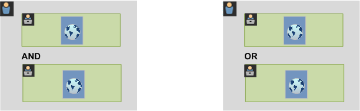
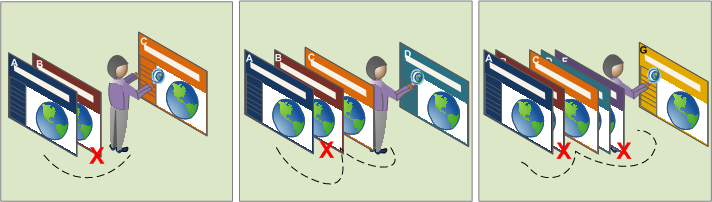
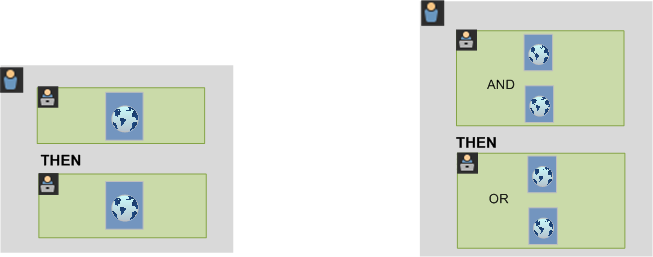

# About segments

Segments allow you to identify subsets of visitors based on characteristics or website interactions. Segments are designed as audience insights that you can build for your specific needs, and then verify, edit, and share with other team members or use in other Adobe products and Analytics capabilities.

Segments are based on a [!UICONTROL Visitor], [!UICONTROL Visit], and [!UICONTROL Hit] level hierarchy using a nested container model. The nested containers allow you to define visitor attributes and actions based on rules between and within the containers. Analytics segments can be built, approved, shared, saved, and run across multiple products and capabilities in the [!DNL Adobe Experience Cloud]. Segments can be generated from a report, built into a dashboard report, or bookmarked for quick access.

You can build and save segments in the Segment Builder, or generate segments from a Fallout report (in [!UICONTROL] Analysis Workspace). You can also employ and extend pre-built segments based on specific rules between nested containers, allowing you to filter results and apply to reports. In addition, segments can be used together as [stacked segments](/help/components/segmentation/segmentation-workflow/seg-workflow.md).

Segments identify 

- who your visitors are (country, gender, coffee shop), 
- what devices and services they use (browser, search engine, mobile device), 
- where they navigated from (search engine, previous exit page, natural search), 
- plus a lot more.

<!---->

Segments can be based in the following values:

- Visitors based on attributes: browser type, device, number of visits, country, gender.
- Visitors based on interactions: campaigns, keyword search, search engine.
- Visitors based on exits and entries: visitors from Facebook, a defined landing page, referring domain.
- Visitors based on custom variables: form field, defined categories, customer ID.

When building audience segments in the Segment Builder, you define conditions using the [!UICONTROL AND] and [!UICONTROL OR] operators between containers.

<table style="table-layout:fixed; border: none;">

<tr>

<td style="background-color: #E5E4E2;" colspan="3" width="200" height="100"> Visitors</td>
</tr>

<tr>
<td style="background-color: #E5E4E2;" width="200"></td>
<td style="background-color: #D3D3D3;" colspan="2" width="200" height="100"> Visits</td>
</tr>

<tr>
<td style="background-color: #E5E4E2;" width="200" height="100"></td>
<td style="background-color: #D3D3D3;" width="200" height="100"></td>
<td style="background-color: #C0C0C0;" width="200" height="100" colspan="1"> Hits</td>
</tr>

<tr>
<td style="background-color: #E5E4E2;"></td><td colspan="2">AND</td></td>
</tr>

<tr>
<td style="background-color: #E5E4E2;" width="200"></td>
<td style="background-color: #D3D3D3;" colspan="2" width="200" height="100"> Visits</td>
</tr>

<tr>
<td style="background-color: #E5E4E2;" width="200" height="100"></td>
<td style="background-color: #D3D3D3;" width="200" height="100"></td>
<td style="background-color: #C0C0C0;" width="200" height="100" colspan="1"> Hits</td>
</tr>
</table>

<table style="table-layout:fixed; border: none;">

<tr>

<td style="background-color: #E5E4E2;" colspan="3" width="200" height="100"> Visitors</td>
</tr>

<tr>
<td style="background-color: #E5E4E2;" width="200"></td>
<td style="background-color: #D3D3D3;" colspan="2" width="200" height="100"> Visits</td>
</tr>

<tr>
<td style="background-color: #E5E4E2;" width="200" height="100"></td>
<td style="background-color: #D3D3D3;" width="200" height="100"></td>
<td style="background-color: #C0C0C0;" width="200" height="100" colspan="1"> Hits</td>
</tr>

<tr>
<td style="background-color: #E5E4E2;"></td><td colspan="2">OR</td></td>
</tr>

<tr>
<td style="background-color: #E5E4E2;" width="200"></td>
<td style="background-color: #D3D3D3;" colspan="2" width="200" height="100"> Visits</td>
</tr>

<tr>
<td style="background-color: #E5E4E2;" width="200" height="100"></td>
<td style="background-color: #D3D3D3;" width="200" height="100"></td>
<td style="background-color: #C0C0C0;" width="200" height="100" colspan="1"> Hits</td>
</tr>
</table>

<!---->

This type of segment filters data sets based on characteristics joined using the [!UICONTROL AND] and [!UICONTROL OR] operators.

- You can [apply multiple segments to a report or project](/help/components/segmentation/segmentation-workflow/seg-workflow.md).
- Segments are universal to all report suites.
- The [Segment Builder](/help/components/segmentation/segmentation-workflow/seg-workflow.md) simplifies segment creation.
- The [Segment Manager](/help/components/segmentation/segmentation-workflow/seg-workflow.md) lets you set up [workflows](/help/components/segmentation/segmentation-workflow/seg-workflow.md) with segment sharing, tagging, verification, and approval features.
- You can [tag segments](/help/components/segmentation/segmentation-workflow/seg-workflow.md) to organize and search later instead of using folders.
- You can create [Sequential Segments](/help/components/segmentation/segmentation-workflow/seg-sequential-build.md).
- The [!UICONTROL Page View] container is now the [!UICONTROL Hit] container to indicate that this container segments all types of data and not just page views. For example, link tracking calls, and trackAction calls from the mobile SDKs are all included or excluded by the hit container.

## Segmentation in Analysis Workspace

Analysis Workspace contains these additional features:

- You can [compare segments](../../analyze/analysis-workspace/c-panels/c-segment-comparison/segment-comparison.md).
- Use [segments as dimensions](https://experienceleague.adobe.com/docs/core-services/interface/audiences/audience-library.html) in a comparison.
- Use segments in [fallout analysis](../../analyze/analysis-workspace/visualizations/fallout/compare-segments-fallout.md).

## Adobe-provided segments

The Component rail on the left side of the screen shows segments that are created by you and your company and Adobe segments that are provided out of the box. When you click **[!UICONTROL Show all]**, these segments typically appear at the bottom of the list and are identified by the Adobe logo to the right.

## Sequential Segments {#sequential}

Sequential segments let you identify visitors based on navigation and page view across your site, providing a segment of defined actions and interactions. Sequential segments help you identify what a visitor likes and what a visitor avoids. When building sequential segments, the [!UICONTROL THEN] operator is used to define and order visitor navigation.

<!---->

|  Visit One  | Visit Two  | Visit Three  |
|---|---|---|
|  In the first visit, the visitor went to the main landing page A, excluded the campaign page B, and then viewed the Product page C. | In the second visit, the visitor again went to the main landing page A, excluded the campaign page B, and went again to the Product page C, and then to a new page D.  | In the third visit, the visitor entered and followed that same path as in the first and second visits, then excluded page F to go directly to a targeted product page G.  |

Sequential segments can be based on the following hit values:

- Visitors based on sequence of page hits: page views within a single visit, page views across separate visits, visits that excluded page views.
- Visitors based on time between and after page views: after a time limit, between hits, after an event.

<table style="table-layout:fixed; border: none;">

<tr>

<td style="background-color: #E5E4E2;" colspan="3" width="200" height="100"> Visitors</td>
</tr>

<tr>
<td style="background-color: #E5E4E2;" width="200"></td>
<td style="background-color: #D3D3D3;" colspan="2" width="200" height="100"> Visits</td>
</tr>

<tr>
<td style="background-color: #E5E4E2;" width="200" height="100"></td>
<td style="background-color: #D3D3D3;" width="200" height="100"></td>
<td style="background-color: #C0C0C0;" width="200" height="100" colspan="1"> Hits</td>
</tr>

<tr>
<td style="background-color: #E5E4E2;"></td><td colspan="2">THEN</td></td>
</tr>

<tr>
<td style="background-color: #E5E4E2;" width="200"></td>
<td style="background-color: #D3D3D3;" colspan="2" width="200" height="100"> Visits</td>
</tr>

<tr>
<td style="background-color: #E5E4E2;" width="200" height="100"></td>
<td style="background-color: #D3D3D3;" width="200" height="100"></td>
<td style="background-color: #C0C0C0;" width="200" height="100" colspan="1"> Hits</td>
</tr>
</table>

<table style="table-layout:fixed; border: none;">

<tr>

<td style="background-color: #E5E4E2;" colspan="3" width="200" height="100"> Visitors</td>
</tr>

<tr>
<td style="background-color: #E5E4E2;" width="200"></td>
<td style="background-color: #D3D3D3;" colspan="2" width="200" height="100"> Visits</td>
</tr>

<tr>
<td style="background-color: #E5E4E2;" width="200" height="100"></td>
<td style="background-color: #D3D3D3;" width="200" height="100"></td>
<td style="background-color: #C0C0C0;" width="200" height="100" colspan="1"> Hits</td>
</tr>

<tr>
<td style="background-color: #E5E4E2;"></td><td style="background-color: #D3D3D3;"></td><td>AND</td></td>
</tr>

<tr>
<td style="background-color: #E5E4E2;" width="200" height="100"></td>
<td style="background-color: #D3D3D3;" width="200" height="100"></td>
<td style="background-color: #C0C0C0;" width="200" height="100" colspan="1"> Hits</td>
</tr>

<tr>
<td style="background-color: #E5E4E2;"></td><td colspan="2">THEN</td></td>
</tr>

<tr>
<td style="background-color: #E5E4E2;" width="200"></td>
<td style="background-color: #D3D3D3;" colspan="2" width="200" height="100"> Visits</td>
</tr>

<tr>
<td style="background-color: #E5E4E2;" width="200" height="100"></td>
<td style="background-color: #D3D3D3;" width="200" height="100"></td>
<td style="background-color: #C0C0C0;" width="200" height="100" colspan="1"> Hits</td>

<tr>
<td style="background-color: #E5E4E2;"></td><td style="background-color: #D3D3D3;"></td><td>OR</td></td>
</tr>

<tr>
<td style="background-color: #E5E4E2;" width="200" height="100"></td>
<td style="background-color: #D3D3D3;" width="200" height="100"></td>
<td style="background-color: #C0C0C0;" width="200" height="100" colspan="1"> Hits</td>
</tr>
</tr>
</table>

<!---->

A sequential segment filters data sets based on user actions using the [!UICONTROL THEN] operator.

## How-to segmentation video {#segment-video}

This video gives a short overview of what segment containers are and how to use them: [Segment Containers in Adobe Analytics](https://experienceleague.adobe.com/docs/analytics-learn/tutorials/components/segmentation/segment-containers.html)

## Access the Segmentation Tools {#access}

+++ **How do I get to the Segment Builder?**

You can access the Segment Builder by:

-   Displaying an existing report and clicking the Segments icon   in the left navigation. In the segment rail that displays, then click **[!UICONTROL Add]**, or 

-   At the top of the Segment Manager, clicking **[!UICONTROL + Add]**.  

    or 

-   Clicking an existing segment title in the Segment Manager to edit the segment in the Segment Builder.

+++

+++ **How do I get to the Segment Manager?**

Access the Segment Manager by:

-   Going to  **[!UICONTROL Analytics]** > **[!UICONTROL Components]** in the top navigation. Then click **[!UICONTROL Segments]**, or 

-   Displaying an existing report and clicking the Segments icon   in the left navigation. Then click **[!UICONTROL Manage]**, or 

-   Pressing the slash key '/' anywhere in the interface and searching for segment manager.

+++

## Permissions {#section_648DFA3A882146C485A84ED014EEC707}

+++ **What rights and privileges do I need to use, create, and manage segments?**

By default, all users can create and edit personal segments. However, Admins can decide who should have [permissions to create segments](https://experienceleague.adobe.com/docs/analytics/admin/admin-console/home.html) and can assign them to specific groups. These segments can be shared directly with any other Analytics user.

Admins can edit any segment, and share segments with groups and with everyone in the organization. [More...](/help/components/segmentation/seg-reference/seg-rights.md)

+++

+++ **Can I see all segments in my company?**

Yes, Admins can see all segments within the [!DNL Analysis Workspace] and [!DNL Reports & Analytics] user interfaces.

Report Builder displays segments that you own and segments that are shared with you.

+++

+++ **Can I manage all Analytics segments in the Segment Manager?**

Yes, all segments can be managed in the Segment Manager. Segment Manager displays segments that are visible to the owner (user who created the segment), shared users, and admin users. The segment selector displays segments that are owned by and shared with the user.

Admins can see all segments within the Analysis Workspace and [!DNL Reports & Analytics] user interfaces.

Report Builder displays only segments built by you or segments that have been shared specifically with you.

+++

+++ **Why can't I delete this segment?**

If the segment was [published to the Experience Cloud](/help/components/segmentation/segmentation-workflow/seg-workflow.md), you cannot delete it or edit it. However, you can copy it and edit the copied version.

+++
