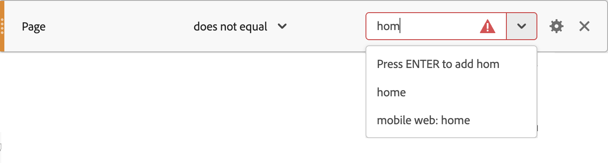

# Comparison operators for segments

The Segment builder lets you compare and constrain values using selected operators. There are three categories of operators: [Standard](#standard-operators), [Data Warehouse](#data-warehouse-operators), and [Distinct Count](#distinct-count-operators).

Depending on the operator you select:

* You can enter a value.
* You can enter part of a value and select from a drop-down menu (if available).
* Immediately select a value from the drop-down menu (if available). 

When you type a value for an operator that validates available values, like **[!UICONTROL equals]**, and the value  doesn't match the values available for the component, you see a  icon. You can either select a value from the drop-down menu or press **[!UICONTROL _Enter_]** to enter the value.

## Wildcards

The only supported wildcard character for operators that support wildcards is the asterisk: `*`. If you need to search for the specific &#42; character, you can escape it with a backslash, like `\*`.

For example, you have a page name called *My cool product*.

* The segment rule **[!UICONTROL Page name]** **[!UICONTROL matches]** `* product` will match the above page name. 
* However, the rule **[!UICONTROL Page name]** **[!UICONTROL matches]** `My \* product` matches only the page name *My * Product*.

## Standard operators

| Operator | The selected dimension, segment, or metric event... |
|--- |--- |
| **[!UICONTROL equals]** | Returns items that match exactly for a numeric or string value. Note:  If using wildcard characters, use the **[!UICONTROL matches]** operator. |
| **[!UICONTROL does not equal]** | Returns all items that do not contain the exact match of the value entered.  Note:  If using wildcard characters, use the **[!UICONTROL does not match]** operator. |
| **[!UICONTROL equals any of]** | Returns items that match exactly for any value in the input field (up to 500 items). For example, entering `Search Results, Homepage` for the **[!UICONTROL Page Name]** dimension with this operator would match *Search Results* and *Homepage*, and count as 2 items. The input field for this operator is comma-delimited. |
| **[!UICONTROL does not equal any of]** | Identifies items that match exactly for any value in the input field (up to 500 items), and then only returns items without these values. For example, entering `Search Results, Homepage` with this operator for the **[!UICONTROL Page Name]** dimension would identify *Search Results* and *Homepage* and then **exclude** them from the returned items. This example would count as 2 items. The input field for this operator is comma-delimited. |
| **[!UICONTROL contains]** | Returns items that compare to the substrings of the values entered. For example, if the rule is **[!UICONTROL Page Name]** **[!UICONTROL contains]** `Search`, then this rule will match any page that has the substring `Search` in it, including *Search Results*, *Search*, and *Searching*. The "contains" clause is not case sensitive in Adobe Analytics, but it is case sensitive in Customer Journey Analytics. |
| **[!UICONTROL does not contain]** | Returns the inverse of the **[!UICONTROL contains]** rule. Specifically, all items that match the entered value will be excluded from the entered values. For example, if the rule is **[!UICONTROL Page Name]** **[!UICONTROL does not contain]** `Search`, then it will not match any page that has the substring `Search` in it, including *Search Results*, *Search*, and *Searching*. These values will be excluded from the results. |
| **[!UICONTROL contains all of]** | Returns items compared to the substrings, including multiple values joined together. For example, entering `Search Results` with this operator for the **[!UICONTROL Page Name]** dimension would match *Search Results* and *Results of Search*, but not *Search* or *Results* individually. The rule would match *Search* AND *Results* found together. The input field for this operator is space-delimited (100 words). |
| **[!UICONTROL does not contain all of]** | Identifies items compared to substrings, including multiple values joined together, and then only return items without these values. For example, entering `Search Results` with this operator for the **[!UICONTROL Page Name]** dimension would identify *Search Results* and *Results of Search* (but not *Search* or *Results* individually) and then exclude these items. The input field for this operator is space-delimited (100 words). |
| **[!UICONTROL contains any of]** | Returns items compared to the substrings, including multiple values joined or independently identified. For example, entering `Search Results` with this operator would match *Search Results*, *Results of Search*, *Search*, and *Results*. It would match either *Search* OR *Results* found together or independently. The input field for this operator is space-delimited (100 words). |
| **[!UICONTROL does not contain any of]** | Identifies items based on substrings and then returns values that do not contain these substrings. It can have multiple joined values or values independently identified. For example, entering `Search Results` for the **[!UICONTROL Page Name]** dimension would match *Search Result*s, *Results of Search*, *Search*, and *Results* where either *Search* or *Result* are found together or independently. It would then exclude items that contain these substrings. The input field for this operator is space-delimited (100 words). |
| **[!UICONTROL starts with]** | Returns items that start with the string value entered. |
| **[!UICONTROL does not start with]** | Returns all items that do not start with the string value entered. This is the inverse of the **[!UICONTROL starts with]** operator. |
| **[!UICONTROL ends with]** | Returns items that end with string value entered. |
| **[!UICONTROL does not end with]** | Returns all items that do not end with the string value entered. This is the inverse of the **[!UICONTROL ends with]** operator. |
| **[!UICONTROL matches]** | Returns items that match exactly based on a given numeric or string value. The **[!UICONTROL matches]** clause is case sensitive in Adobe Analytics and in Customer Journey Analytics. **Note**: Use this operator when using [wildcard](#wildcards) (globbing) features. Examples of "globbing":<ul><li>`a*e` would match `ae`, `abcde`, `adobe`, and `a whole sentence`</li><li>`adob*` would match `adobe`, `adobe analytics`, and `adobo recipe`</li><li>`*dobe` would match `dobe`, `adobe`, and `cute little dobe`</li></ul>|
| **[!UICONTROL does not match]** | Returns all items that do not contain the exact match of the value entered. Note:  Use this operator when using [wildcard](#wildcards) (globbing) features. |
| **[!UICONTROL exists]** | Returns the number of items that exist. For example, if you evaluate the **[!UICONTROL Pages Not Found]** dimension using the **[!UICONTROL exist]** operator, the number of error pages that exist is returned. |
| **[!UICONTROL does not exist]** | Returns all items that do not exist. For example, if you evaluate the **[!UICONTROL Pages Not Found]** dimension using the **[!UICONTROL does not exist]** operator, the number of pages where this error page did not exist is returned. |

## Data Warehouse operators

| Operator | The selected dimension, segment, or metric event... |
| --- | --- |
| **[!UICONTROL is less than]** | Returns items whose numeric count is less than the value entered. |
| **[!UICONTROL is less than or equal to]** | Returns items whose numeric count is less than or equal to the value entered. |
| **[!UICONTROL is greater than]** | Returns items whose numeric count is greater than the value entered. |
| **[!UICONTROL is greater than or equal to]** | Returns items whose numeric count is greater than or equal to the value entered. |

## Distinct Count operators

You can segment on a distinct count of items within a dimension. Examples: *Visitors who viewed more than 5 distinct products*, or *Visits where more than 5 distinct pages were seen*.

| Operator | The selected dimension, segment, or metric event... |
| --- | --- |
| **[!UICONTROL equals]**| Returns dimension items whose unique count equals the value entered. |
| **[!UICONTROL does not equal]** |Returns dimension items whose unique count does not equal the value entered. |
| **[!UICONTROL is greater than]** |Returns dimension items whose unique count is greater than the value entered. |
| **[!UICONTROL is less than]** |Returns dimension items whose unique count is less than the value entered. |
| **[!UICONTROL is greater than or equal to]** |Returns dimension items whose unique count is greater than or equal to the value entered. |
| **[!UICONTROL is less than or equal to]** |Returns dimension items whose unique count is less than or equal to the value entered. |

>[!BEGINSHADEBOX]

See  [Distinct dimension counts](https://experienceleague.adobe.com/en/docs/analytics-learn/tutorials/components/segmentation/segmentation-on-distinct-dimension-counts){target="_blank"} for a demo video.

>[!ENDSHADEBOX]
