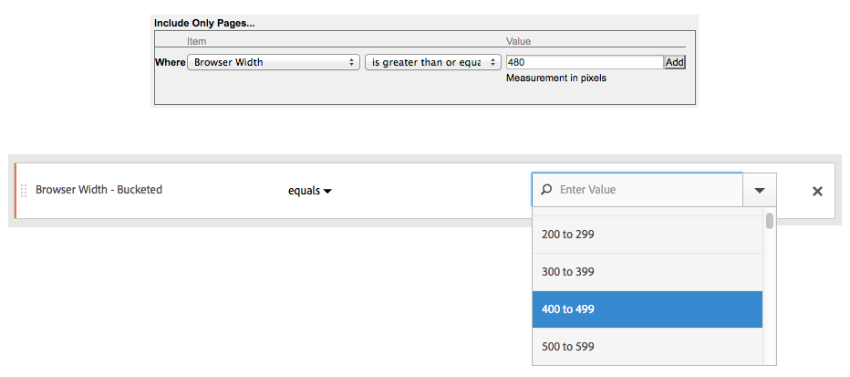

# Legacy segments

This article answers frequently asked questions on best practices for managing legacy segments. Legacy segments are segments that were created before 2014.

## Managing legacy segments {#legacy}

+++ **What happened to my existing segments?**

Your existing segments continue to work as they did before. Any reports that have these segments applied continue to work correctly.

Most former pre-defined and suite segments are migrated over as segment templates into the Segment builder. Segment templates are used to build quickly custom segments with common audiences. Segment templates can't be applied to a report directly, but they can be easily saved to a custom segment.

Segment templates are marked with a special icon  in the Segment builder.

+++

+++ **What happened to scheduled reports that have segments applied?**

Scheduled reports continue to run properly with the segments that you defined.

When you delete a segment, scheduled reports and dashboards that have this segment applied continue to work normally, i.e. the segment or dashboard continues to use the deleted segment.

Scheduled reports do not update when you edit a segment with the same name. Here is an example: Let's suppose you have 2 segments with the same name in different report suites:

You have a visualization that references the segment for the **[!UICONTROL mainprod]** report suite. Then you delete that segment because it's a duplicate. The visualization continue to run, referencing the definition of the deleted segment. If you change the segment definition for the maindev segment to include Catalina Island and Tijuana, Mexico, the segment applied to the visualization does not change and uses the old definition. To use the new definition, update the visualization to reference the new definition. If you are unsure whether a visualization, project or scheduled report is using a deleted segment, change the name of the remaining segment to show whether the visualization uses the remaining segment.

+++

+++ **What happened to Data Warehouse segments?**

All existing Data Warehouse segments still work in Data Warehouse. Most Data Warehouse segments also work in other components such as Analysis Workspace.

You can create or edit a new Data Warehouse segments in the segment builder/manager. The Product Compatibility mechanism in the Segment builder automatically determines whether a segment is compatible with Data Warehouse.

+++

+++ **What happened to Pre-Configured Segments?**

* **Single Page Visits**
* **Visits from Mobile Devices**
* **Visits from Natural Search**
* **Visits from Paid Search**
* **Visits with Visitor ID Cookie**

These segments are migrated over as segment templates into the Segment builder. Existing reports that have these segments applied continue to work correctly.

+++

+++ **What happened to Experience Cloud (Suite) segments:**

* Non-Purchasers
* Purchasers
* First Time Visits
* Visits from Social Sites
* Visits of More than 10 Minutes*
* Visits with 5+ Previous Visits*
* Visits from Facebook*

Most of these segments (except the ones marked with an asterisk *) were migrated over as segment templates into the segment builder. Additionally, several new segment templates have been added.

Existing reports that have these segments applied continue to work correctly.

+++

+++ **What happened to Admin segments (also known as "Global" segments)?**

**Admin** segments are migrated into the new segment interface and show up as segments shared with everyone.

The owner of these segments is set to the admin with the oldest account of admin users. However, all Admins can delete, edit and share these segments.

The segment management interface in the Admin Console where Admins created and managed these global segments is no longer available. Admins should now use the new segment builder to create segments and share them with appropriate groups or individuals or with everyone.

Existing segments that use logic that has changed as described in this document continue to work correctly, though the segments must be updated before they can be saved again. For example, if you have an existing segment where **[!UICONTROL US States]** **[!UICONTROL contains]** `New York`, that segment continues to work correctly. The next time you edit the segment you'll need to update the segment to use the enumerated type with an **[!UICONTROL equals]** condition.

+++

+++ **What should I do with duplicate segments that have the same name but may have different definitions?** 
Now that segments work in multiple report suites, you might find that you have multiple segments with the same name. You should:

* Rename segments that have the same name, but different definitions, or 
* Delete segments that are no longer necessary.

+++

+++ **What does Adobe recommend with regard to cleaning up segments?**

* Tag all segments with legacy tag.
* Review the segments that you have.
* Add them to the segment library where applicable.
* Approve segments that are canonical.
* Tag segments according to [best practices](/help/components/segmentation/segmentation-workflow/seg-workflow.md).

+++

### Migration tips

The following tips help you migrate common dimensions:

* Geo-city/region/country - search for and select specific cities, regions or countries instead of using a partial match.
* Browsers - use the Browser Types dimension to get all browsers in a type, for example, Google Chrome 
* Operating Systems - use the OS Types dimensions to get all operating systems in a type, for example, Microsoft Windows.
* Refer to "New and Renamed Dimensions" (see below)

## New and renamed dimensions {#renamed}

The following table contains a list of dimensions that were renamed in Segment builder.

|New Dimension Name|Previous Name|Notes|
|--- |--- |--- |
|Operating System Types|New|Added in Spring 2015.|
|Browser Width - Bucketed|Browser Width|This dimension is compatible with all interfaces, and is split into an enumerated list of ranges instead of specific integer values. If you need to segment specific values, use the granular version of this dimension in a Data Warehouse segment.|
|Browser Height - Bucketed|Browser Height|This dimension is compatible with all interfaces, and is split into an enumerated list of ranges instead of specific integer values. If you need to segment specific values, use the granular version of this dimension in a Data Warehouse segment.|
|Browser Width - Granular|Browser Width|This dimension was renamed and is now compatible with Data Warehouse only. When defining segments that are compatible with all interfaces, use the enumerated type, Browser Width - Bucketed.|
|Browser Height - Granular|Browser Height|This dimension was renamed and is now compatible with Data Warehouse only. When defining segments that are compatible with all interfaces, use the enumerated type, Browser Height - Bucketed.|
|Cookie Support|Cookies|-|
|Color Depth|Monitor Color Depth|-|
|-|"App - *"|the "App -" prefixes were removed from a number of dimension types. Since mobile app data is typically captured in a report suite that does not contain web data, these prefixes were not necessary.|
|Entry Page Original|Original Entry Page|-|
|Java Enabled|Java|-|
|Mobile Max Browser URL Length|Mobile Browser URL Length|-|
|Mobile Mail Decoration|Mobile Decoration Mail Support|-|
|Mobile Device|Mobile Device Name|-|
|Mobile Max Bookmark Length|Mobile Max Bookmark URL Length|-|
|Mobile Max Email Length|Mobile Max Mail URL Length|-|
|Mobile Operating System (Deprecated)|Mobile OS|Use the Operating System dimension and apply a visits from mobile devices segments instead.|
|Mobile Push To Talk|Mobile PTT|-|
|Survey Views|Total Survey Views|-|
|Survey Responses|Total Survey Responses|-|
|Visit Depth|Path Length|-|
|Zip Code|Zip/Postal Code|-|

{style="table-layout:auto"}

## Changes to string-based dimensions that have known values {#string-based-dims}

String-based dimensions that have a known set of values were are changed to enumerated types. When creating a segment using these dimensions, the list is pre-populated with all known values and the only operator supported is **[!UICONTROL equals]**. This population of values lets you quickly segment the exact values you were looking for without selecting unintended values when using less restrictive matching.

The following dimensions were changed to enumerated lists: 

| Dimension name | Dimension name | Dimension name |
| --- | --- | --- |
|  mobile manufacturer  | mobile email length  | color depth  |
|  mobile screen size  | mobile device number  | monitor resolution  |
|  mobile screen height  | mobile push to talk  | plugin  |
|  mobile cookie support  | mobile mail decoration  | operating system  |
|  mobile image support  | mobile information services  | referrer type  |
|  mobile color depth  | mobile device type  | search engine  |
|  mobile audio support  | browser type  | state  |
|  mobile video support  | browser  | geo country  |
|  mobile drm  | connection type  | geo region  |
|  mobile net protocols  | mobile carrier  | geo city  |
|  mobile os  | cookie  | geo dma  |
|  mobile java vm  | customer loyalty  | persistent cookie  |
|  mobile bookmark length  | java enabled  | paid search  |
|  mobile url length  | language  |  |

## Changes to integer-based dimensions that have known values {#integer-based-dims}

Integer-based dimensions (such as browser width) with a known set of values are split into enumerated ranges so you can quickly define segments for a specific range. These enumerated lists are appended with " - Bucketed" after the dimension name. The following screen shows how these dimensions are segmented using the previous and new segment builder interfaces: 

The less than, greater than, and similar operators are now compatible with Data Warehouse segments only. Segments intended to be compatible with all reporting interfaces should use the "Bucketed" version of the metric with the **[!UICONTROL equals]** operator.
