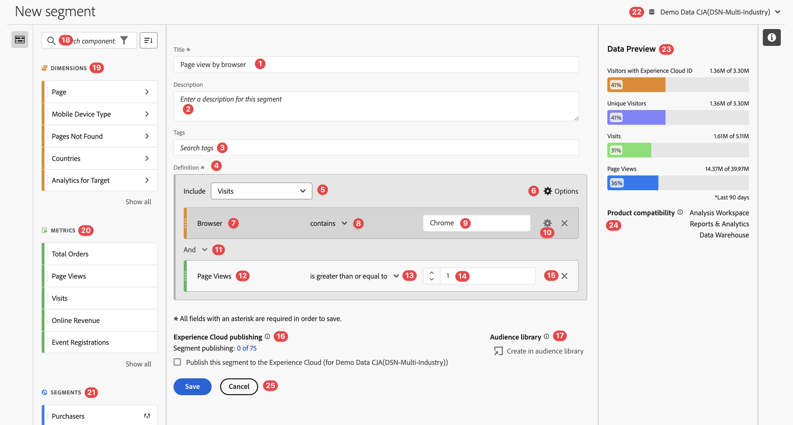

# Build segments {#build-segments}

>[!CONTEXTUALHELP]
>id="components_segments_productcompatibility"
>title="Product Compatibility"
>abstract="A small number of available segment criteria are not compatible with all Adobe Analytics tools. Tools that are compatible with the segment are indicated in this list. To make a segment compatible with all Adobe Analytics tools, edit your criteria."

>[!CONTEXTUALHELP]
>id="components_filters_createaudience"
>title="Create Audience"
>abstract="Audiences can be created from a segment and shared with the Adobe Experience Platform for activation."

>[!CONTEXTUALHELP]
>id="components_filters_datapreview"
>title="Data preview"
>abstract="Compares the data of this segment with data of the data view. The preview percentage is based on the total number in the data view from the **last 90 days**.  If the preview is not loading, your connection could still be backfilling."

The **[!UICONTROL Segment builder]** dialog is used to create new or edit existing segments. The dialog is titled **[!UICONTROL New segment]** or **[!UICONTROL Edit segment]** for segments that you create or manage from the [[!UICONTROL Segment] manager](/help/components/segmentation/segmentation-workflow/seg-manage.md).

>[!BEGINTABS]

>[!TAB Segment builder] 

>[!TAB Create or Edit segment] 

>[!ENDTABS]

1. Specify the following details ( is required):

   | Element | Description |
   | --- | --- |
   | **[!UICONTROL Report suite]** | You can select the report suite for the segment. | 
   | **[!UICONTROL Project-only segment]** | An info box to explain that the segment is only visible in the project where it is created and that the segment will not be added to your component list. Enable **[!UICONTROL Make this segment available to all your projects and add it to your component list]** to change that setting. This info box is only visible when you create a [quick segment](seg-quick.md) and turn the quick segment info a regular segment using **[!UICONTROL Open builder]** from the [!UICONTROL Quick segment] interface. |
   | **[!UICONTROL Title]**  | Name the segment, for example, `Last month mobile visitors`. |
   | **[!UICONTROL Description]** | Provide a description for the segment, for example, `Segment to define the mobile customers for the last month`. |
   | **[!UICONTROL Tags]**| Organize the segment by creating or applying one or more tags. Start typing to find existing tags you can select. Or press **[!UICONTROL ENTER]** to add a new tag. Select  to remove a tag. |
   | **[!UICONTROL Definition]** | Define your segment using the [Definition builder](#definition-builder). |
   
   {style="table-layout:auto"}
   
1. To verify whether your segment definition is correct, use the constantly updated preview of the results of the segment at the top right.
1. To publish your segment to the Experience Cloud, select **[!UICONTROL Publish this segment to the  Experience Cloud (for *report suite*)]**. See [Publish segments to Experience Cloud](/help/components/segmentation/segmentation-workflow/seg-publish.md) for more information.
1. Select:
   * **[!UICONTROL Save]** to save the segment.
   * **[!UICONTROL Save As]** to save a copy of the segment. 
   * **[!UICONTROL Delete]** to delete the segment.
   * **[!UICONTROL Cancel]** to cancel any changes you made to the segment or cancel the creation of a new segment.

## Definition builder

You use the Definition builder to construct your segment definition. In that construction, you use components, containers, operators and logic.

You can configure the type and scope of your definition: 

1. To specify the type of your definition, specify whether you want the build an include or exclude definition. Select  **[!UICONTROL Options]** and from the drop-down menu **[!UICONTROL Include]** or **[!UICONTROL Exclude]**.
1. To specify the scope of your definition, select from the **[!UICONTROL Include]** or **[!UICONTROL Exclude]** drop-down menu whether you want the scope of the definition to be **[!UICONTROL Hits]**, **[!UICONTROL Visits]**, or **[!UICONTROL Visitors]**.

You can always change these settings later.

### Components

A vital part of the construction of your segment definition is using dimensions, metrics, existing segments and date ranges. All these components are available from the component panel in the Segment builder.

{width=100%}

To add a component:

1. Drag and drop a component from the components panel onto **[!UICONTROL Drag and drop Metric(s), Segment(s), and/or Dimensions here]**. You can use the  in the components bar to search for specific components.
1. Specify details for the component. For example, select a value from **[!UICONTROL Select value]**. Or enter a value. What and how you can specify one or more values depends on the component and the operator.
1. Optionally modify the default operator. For example, from **[!UICONTROL equals]** to **[!UICONTROL equals any of]**. See [Operators](../seg-reference/seg-operators.md) for a detailed overview of the available operators.

To edit a component:

* Select a new operator for the component from the operator drop-down menu.
* Select or specify a different value for the operator if appropriate. 
* If the component type is a dimension, you can define the attribution model. See [Attribution model](#attribution) for more information.

To delete a component:

* Select  in a component.

### Containers

You can group multiple components in one or more containers and define logic within and between containers. Containers allow you to build complex definitions for your segment.

{Width=100%}

* To add a container, select **[!UICONTROL Add container]** from  **[!UICONTROL Options]**.
* To add an existing component to the container, drag and drop the component into the container.
* To add another component to the container, drag and drop a component from the component panel into the container. Use the blue insertion line as a guide.
* To add another component outside of the container, drag and drop a component from the component panel outside of the container, but inside the main definition container. User the blue insertion line as a guide.
* To modify the logic between components in a container, between containers or between a container and a component, select the appropriate **[!UICONTROL And]**, **[!UICONTROL Or]**, **[!UICONTROL Then]**. When you select **[!UICONTROL Then]**, you turn the segment into a sequential segment. See [Create sequential segment](seg-sequential-build.md) for more information.
* To switch the container level, select  **[!UICONTROL Hits]**,  **[!UICONTROL Visits]** or  **[!UICONTROL Visitors]**.

You can use  in a container for the following actions:

| Container action | Description |
|---|---|
| **[!UICONTROL Add container]** | Add a nested container to the container. |
| **[!UICONTROL Exclude]** | Exclude the result from the container in the segment definition. A thin red left bar identifies an exclude container.  |
| **[!UICONTROL Include]** | Include the result from the container in the segment definition. Include is the default. A thin gray left bar identifies an include container. |
| **[!UICONTROL Name container]** | Rename the container from its default description. Type a name in the text field. If you provide no input, the default description is used. |
| **[!UICONTROL Delete container]** | Delete the container from the definition. | 

## Date ranges

You can build segments that contain rolling date ranges. This way, you are able to answer questions about ongoing campaigns or events. For example, you can build a segment that includes *everyone who has made an online purchase over the last 60 days*.

>[!BEGINSHADEBOX]

See  [Rolling date ranges in segments](https://video.tv.adobe.com/v/25403/?quality=12&learn=on){target="_blank"} for a demo video.

>[!ENDSHADEBOX]

## Stack segments {#stack}

You can build a segment using segments. When you use segments in a segment, you can optimize your segment and reduce the complexity.

Imagine you want to segment on the combination of interaction channel (5) and US states (50). You could either build 250 segments, each for the unique combination of device type (mobile phone versus tablet) and US state. To get the tablet users in California, you would use one of the 250 segments:

Or, you could define 55 segments: 50 segments for the US states, and 5 for the possible interaction channels. And then stack the segments to obtain the same results. To get the California mobile app users, you would stack two segments:

## Attribution {#attribution}

>[!CONTEXTUALHELP]
>id="components_filters_attribution_repeating"
>title="Repeating"
>abstract="Includes instances and persisted values for the dimension."

>[!CONTEXTUALHELP]
>id="components_filters_attribution_instance"
>title="Instance"
>abstract="Includes instances for the dimension."

>[!CONTEXTUALHELP]
>id="components_filters_attribution_nonrepeatinginstance"
>title="Non-repeating instance"
>abstract="Includes unique (non-repeating) instances for the dimension."

When you use a dimension in the Segment builder, you have the options to specify the attribution model for that dimension. The attribution model you select determines whether data qualifies for the condition you have specified for the dimension component.

Select  within the dimension component and select one of the Attribution models from the popup: 

| Models | Description |
|---|---|
| **[!UICONTROL Repeating model (default)]** | Include instance and persisted values for the dimension to determine qualification. |
| **[!UICONTROL Instance]** | Include only instance values for the dimension to determine qualification. |
|  **[!UICONTROL Non-repeating instance]** | Include unique instance (non-repeating) values for the dimension to determine qualification. |

### Example

As part of a segment definition you have specified the following condition: Page Name equals Women. Similar to the example above. You repeat this segment definition using the two other attribution models. So you have three segments each with their own attribution model:

* Women Page - Attribution - Repeating (default)
* Women Page - Attribution - Instance
* Women Page - Attribution - Non-repeating instance

The table below explains, for each attribution model, which incoming events are qualified  for that condition.

|  Women Page - Attribution -  *attribution model*  | Event 1: Page Name equals Women  | Event 2: Page Name equals Men | Event 3: Page Name equals Women |  Event 4: Page Name equals Women (persisted) | Event 5: Page Name equals Checkout  |  Event 6: Page Name equals Women  | Event 7: Page Name equals Home  |
|---|:---:|:---:|:---:|:---:|:---:|:---:|:--:|
|  Repeating (default) |   |  |   |   |   |   |   |
|  Instance  |   |  |  |  |  |  |  |
|  Non-repeating instance  |  | |  |  |   |   |   |

An example report on events using the three segments looks like:

<!--

The [!UICONTROL Segment builder] lets you build simple or complex segments that identify visitor attributes and actions across visits and page hits. It provides a canvas to drag and drop metric dimensions, events, or other segments in order to segment visitors based on hierarchy logic, rules, and operators.

There are several ways to access the Segment builder:

* **Analytics top navigation**: Click **[!UICONTROL Analytics]** > **[!UICONTROL Components]** > **[!UICONTROL Segments]**.
* **[!UICONTROL Analysis Workspace]**: Click **[!UICONTROL Analytics]** > **[!UICONTROL Workspace]**, open a project and click **[!UICONTROL + New]** > **[!UICONTROL Create Segment]**.
* **[!UICONTROL Report Builder]**: [Add or edit segments in Report Builder](https://experienceleague.adobe.com/en/docs/analytics/analyze/report-builder/work-with-segments).

## Builder criteria {#section_F61C4268A5974C788629399ADE1E6E7C}

You can add rule definitions and containers to define your segments.

1. **[!UICONTROL Title]**: Name the segment.
1. **[!UICONTROL Description]**: Provide a description for the segment. 
1. **[!UICONTROL Tags]**: [Tag the segment](/help/components/segmentation/segmentation-workflow/seg-workflow.md) you are creating by picking from a list of existing tags or creating a new tag.
1. **[!UICONTROL Definitions]**: This is where you [build and configure segments](/help/components/segmentation/segmentation-workflow/seg-workflow.md), add rules, and nest and sequence containers. 
1. **[!UICONTROL Show]**: (Top Container selector.) Lets you select the top-level [container](/help/components/segmentation/seg-overview.md) ( [!UICONTROL Visitor], [!UICONTROL Visit], [!UICONTROL Hit]). The default top-level container is the Hit container.
1. **[!UICONTROL Options]**: (gear) icon

   * **[!UICONTROL + Add container]**: Lets you add a new container (below the top-level container) to the segment definition.
   * **[!UICONTROL Exclude]**: Lets you define the segment by excluding one or more dimensions, segments, or metrics.

1. **[!UICONTROL Dimensions]**: Components are dragged and dropped from the Dimensions list (orange sidebar).
1. **[!UICONTROL Operator]**: You can compare and constrain values using selected operators.
1. **[!UICONTROL Value]**: The value you entered or selected for the dimension or segment or metric.
1. **[!UICONTROL Attribution Models]**: Available for dimensions only, these models determine what values in a dimension to segment for. Dimension models are particularly useful in sequential segmentation.

   * **[!UICONTROL Repeating]** (default): Includes instances and persisted values for the dimension.
   * **[!UICONTROL Instance]**: Includes instances for the dimension.
   * **[!UICONTROL Non-repeating instance]**: Includes unique instances (non-repeating) for the dimension. This is the model applied in Flow when repeat instances are excluded.

   

   **Example: Hit segment where eVar1 = A** 

   |  Example  | A  | A  |  A (persisted) | B  | A  | C  |
   |---|---|---|---|---|---|---|
   |  Repeating  | X  | X  | X  | -  | X  | -  |
   |  Instance  | X  | X  | - | - | X | - |
   |  Non-repeating instance  | X | - | - | -  | X  | -  |

1. **[!UICONTROL And/Or/Then]**: Assigns the [!UICONTROL AND/OR/THEN] operators between containers or rules. The THEN operator lets you [define sequential segments](/help/components/segmentation/segmentation-workflow/seg-sequential-build.md).
1. **[!UICONTROL Metric]**: (Green sidebar) Metric that was dragged and dropped from the Metrics list.
1. **[!UICONTROL Comparison]** operator: You can compare and constrain values using selected operators.
1. **[!UICONTROL Value]**: The value you entered or selected for the dimension or segment or metric.
1. **[!UICONTROL X]**: (Delete) Lets you delete this part of the segment definition.
1. **[!UICONTROL Experience Cloud publishing]**: Publishing an Adobe Analytics segment to the Experience Cloud lets you use the segment for marketing activity in [!DNL Audience Manager] and in other activation channels. [Learn more...](/help/components/segmentation/segmentation-workflow/seg-publish.md)
1. **[!UICONTROL Audience library]**: Adobe's audience services manage the translation of visitor data into audience segmentation. As such, creating and managing audiences is similar to creating and using segments, with the added ability to share the audience segment to the Experience Cloud. [Learn more...](https://experienceleague.adobe.com/docs/core-services/interface/audiences/audience-library.html)
1. **[!UICONTROL Search]**: Searches the list of dimensions, segments, or metrics.
1. **[!UICONTROL Dimensions]**: (List) Click the header to expand.
1. **[!UICONTROL Metrics]**: Click the header to expand.
1. **[!UICONTROL Segments]**: Click the header to expand.
1. **[!UICONTROL Report suite selector]**: Lets you select the report suite that this segment will be saved under. You can still utilize the segment in all report suites.
1. **[!UICONTROL Segment Preview]**: Lets you preview the key metrics to see whether you have a valid segment and how broad the segment is. Represents the breakdown of the data set you can expect to see if you apply this segment. Shows 3 concentric circles and a list to show the number and percentage of matches for [!UICONTROL Hits], [!UICONTROL Visits], and [!UICONTROL Visitors] for a segment run against a data set. This chart is updated immediately after you create or make changes to your segment definition.
1. **[!UICONTROL Product Compatibility]**: Provides a list of which Adobe Analytics products (Analysis Workspace, Data Warehouse) with which the segment you created is compatible. Most segments are compatible with all products. However, not all operators and dimensions are compatible with all Analytics products, especially [Data Warehouse](/help/components/segmentation/seg-reference/seg-compatibility.md). This chart is updated immediately after you make changes to your segment definition.
1. **[!UICONTROL Save]** or **[!UICONTROL Cancel]**: Saves or cancels the segment. After clicking **[!UICONTROL Save]**, you are taken to the Segment manager where you can manage the segment.

## Build segments {#build-segments}

1. Simply drag a Dimension, Segment, or Metric Event from the left pane to the [!UICONTROL Definitions] field.

   

   The default top-level [!UICONTROL Hit] container is shown after dragging an element to [!UICONTROL Definitions]. You can change the container type to Visit or Visitor from the **[!UICONTROL Show]** drop-down menu.

1. Set the [operator](/help/components/segmentation/seg-reference/seg-operators.md) from the drop-down menu.
1. Enter or select a value for the item selected.
1. Add additional containers if needed, using **[!UICONTROL And]**, **[!UICONTROL Or]**, or **[!UICONTROL Then]** rules.
1. After placing the containers and setting the rules, see the results of the segment in the validation chart at the top right. The validator indicates the percentage and absolute number of page views, visits, and unique visitors that match the segment you created.
1. Under **[!UICONTROL Tags]**, [tag](/help/components/segmentation/segmentation-workflow/seg-tag.md) the container by selecting an existing tag or creating a new one.
1. Click **[!UICONTROL Save]** to save the segment.

You are now taken to the [Segment manager](/help/components/segmentation/segmentation-workflow/seg-manage.md), where you can tag, share, and manage your segment in multiple ways.

## Add containers {#section_1C38F15703B44474B0718CEF06639EFD}

You can [build a framework of containers](/help/components/segmentation/seg-overview.md) and then place logic rules and operators between.

1. Click **[!UICONTROL Options > Add Container]**.

   

   A new [!UICONTROL Hit] container opens without a [!UICONTROL Hit] (Page View) identified.

   

1. Change the container type as needed.
1. Drag a Dimension, Segment, or Event from the left pane to the container.
1. Continue to add new containers from the top-level **[!UICONTROL Options]** > **[!UICONTROL Add container]** button at the top of the definition, or add containers from within a container to nest logic.

   **OR**

   Select one or more rules and then click **[!UICONTROL Options]** > **[!UICONTROL Add container from selection]**. This turns your selection into a separate container.

## Use date ranges {#concept_252A83D43B6F4A4EBAB55F08AB2A1ACE}

You can build segments that contain rolling date ranges in order to answer questions about ongoing campaigns or events.

For example, you can easily build a segment that includes "everyone who has made a purchase over the past 60 days".

You create a Visit container and within it, add the [!UICONTROL Last 60 days] time range and the metric [!UICONTROL Orders is greater than or equal to 1], with an AND operator:

>[!BEGINSHADEBOX]

See  [Rolling date ranges in segments](https://video.tv.adobe.com/v/25403?quality=12&learn=on){target="_blank"} for a demo video.

>[!ENDSHADEBOX]

## Stack segments {#task_58140F17FFD64FF1BC30DC7B0A1B0E6D}

Stacking segments works by combining the criteria in each segment using an 'and' operator, and then applying the combined criteria. This can be done in a Workspace project directly or in segment builder. 

For example, stacking a "mobile phone users" segment and a "US geography" segment would return data only for mobile phone users in the US.

Think of these segments as building blocks or modules that you can include in a segment library, for users to use as they see fit. That way, you can dramatically reduce the number of segments needed. For example, assume you have 40 segments:

* 20 for mobile phone users in different countries (US_mobile, Germany_mobile, France_mobile, Brazil_mobile, etc.) 
* 20 for tablet users in different countries (US_tablet, Germany_tablet, France_tablet, Brazil_tablet, etc.)

By using segment stacking, you can reduce your segment count to 22 and stack them as needed. You would need to create these segments:

* one segment for mobile users 
* one segment for tablet users 
* 20 segments for the different geographies

>[!NOTE]
>
>When stacking two segments, they are by default joined by an AND statement. This cannot be changed to an OR statement.

1. Go to the Segment builder.
1. Provide a title and description for the segment.

   Step Result 1. Click **[!UICONTROL Show Segments]** to bring up the list of segments in the left navigation.

   Step Result 1. Drag and drop the segments you want to stack to the segment definition canvas. Here is an example of a segment that stacks the existing segments "Visits from Tablets" and "US Geo":

   

1. Save the segment.

   Step Result 

-->

## Segment templates {#concept_5098446CC78D441E93B8E4D1D1EA6558}

Segment templates are provided for common segmentation use cases, such as "First-time Visits" or "Vists from Mobile Devices". They are available in Workspace projects and in the segment builder as building blocks for new segments. 

Templates are denoted by the Adobe "A" logo. A sample of the templates are listed below:

<table id="table_98B87D807E9344C9BEBF072C65D87B1B"> 
 <thead> 
  <tr> 
   <th colname="col1" class="entry"> Template Name </th> 
   <th colname="col2" class="entry"> Definition </th> 
  </tr> 
 </thead>
 <tbody> 
  <tr> 
   <td colname="col1"> Abandon Cart </td> 
   <td colname="col2">View data for visitors that added items to their carts but did not order anything. In the Segment Definition, the container is Visit. The rule for this sequential segment is 
 Cart Additions is not null 
 
Then 
 
Orders equals 0. 
 </td> 
  </tr> 
  <tr> 
   <td colname="col1"> First Time Visits </td> 
   <td colname="col2">View data for visitors that have visited a maximum of one [1] times. In the Segment Definition, the container is Visit. The rule is 
Visit Number equals 1. 
 </td> 
  </tr> 
  <tr> 
   <td colname="col1"> Non-Purchasers </td> 
   <td colname="col2">View data for visitors that have not participated in an order event. In the Segment Definition, the container is Visitor. This segment uses the Exclude logic. The rule is 
Orders is not null. 
 </td> 
  </tr> 
  <tr> 
   <td colname="col1"> Non-Single Page Visit (Non-Bounces) </td> 
   <td colname="col2">View data for visitors that visited more than once. In the Segment Definition, the container is Visitor. This segment uses the Exclude logic. The rule is 
Single Access is not null. 
 </td> 
  </tr> 
  <tr> 
   <td colname="col1"> Paid Search </td> 
   <td colname="col2">View data from visitors originating from a paid search. In the Segment Definition, the container is Visit. The rule is 
Paid Search equals 1. 
 </td> 
  </tr> 
  <tr> 
   <td colname="col1"> Purchasers </td> 
   <td colname="col2">View data for visitors that have participated in an order event. In the Segment Definition, the container is Visitor. The rule is 
Orders is not null. 
 </td> 
  </tr> 
  <tr> 
   <td colname="col1"> Return Visits </td> 
   <td colname="col2">View data from visitors that have visited at least once. In the Segment Definition, the container is Visit. The rule is 
Visit Number is greater than 1. 
 </td> 
  </tr> 
  <tr> 
   <td colname="col1"> Single Page Visits </td> 
   <td colname="col2"> View data from visits in which you see a single page value, even though you may submit multiple page views during that visit. Single-page visits with exit link events are included in the segment. In the Segment Definition, the container is Visit. The rule is 
Single Page Visits equals 1. 
 </td> 
  </tr> 
  <tr> 
   <td colname="col1"> Viewed Product Didn't Add to Cart </td> 
   <td colname="col2">View data for visitors that viewed products but had no cart additions. In the Segment Definition, the container is Visit. The rule for this sequential segment is 
Product Views is not null 
 
Then 
 
 Cart Additions equals 0. 
 </td> 
  </tr> 
  <tr> 
   <td colname="col1"> Visits from Campaign </td> 
   <td colname="col2">View data from visitors referred by campaigns. In the Segment Definition, the container is Visit. The rule is 
Tracking Code is not null. 
 </td> 
  </tr> 
  <tr> 
   <td colname="col1"> Visits from Mobile Devices </td> 
   <td colname="col2">View data from visitors using mobile devices. In the Segment Definition, the container is Visit. The rule is 
Mobile Device is not null. 
 </td> 
  </tr> 
  <tr> 
   <td colname="col1"> Visits from Natural Search </td> 
   <td colname="col2">View data from visitors not originating from a paid search. In the Segment Definition, the container is Visit. The rule is 
Paid Search equals 0. 
 </td> 
  </tr> 
  <tr> 
   <td colname="col1"> Visits from Non-Mobile Device </td> 
   <td colname="col2">View data from visitors not using mobile devices. In the Segment Definition, the container is Visit. This segment uses the Exclude logic. The rule is 
Mobile Device Type equals Mobile Phone 
 
Or 
 
Mobile Device Type equals Tablet. 
 </td> 
  </tr> 
  <tr> 
   <td colname="col1"> Visits from Phones </td> 
   <td colname="col2">View data from visitors using phones. In the Segment Definition, the container is Visit. The rule is 
Device Type equals Mobile Phone. 
 </td> 
  </tr> 
  <tr> 
   <td colname="col1"> Visits from Search Engines </td> 
   <td colname="col2">View data from visitors referred by search engines. In the Segment Definition, the container is Visit. The rule is 
Referrer Type equals Search Engines. 
 </td> 
  </tr> 
  <tr> 
   <td colname="col1"> Visits from Social Sites </td> 
   <td colname="col2">View data from visitors referred by social sites. In the Segment Definition, the container is Visit. The rule is 
Referrer Type equals Social Networks. 
 </td> 
  </tr> 
  <tr> 
   <td colname="col1"> Visits from Tablets </td> 
   <td colname="col2">View data from visitors using tablets. In the Segment Definition, the container is Visit. The rule is 
Device Type equals Tablet. 
 </td> 
  </tr> 
  <tr> 
   <td colname="col1"> Visits with Visitor ID Cookie </td> 
   <td colname="col2">View data from visitors to your site, where a persistent cookie is required. In the Segment Definition, the container is Visit. The rule is 
Persistent Cookie equals 1. 
 </td> 
  </tr> 
 </tbody> 
</table>
