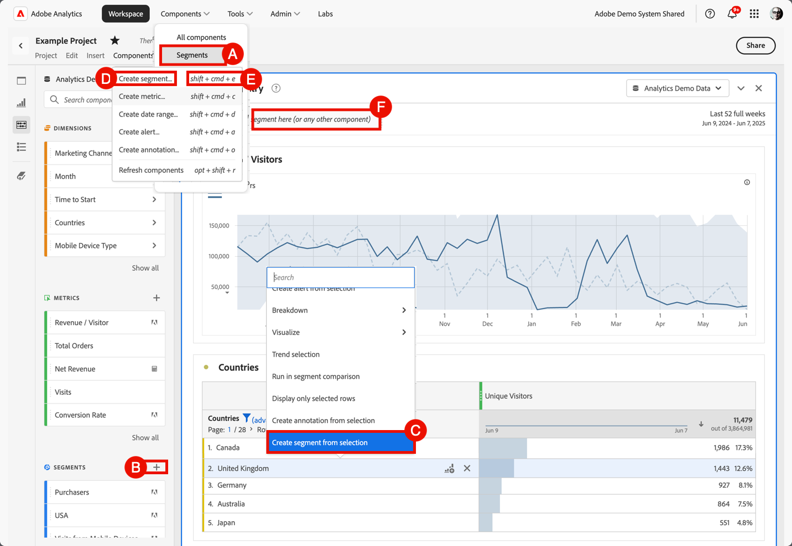

# Create segments

You can create different types of segments in Adobe Analytics.  The type you select depends on how complex the segments need to be and whether the segments should apply to the current Workspace project only or apply to all projects. You can create segments directly in the main interface of Adobe Analytics or when working in a Workspace project. 

[Segments rights by role](/help/components/segmentation/seg-reference/seg-rights.md) explain who can create segments.

You can create a segment in the following ways:

* **A**. In the main interface, select **[!UICONTROL Components]** and select **[!UICONTROL Segments]**. Select  [!UICONTROL **[!UICONTROL Add]**] from the [[!UICONTROL Segment] manager](seg-manage.md). 
* **B**. In a Workspace project, from the Components left panel, select  at  **Segments**.
* **C**. In a Workspace project, from the context menu in a visualization, select **[!UICONTROL Create segment from selection]**.
* **D**. In a Workspace project, select **[!UICONTROL Components]** from the menu, and select **[!UICONTROL Create segment]**. 
* **E**. In a Workspace project, use the shortcut **[!UICONTROL shift+cmd+e]** (macOS) or **[!UICONTROL shift+ctrl+e]** (Windows).
* **F**. Select  in ***Drop a segment here (or any other component)*** drop zone. This action creates a Project-only segment.

To define the new segment, you use the [Segment builder](seg-build.md).

When you are in a Workspace project, you can also create a segment quickly using [Quick segment](seg-quick.md).
